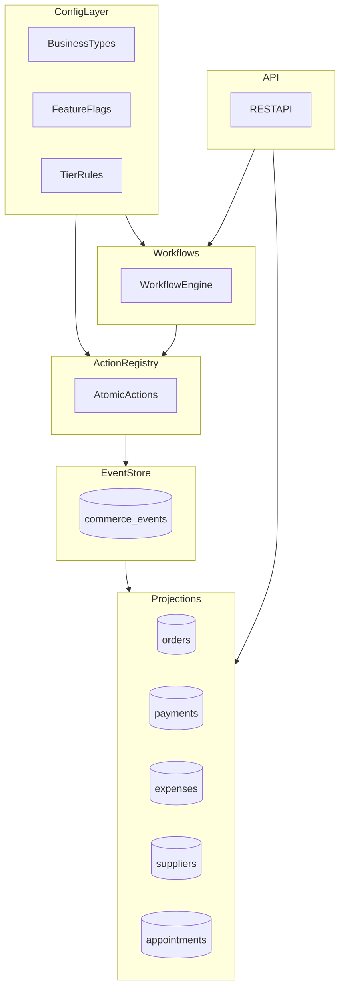

# KCOS Architecture - Everything Lite Edition

KCOS is built to support a unified "lite everything" experience across Kenyan SMEs. The system stays simple in the UI while remaining modular and scalable in the backend.

## Core Principle: Config-Driven Variability

One codebase serves multiple business types by toggling features through configuration.



## Example: Same Code, Different Experience

**Solo Retail (Lite):**
```json
{
  "businessType": "retail",
  "config": {
    "enableExpenses": true,
    "enableInventory": true,
    "enableCommissions": false,
    "enableMultiLocation": false
  }
}
```

**Multi-Location Retail (Pro):**
```json
{
  "businessType": "retail",
  "config": {
    "enableExpenses": true,
    "enableInventory": true,
    "enableCommissions": true,
    "enableMultiLocation": true,
    "tier": "pro"
  }
}
```

Same actions and tables, different features enabled.

## Why This Works for "Everything Lite"

1. Lite does not mean shallow. It means focused.
2. Each business sees only what they need.
3. Feature flags prevent UI and workflow bloat.
4. One platform replaces multiple scattered tools.

