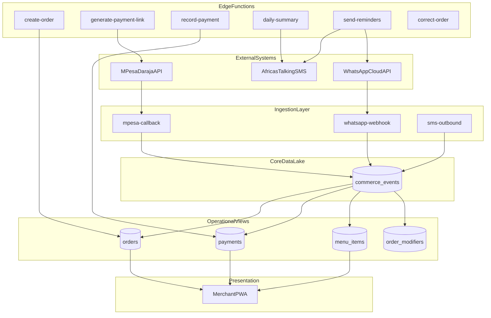
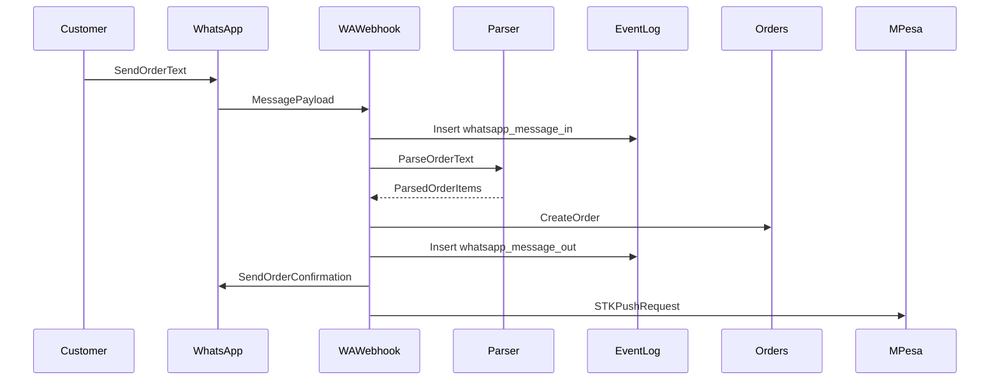
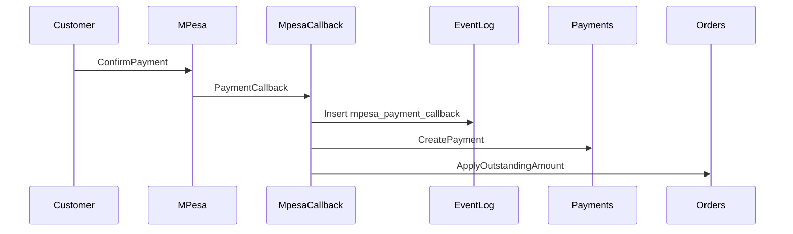
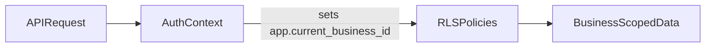
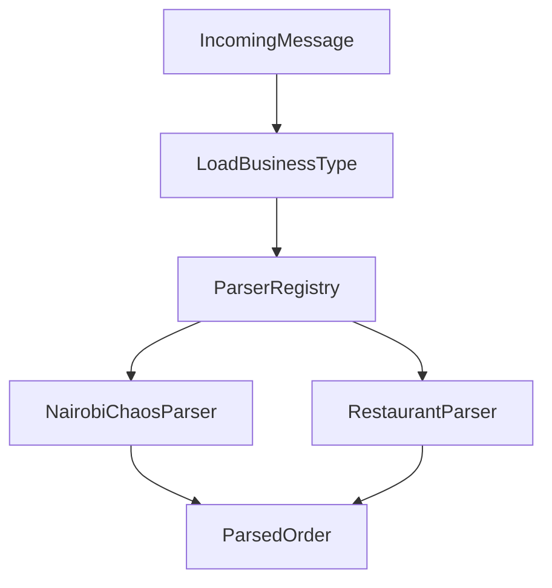
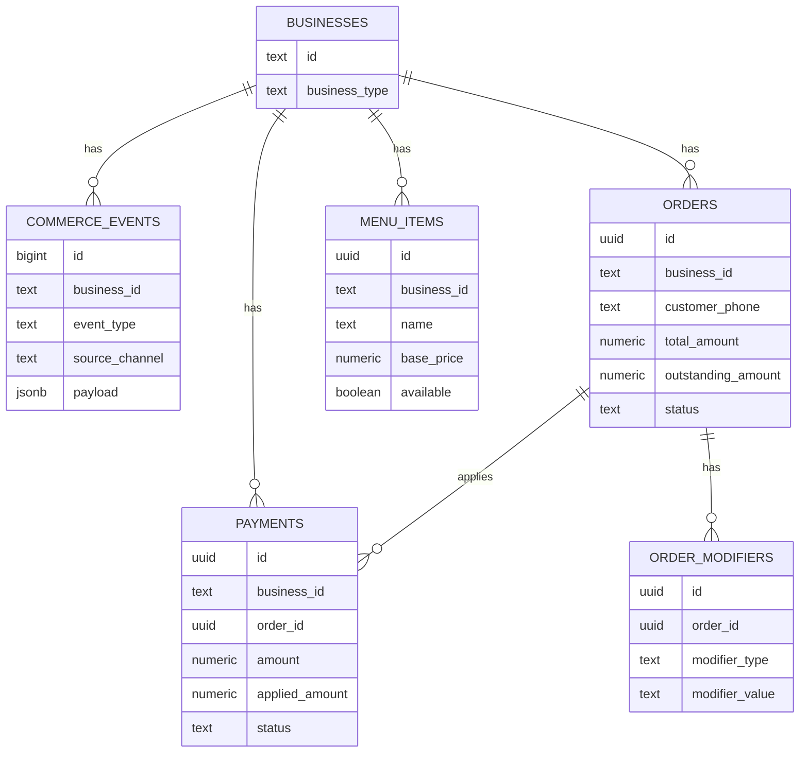

# Kenya Commerce OS Architecture

This document describes the current system architecture for Nairobi-first commerce on WhatsApp and M-Pesa. The system uses event sourcing as a data lake, plus operational projections for fast queries.

## System Overview

## Event Flow (WhatsApp Order)

## Payment Confirmation Flow

## Multi-Tenant Isolation (RLS)

## Parser Registry Routing

## Database Schema Relationships

## Notes on Data Model

- `commerce_events` is the immutable data lake and source of truth.
- `orders`, `payments`, `menu_items`, and `order_modifiers` are projections optimized for reads and operational workflows.
- All tables enforce business isolation using Row Level Security.

