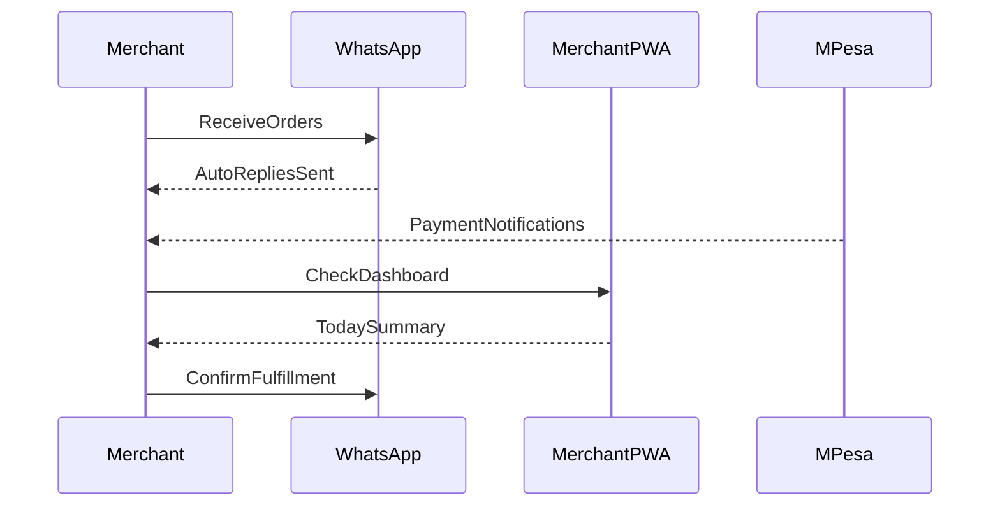
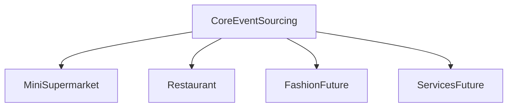
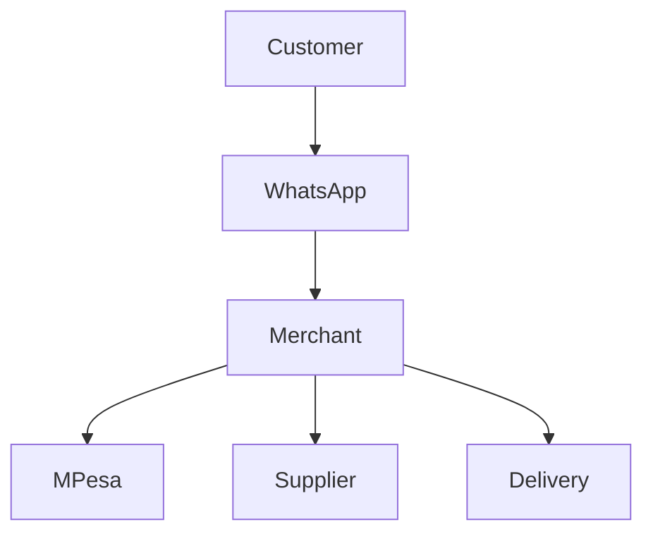
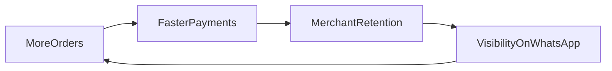

# Kenya Commerce OS Business Model

This document maps Nairobi commerce realities to system capabilities. The goal is to make merchants successful on WhatsApp and M-Pesa with minimal friction.

## Target Merchants

- Mini-supermarkets (Kamau profile)
- Restaurants and small eateries
- Boutiques and fashion resellers (future)
- Jua Kali services (future)
- Electronics shops (future)

## Channel Strategy

- Primary: WhatsApp order intake and confirmations
- Payments: M-Pesa STK Push + callback reconciliation
- Secondary: SMS fallback for customers without WhatsApp
- Merchant view: PWA dashboard (offline-first)

## Customer Journey by Business Type

## Merchant Daily Workflow

## Multi-Business-Type Scaling Strategy

## Kenya Commerce Ecosystem Map

## Revenue Loop (Retention + Growth)

## Success Metrics by Business Type

| Business Type | Primary Metric | Secondary Metric |
| --- | --- | --- |
| Mini-supermarket | 50+ orders via auto-replies | < 5% order failures |
| Restaurant | 90% order parse accuracy | < 5 min response time |
| Fashion | 80% variant clarity | 30% repeat buyers |
| Services | 80% booking confirmations | 20% deposit rate |

## Pricing Model (Direction)

- Base monthly fee for core automation
- Usage-based fees for SMS reminders
- Premium add-ons for custom parsers and analytics

