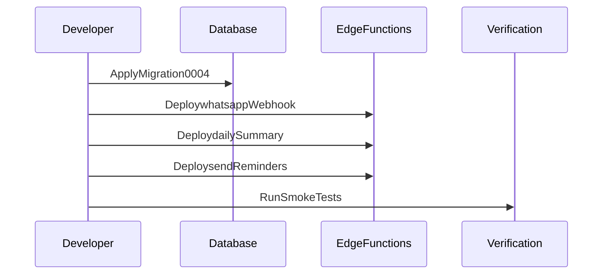
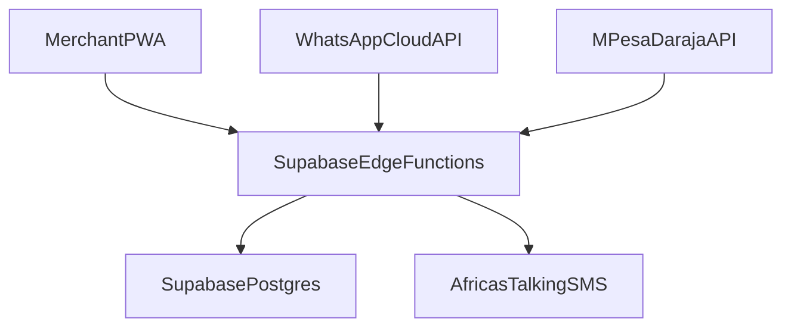

# Kenya Commerce OS Deployment Guide

This guide covers database migrations, edge function deployments, environment configuration, and operational checks.

## Prerequisites

- Supabase CLI authenticated
- `SUPABASE_ACCESS_TOKEN` configured
- Project reference available
- M-Pesa and WhatsApp credentials provisioned

## Deployment Sequence



## Infrastructure Topology



## Health Check Flow


## Step 1: Apply Database Migration

```bash
cd /Users/jaabirahmed/Documents/projects/WABAAA
supabase db push
# Or manual:
psql $DATABASE_URL -f packages/database/migrations/0004_business_types_and_modifiers.sql
```

## Step 2: Deploy Edge Functions

```bash
supabase functions deploy whatsapp-webhook
supabase functions deploy daily-summary
supabase functions deploy send-reminders
```

## Step 3: Configure Secrets

```bash
supabase secrets set AFRICASTALKING_API_KEY=...
supabase secrets set AFRICASTALKING_USERNAME=...
supabase secrets set SMS_SENDER_ID=ElixoSense
supabase secrets set WHATSAPP_ACCESS_TOKEN=...
supabase secrets set WHATSAPP_PHONE_NUMBER_ID=...
supabase secrets list
```

## Step 4: Activate Business Types

```sql
UPDATE businesses
SET business_type = 'mini_supermarket'
WHERE id = 'elixosense';

-- For restaurants:
-- UPDATE businesses SET business_type = 'restaurant' WHERE id = '...';
```

## Step 5: Smoke Tests

- Send a WhatsApp order message and confirm auto-reply.
- Trigger M-Pesa payment and confirm callback updates.
- Run `send-reminders` and verify SMS fallback.
- Run `daily-summary` and confirm WhatsApp + SMS sent.
- Open PWA and confirm menu management UI for restaurants.

## Rollback Strategy

- Revert migration: create a down migration to drop `menu_items` and `order_modifiers`.
- Re-deploy previous edge function versions if issues.
- Disable reminders by turning off cron and/or API access.

## Monitoring Checklist

- Monitor `commerce_events` insert rate.
- Check `payments` reconciliation success.
- Track SMS delivery success in `commerce_events`.
- Verify WhatsApp API error rates.

