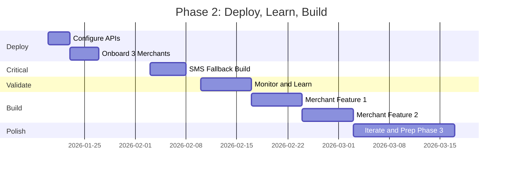
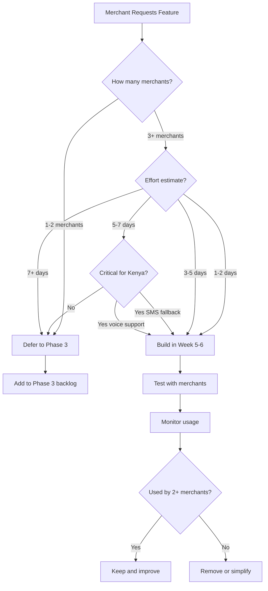

# 🚀 Phase 2 Roadmap - Kenya Commerce OS

**Status**: Phase 1 Complete → Phase 2 Deployment & Validation  
**Timeline**: 8 Weeks (January 20 - March 17, 2026)  
**Goal**: Deploy to 3-5 merchants, validate product-market fit, build merchant-requested features  

---

## Executive Summary

Phase 1 delivered a production-ready platform with WhatsApp auto-reply, M-Pesa integration, QR codes, and a merchant dashboard. Phase 2 focuses on **real-world validation** with Kenyan merchants and building **only what they ask for**.

**Key Principle**: Let merchants tell us what to build. No speculation, no Silicon Valley features.

---

## 8-Week Timeline

---

## Week 1-2: Deploy Phase 1 (January 20-31)

### **Week 1: Configure & Deploy**

**Monday-Wednesday (Jan 20-22): API Configuration**
- Set up WhatsApp Cloud API (Meta Business Account)
- Configure M-Pesa Daraja API (sandbox → production)
- Set up Africa's Talking SMS
- Generate encryption keys
- Configure webhooks
- Set up Sentry monitoring
- Test all integrations

**Thursday-Sunday (Jan 23-26): Merchant Onboarding**
- Contact 5 potential merchants
- Select 3 best-fit merchants:
  - Mini-supermarket or similar
  - 20+ orders/week on WhatsApp
  - M-Pesa Till/Paybill active
  - Willing to give feedback
- Schedule onboarding calls
- Prepare demo data

**Deliverables**:
- ✅ All APIs configured and tested
- ✅ Webhooks verified
- ✅ 3 merchants selected and scheduled

### **Week 2: Onboard & Monitor**

**Monday-Wednesday (Jan 27-29): Merchant Setup**
- Onboarding call #1 (Merchant A)
- Onboarding call #2 (Merchant B)
- Onboarding call #3 (Merchant C)
- Configure each business in database
- Add products and pricing
- Test first orders with each merchant
- Train on dashboard usage

**Thursday-Sunday (Jan 30-Feb 2): Daily Monitoring**
- Check errors daily (Sentry + Supabase logs)
- Respond to merchant questions (WhatsApp support)
- Track 10 key metrics:
  1. Orders processed
  2. Parsing accuracy
  3. M-Pesa success rate
  4. WhatsApp delivery rate
  5. Dashboard usage
  6. Merchant satisfaction
  7. Customer complaints
  8. Failed payments
  9. QR code scans
  10. Daily summary delivery

**Deliverables**:
- ✅ 3 merchants onboarded and trained
- ✅ Each merchant processes 5+ orders
- ✅ Daily monitoring routine established
- ✅ Initial feedback collected

---

## Week 3: Build SMS Fallback (February 3-7)

### **Why SMS Fallback is Critical for Kenya**

**Reality Check**:
- WhatsApp shut down during 2017 elections
- WhatsApp shut down during 2022 protests
- WhatsApp costs data (merchants on tight budgets)
- SMS is 99.9% reliable in Kenya
- Africa's Talking SMS is cheaper than WhatsApp for bulk

**This is NOT optional. It's survival.**

### **Implementation Plan**

**Monday-Tuesday (Feb 3-4): Enhanced SMS Utility**
- Create `sms-enhanced.ts` with fallback logic
- Implement automatic WhatsApp → SMS fallback
- Add retry mechanism (3 attempts with backoff)
- Add cost tracking per business
- Add delivery confirmation tracking

**Wednesday-Thursday (Feb 5-6): Integration**
- Update `whatsapp-webhook` to use fallback
- Update `daily-summary` to use fallback
- Update `send-reminders` to use fallback
- Add SMS templates (order confirmation, payment reminder, daily summary)

**Friday (Feb 7): Test & Deploy**
- Test SMS delivery with all 3 merchants
- Simulate WhatsApp failure
- Verify fallback works
- Deploy to production
- Document for merchants

**Deliverables**:
- ✅ SMS fallback working for all outbound messages
- ✅ Tested with 3 merchants
- ✅ Cost tracking enabled
- ✅ Merchants know how to trigger SMS manually

---

## Week 4: Monitor & Prioritize (February 10-16)

### **Daily Tasks**
- Check Sentry for errors
- Review Supabase logs
- Check merchant WhatsApp for issues
- Track 10 key metrics
- Respond to support requests

### **Weekly Feedback Calls**

**Monday (Feb 10): Merchant A Feedback**
- What worked well this week?
- What broke or was frustrating?
- Kenya-specific questions:
  - "Has WhatsApp been down for you?"
  - "How many orders do you get between 7am-9am?"
  - "Which customers owe you money? How do you track it?"
  - "Do you have agents/resellers?"
  - "Do customers send voice messages?"
- Feature requests (document verbatim)
- Satisfaction score (1-10)

**Wednesday (Feb 12): Merchant B Feedback**
- Same questions as Merchant A
- Compare answers
- Look for patterns

**Friday (Feb 14): Merchant C Feedback**
- Same questions
- Synthesize all feedback
- Identify top 3 feature requests

**Weekend (Feb 15-16): Feature Prioritization**
- Apply Rule of 3: Build if 3+ merchants request it
- Estimate effort (3-5 days per feature)
- Create Phase 2 feature backlog
- Decide on Week 5-6 features

**Deliverables**:
- ✅ 3 merchant feedback calls completed
- ✅ Feature requests documented
- ✅ Top 2 features prioritized for Weeks 5-6
- ✅ Effort estimates confirmed

---

## Week 5-6: Build Merchant-Requested Features (February 17-28)

### **Candidate Features (Based on Kenya Reality)**

**IF merchants say: "I can't keep up with morning orders"**
→ **Build: Bulk Order Processing** (3-4 days)
- Parse multiple orders at once
- Create orders in batch
- Send single consolidated message
- Reduce merchant overwhelm during 7am-9am rush

**IF merchants say: "I forget who owes me money"**
→ **Build: Real-time Debt Alerts** (2-3 days)
- Alert when customer debt crosses KSh 5,000
- Alert when total debt crosses KSh 10,000
- Alert when no payment in 7 days
- Send WhatsApp message to merchant: "🔴 Kamau owes KSh 12,000 (last paid 7 days ago)"

**IF merchants say: "Customers send voice messages I can't understand"**
→ **Build: Voice Message Support** (5-7 days)
- Integrate AssemblyAI or Deepgram
- Download voice message
- Transcribe to text
- Parse and process as normal order
- Fallback: Notify merchant to handle manually

**IF merchants say: "I need to track my agents' sales"**
→ **Build: Agent/Commission Tracking** (4-5 days)
- Add agent field to orders
- Track sales per agent
- Calculate commissions
- Generate agent reports

**IF merchants say: "I run out of stock and don't know"**
→ **Build: Inventory Management** (3-4 days)
- Track product quantities
- Decrement on order
- Alert when low stock (< 5 units)
- Prevent overselling

### **Week 5 (Feb 17-23): Feature #1**
- Monday: Finalize feature based on feedback
- Tuesday-Thursday: Build (Claude writes, you review)
- Friday: Deploy and test with merchants
- Weekend: Monitor and fix bugs

### **Week 6 (Feb 24-28): Feature #2**
- Monday: Finalize 2nd feature
- Tuesday-Thursday: Build
- Friday: Deploy and test
- Weekend: Monitor

**Deliverables**:
- ✅ 1-2 features shipped based on merchant feedback
- ✅ Merchants using new features
- ✅ Feature usage tracked
- ✅ Bugs fixed

---

## Week 7-8: Iterate & Prepare Phase 3 (March 3-17)

### **Week 7 (Mar 3-9): Polish**
- Fix bugs from Weeks 5-6
- Improve dashboard based on feedback
- Optimize performance (if needed)
- Update documentation
- Prepare case studies (merchant success stories)

### **Week 8 (Mar 10-17): Phase 3 Prep**
- Review all metrics
- Calculate churn rate
- Measure merchant satisfaction
- Identify what's working vs. not working
- Create Phase 3 roadmap based on learnings
- Decide: Scale to more merchants OR build more features?

**Deliverables**:
- ✅ All bugs fixed
- ✅ Metrics reviewed
- ✅ Phase 3 roadmap created
- ✅ Decision on next steps

---

## Success Metrics (By Week 8)

### **Merchant Metrics**
- ✅ 3-5 merchants actively using Phase 1 daily
- ✅ 95%+ message parsing accuracy
- ✅ 98%+ M-Pesa payment success rate
- ✅ <10% monthly churn
- ✅ 8/10+ merchant satisfaction score

### **Technical Metrics**
- ✅ SMS fallback tested and working
- ✅ 99.9%+ uptime
- ✅ <500ms average response time
- ✅ Zero data loss incidents
- ✅ All webhooks reliable

### **Business Metrics**
- ✅ Merchants process 50+ orders/week via WhatsApp
- ✅ Merchants trust the system with money
- ✅ Merchants recommend to other merchants
- ✅ Clear path to monetization (if scaling)

### **Feature Metrics**
- ✅ 1-2 features shipped based on merchant feedback
- ✅ Features used by 2+ merchants
- ✅ Features solve real problems (not just "nice to have")

---

## Kenya-Specific Risks & Mitigation

### **Risk 1: M-Pesa API Downtime**
**Frequency**: 2-3 times/year  
**Impact**: Payments fail, merchants panic  
**Mitigation**:
- Manual payment recording (`record-payment` function)
- Train merchants on manual entry
- SMS alert when M-Pesa is down
- Clear dashboard message: "M-Pesa down, record payments manually"

### **Risk 2: WhatsApp Shutdowns**
**Frequency**: During political unrest (2017, 2022)  
**Impact**: No orders, no communication  
**Mitigation**:
- SMS fallback (Week 3 build)
- Test SMS delivery monthly
- Train merchants on SMS workflow
- Keep SMS credits topped up

### **Risk 3: Merchant Phone Theft**
**Frequency**: Common in Nairobi  
**Impact**: Merchant loses business access  
**Mitigation**:
- Web dashboard login from any device
- Phone number recovery process
- Backup owner phone number
- Document recovery steps

### **Risk 4: Network Fluctuations**
**Frequency**: Daily in some areas  
**Impact**: Orders lost during network drops  
**Mitigation**:
- Offline PWA (already built)
- Verify sync works after 24hr offline
- Test with merchants in low-network areas

### **Risk 5: Merchant Literacy**
**Frequency**: Some merchants struggle with dashboard  
**Impact**: Can't use system, churn  
**Mitigation**:
- Voice calls > SMS for critical alerts
- Swahili-first UI (already built)
- In-person training if needed
- Consider Twilio voice API (Week 5-8)

---

## Feature Decision Framework

### **Rule of 3**
**Build if**: 3+ merchants request it AND it takes 3-5 days

**Why this works**:
- Prevents building niche features
- Prevents over-engineering
- Keeps focus on merchant needs
- Sustainable solo dev pace

### **Decision Tree**

### **Examples**

**Scenario 1**: 1 merchant asks for "inventory management"
→ **Defer** (only 1 merchant, wait for more requests)

**Scenario 2**: 3 merchants ask for "bulk order processing"
→ **Build** (3+ merchants, 3-4 days effort)

**Scenario 3**: 2 merchants ask for "AI chatbot"
→ **Defer** (only 2 merchants, costs money, no clear ROI)

**Scenario 4**: 1 merchant asks for "SMS fallback" but WhatsApp went down
→ **Build** (critical for Kenya, even if only 1 merchant asks)

---

## Solo Dev + Agentic Workflow

### **Time Allocation**

**You (30% = 12 hrs/week)**:
- Monday: Review feedback, prioritize features (2 hrs)
- Tuesday-Thursday: Review Claude's code, test, deploy (8 hrs)
- Friday: Merchant support, monitoring (2 hrs)

**Claude (70% = 28 hrs/week)**:
- Write code for features
- Write tests
- Write documentation
- Generate SQL migrations
- Create UI components

### **Weekly Rhythm**

**Monday**:
- Review merchant feedback
- Pick feature to build
- Create spec for Claude
- Start feature build

**Tuesday-Thursday**:
- Claude writes code
- You review pull requests
- Test locally
- Deploy to staging
- Test with merchants

**Friday**:
- Deploy to production
- Monitor for errors
- Respond to merchant questions
- Update metrics dashboard

**Weekend**:
- Light monitoring
- Plan next week
- Rest (no burnout!)

---

## What NOT to Build (Unless Merchants Ask)

### **Western E-commerce Features**
- ❌ Cart abandonment recovery (doesn't apply in Kenya)
- ❌ Advanced analytics (merchants want debt tracking MORE)
- ❌ Customer segments (nice-to-have, not critical)
- ❌ Broadcast messaging (can overwhelm customers)
- ❌ AI chatbot (costs money, no demand)

### **Complex Features**
- ❌ B2B wholesale (different product, 3-4 weeks)
- ❌ Multi-location (not requested yet)
- ❌ Franchise management (too early)
- ❌ Supplier integration (not requested)

### **Premature Optimization**
- ❌ Advanced caching (not needed yet)
- ❌ Microservices (monolith works fine)
- ❌ Kubernetes (Supabase handles scaling)
- ❌ GraphQL (REST is fine)

**Principle**: Build only what merchants ask for. Everything else is waste.

---

## Phase 3 Preview (Week 8 Decision)

### **Option A: Scale to More Merchants**
- Onboard 10-20 more merchants
- Focus on stability and support
- Refine existing features
- Build monetization (if needed)

### **Option B: Build More Features**
- Keep 3-5 merchants
- Build 3-4 more features
- Deepen product capabilities
- Prepare for larger rollout

### **Option C: Pivot to Specific Vertical**
- Focus on one business type (e.g., restaurants)
- Build vertical-specific features
- Become best solution for that vertical
- Scale within vertical

**Decision criteria**: What do merchants need most? More features or more stability?

---

## Communication Plan

### **Merchant Communication**
- **Daily**: WhatsApp support (respond within 2 hours)
- **Weekly**: Feedback calls (30 min each)
- **Monthly**: Business review (metrics, satisfaction)

### **Internal Communication**
- **Daily**: Error logs (Sentry)
- **Weekly**: Metrics review (dashboard)
- **Monthly**: Phase review (what's working, what's not)

---

## Budget & Sustainability

### **Phase 2 Costs (8 weeks)**
- Supabase: $25/month = $50
- Africa's Talking SMS: ~$10/month = $20
- Sentry: Free tier
- WhatsApp: Free (Meta Cloud API)
- M-Pesa: Transaction fees only
- **Total**: ~$70 for 8 weeks

### **Time Investment**
- Week 1-2: 20 hrs (deployment)
- Week 3: 15 hrs (SMS fallback)
- Week 4: 10 hrs (monitoring)
- Week 5-6: 20 hrs (feature builds)
- Week 7-8: 15 hrs (polish)
- **Total**: ~80 hours over 8 weeks = 10 hrs/week

**Sustainable**: Yes, with agentic help (Claude writes 70% of code)

---

## Next Steps (This Week)

### **Monday (Tomorrow)**
- ✅ Read all Phase 2 documentation
- ✅ Review Phase 1 code
- ✅ Create API accounts (WhatsApp, M-Pesa, SMS)

### **Tuesday-Thursday**
- ✅ Configure APIs
- ✅ Set up webhooks
- ✅ Test integrations
- ✅ Deploy to production

### **Friday**
- ✅ Contact 5 potential merchants
- ✅ Schedule Week 2 onboarding calls
- ✅ Prepare demo data

---

## Conclusion

Phase 2 is about **validation, not speculation**. We deploy Phase 1, onboard real merchants, listen to their feedback, and build only what they ask for.

**The merchants will tell us what to build. Our job is to listen and execute fast.**

**Success = 3-5 happy merchants using the system daily by Week 8.**

Let's go. 🚀

---

**Last Updated**: January 17, 2026  
**Status**: Phase 2 Ready to Start  
**Next Review**: February 16, 2026 (after Week 4 feedback)
