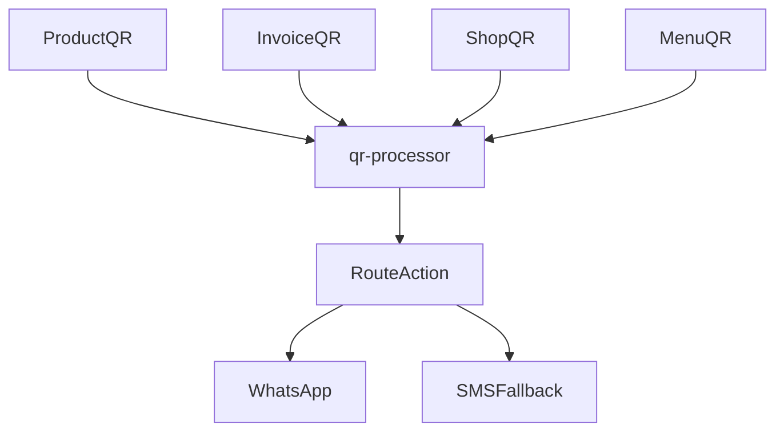
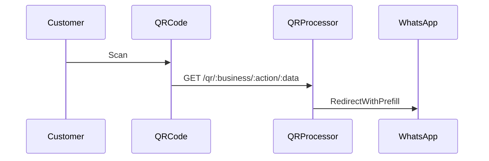
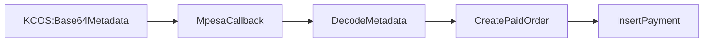

# QR Implementation

This document describes the QR system used to connect physical commerce to WhatsApp and M-Pesa flows.

## QR Types

- Product QR: sticker per item, redirects to WhatsApp order message
- Invoice QR: payment reminder QR for a specific order
- Shop QR: opens WhatsApp chat for discovery
- Menu QR: opens menu in WhatsApp for restaurants

## QR Routing Architecture



## QR Scan Flow



## M-Pesa QR Metadata Strategy



## QR Analytics

- `qr_scan` events stored in `commerce_events` (note_type = qr_scan)
- `qr_conversion` events stored in `commerce_events` (note_type = qr_conversion)
- Analytics dashboard aggregates scans, conversions, and revenue

## URL Format

```
{SUPABASE_URL}/functions/v1/qr-processor/qr/{businessId}/{action}/{data}
```

Actions:
- `order`: `{productId}:{quantity}:{unit}`
- `pay`: `{orderId}:{amount}`
- `chat`: `welcome`
- `menu`: `main`

## Security Notes

- QR functions should be deployed with `verify_jwt=false`
- Business validation is enforced in QR processor
- Data writes are logged in `commerce_events`

