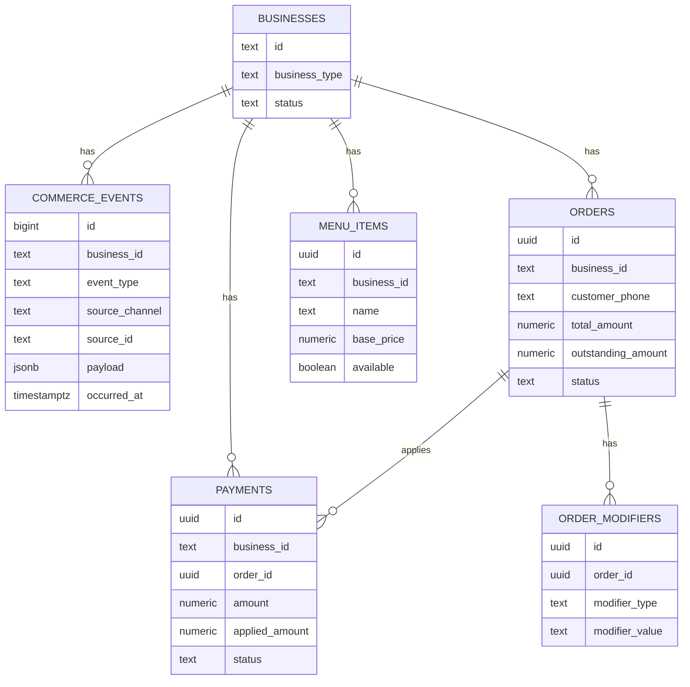
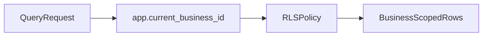
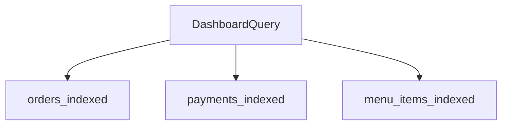

# Database Schema

This document describes the core schema, relationships, indexes, and RLS policy strategy.

## Entity Relationship Diagram

## Core Tables

### commerce_events
- Immutable audit log
- Event types are locked to known values
- Used for reconciliation, debugging, and analytics

### orders
- Operational state with outstanding balance tracking
- Used by PWA dashboards and reminder services

### payments
- Applied payments with M-Pesa receipts
- Reconciles against orders

### order_notifications
- Tracks outbound notifications for idempotency
- Prevents duplicate WhatsApp/SMS sends on retries
- Primary key: (order_id, status, channel)

### menu_items
- Restaurant menu catalog with aliases and modifiers

### order_modifiers
- Per-item modifiers for restaurant orders

## Index Strategy

- `orders(business_id)`
- `orders(status)`
- `orders(outstanding_amount) WHERE outstanding_amount > 0`
- `payments(business_id)`
- `menu_items(business_id)`
- `order_modifiers(order_id)`

## RLS Strategy

## Query Optimization Paths

## Migration History

- `0003_create_explicit_orders_payments.sql` (orders, payments, RLS)
- `0004_business_types_and_modifiers.sql` (business_type, menu_items, order_modifiers)

