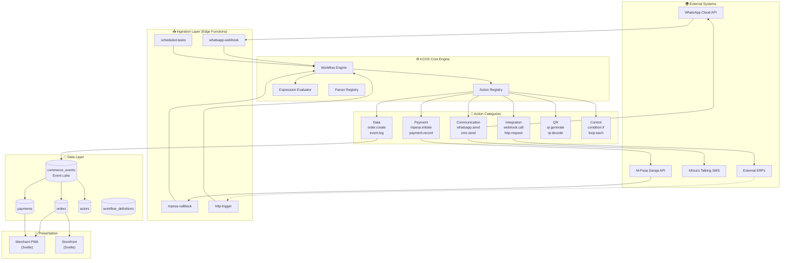
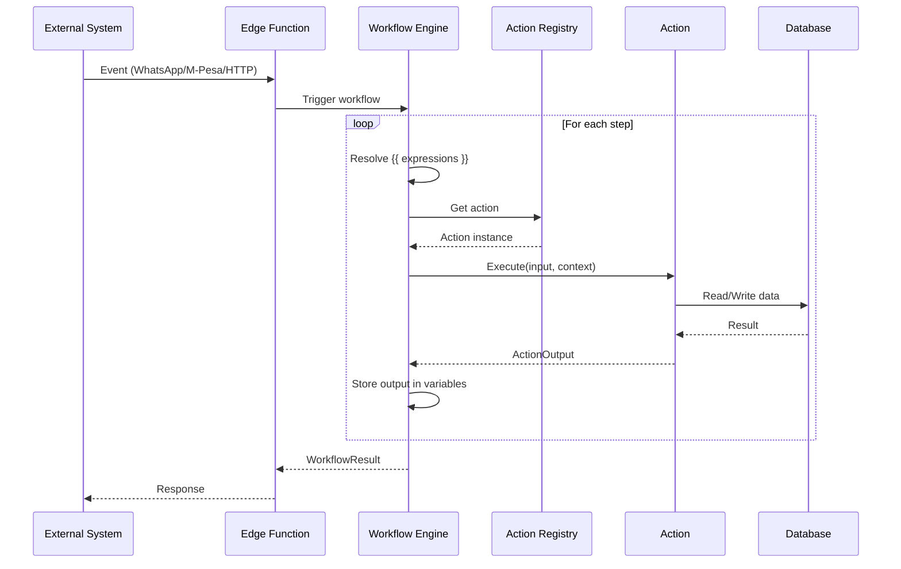

# KCOS System Architecture

## High-Level Overview

## Component Responsibilities

### Ingestion Layer
- **whatsapp-webhook**: Receives WhatsApp messages, verifies signatures, routes to workflows
- **mpesa-callback**: Handles M-Pesa STK Push callbacks, updates payment status
- **http-trigger**: API endpoint for manual/external workflow triggers
- **scheduled-tasks**: Cron-based workflows (reminders, summaries)

### Core Engine
- **Workflow Engine**: Executes workflow definitions step-by-step
- **Action Registry**: Catalog of all available actions
- **Expression Evaluator**: JSONata-based `{{ }}` expression resolution
- **Parser Registry**: Business-type-specific message parsers

### Data Layer
- **commerce_events**: Immutable event log (source of truth)
- **orders/payments/actors**: Operational projections for queries
- **workflow_definitions**: Stored workflow YAML/JSON

## Request Flow

## Key Design Principles

1. **Event Sourcing**: All state changes logged to `commerce_events`
2. **Multi-Tenant**: Every operation scoped by `business_id` with RLS
3. **Composable**: Actions are atomic, workflows wire them together
4. **Declarative**: Workflows defined in YAML, not code
5. **Idempotent**: Actions safe to retry with same input
