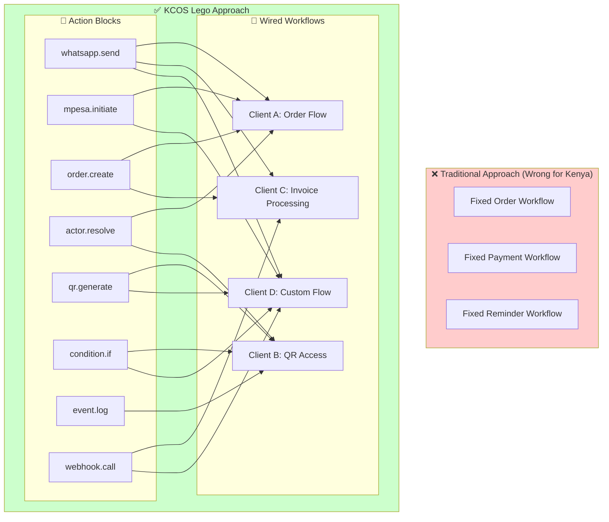
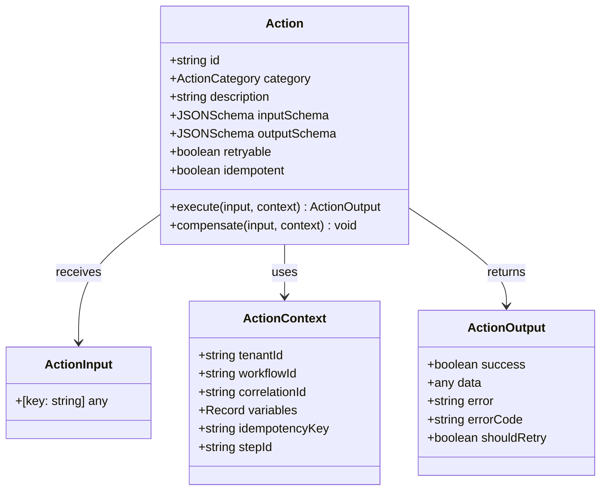
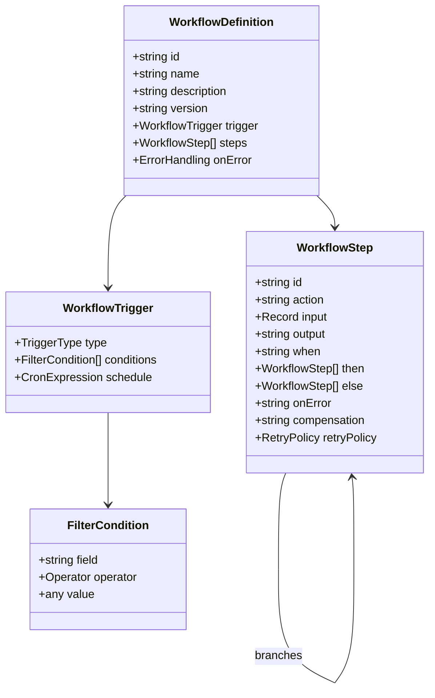
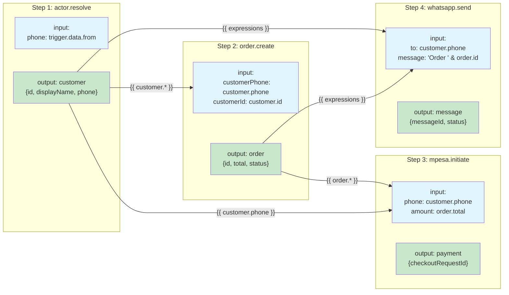
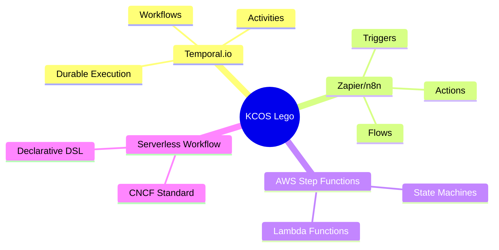

# KCOS Lego Architecture

## The Composability Model

KCOS is built like Lego blocks - infinite workflows from finite, composable actions.

## Action Interface (The Lego Block Shape)

All actions share the same interface - this is what makes them composable:

## Workflow Definition Structure

## Data Flow Between Steps

## Why This Architecture?

| Challenge | How Lego Solves It |
|-----------|-------------------|
| Unknown QR use cases | QR actions wire into ANY workflow |
| Different client flows | Each client defines their own workflow |
| Adding new capabilities | Add new action, all workflows can use it |
| Existing code must work | Edge functions become action wrappers |
| Future requirements | New actions + new workflows = infinite combinations |

## Industry Validation

