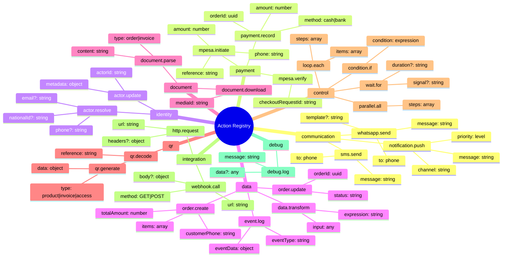
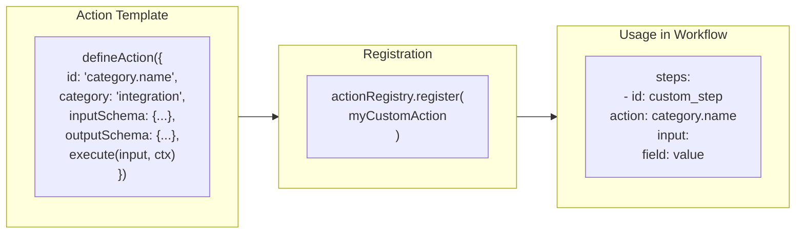

# KCOS Action Registry

## All Available Actions



## Action Categories Explained

```mermaid
flowchart TB
    subgraph COM["📱 COMMUNICATION"]
        direction TB
        WS["whatsapp.send\n─────────────\nSend WhatsApp message\nSupports templates"]
        SS["sms.send\n─────────────\nSend SMS via\nAfrica's Talking"]
        NP["notification.push\n─────────────\nInternal notifications\nto merchant/admin"]
    end

    subgraph PAY["💰 PAYMENT"]
        direction TB
        MI["mpesa.initiate\n─────────────\nSTK Push request\nto customer phone"]
        MV["mpesa.verify\n─────────────\nCheck payment\nstatus"]
        PR["payment.record\n─────────────\nManual payment\ncash/bank/cheque"]
    end

    subgraph IDN["👤 IDENTITY"]
        direction TB
        AR["actor.resolve\n─────────────\nFind or create\nby phone/email/ID"]
        AU["actor.update\n─────────────\nUpdate actor\nmetadata"]
    end

    subgraph DAT["💾 DATA"]
        direction TB
        OC["order.create\n─────────────\nCreate order\nwith items"]
        OU["order.update\n─────────────\nUpdate order\nstatus"]
        EL["event.log\n─────────────\nLog to event\nstore"]
        DT["data.transform\n─────────────\nTransform data\nwith JSONata"]
    end

    subgraph DOC["📄 DOCUMENT"]
        direction TB
        DP["document.parse\n─────────────\nParse text into\nstructured data"]
        DD["document.download\n─────────────\nDownload media\nfrom WhatsApp"]
    end

    subgraph QRC["📲 QR"]
        direction TB
        QG["qr.generate\n─────────────\nGenerate QR code\nwith metadata"]
        QD["qr.decode\n─────────────\nDecode QR\nreference"]
    end

    subgraph CTL["🔀 CONTROL"]
        direction TB
        CI["condition.if\n─────────────\nBranch workflow\nbased on condition"]
        PA["parallel.all\n─────────────\nExecute steps\nin parallel"]
        WF["wait.for\n─────────────\nWait for time\nor signal"]
        LE["loop.each\n─────────────\nIterate over\narray"]
    end

    subgraph INT["🔌 INTEGRATION"]
        direction TB
        WC["webhook.call\n─────────────\nCall external\nwebhook/API"]
        HR["http.request\n─────────────\nGeneric HTTP\nrequest"]
    end
```



## Action Input/Output Schemas

### Communication Actions

```yaml
# whatsapp.send
input:
  to: "254712345678"        # Required: Phone number
  message: "Hello!"         # Required: Message text
  template: "order_confirm" # Optional: Template name
  variables:                # Optional: Template vars
    name: "John"
    
output:
  messageId: "wamid.xxx"
  status: "sent" | "failed" | "queued"

# sms.send
input:
  to: "254712345678"
  message: "Your order is ready" # Max 160 chars
  
output:
  messageId: "ATxxxx"
  status: "sent" | "failed"
```

### Payment Actions

```yaml
# mpesa.initiate
input:
  phone: "254712345678"     # Required: Customer phone
  amount: 1500              # Required: Amount (1-150000)
  reference: "ORD-123"      # Required: Transaction ref
  description: "Order payment"
  
output:
  checkoutRequestId: "ws_CO_xxx"
  merchantRequestId: "xxx"
  status: "initiated" | "failed"

# payment.record
input:
  orderId: "uuid"
  amount: 1500
  method: "cash" | "bank" | "cheque"
  reference: "optional-ref"
  
output:
  paymentId: "uuid"
  newOutstanding: 0
```

### Data Actions

```yaml
# order.create
input:
  customerPhone: "254712345678"
  customerId: "uuid"        # Optional
  items:
    - product: "sukari"
      quantity: 2
      price: 200
  totalAmount: 400
  source: "whatsapp"
  isCredit: false
  
output:
  id: "uuid"
  status: "pending"
  totalAmount: 400
  outstandingAmount: 400
  itemsText: "sukari 2kg"
```

### Control Actions

```yaml
# condition.if
input:
  condition: "{{ order.total > 1000 }}"
  
output:
  result: true | false
  branch: "then" | "else"

# loop.each
input:
  items: "{{ orders }}"
  itemVariable: "order"     # Default: "item"
  indexVariable: "index"
  steps:
    - id: notify
      action: whatsapp.send
      input:
        to: "{{ order.customerPhone }}"
        
output:
  results: [...]
  completedCount: 5
```

## Creating Custom Actions


