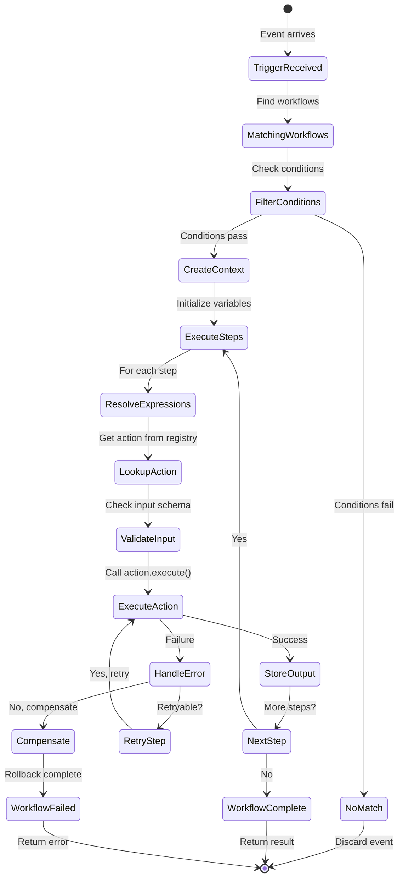
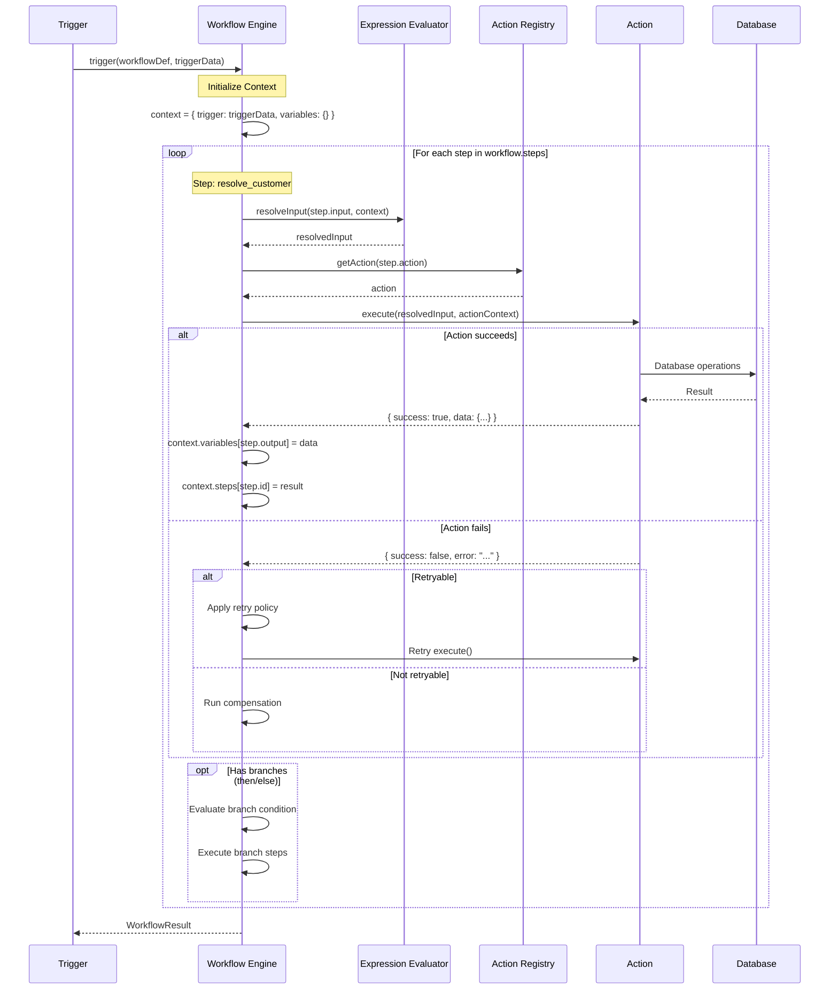
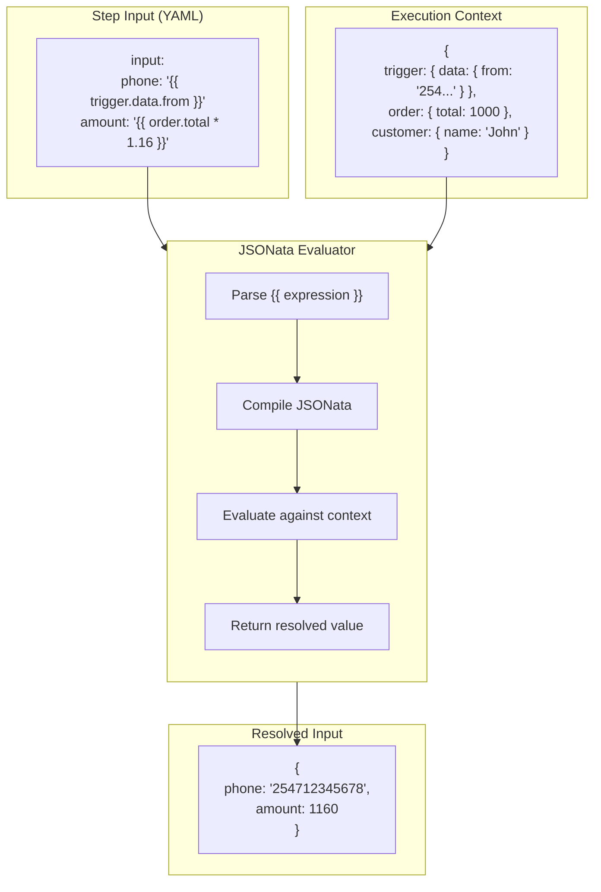
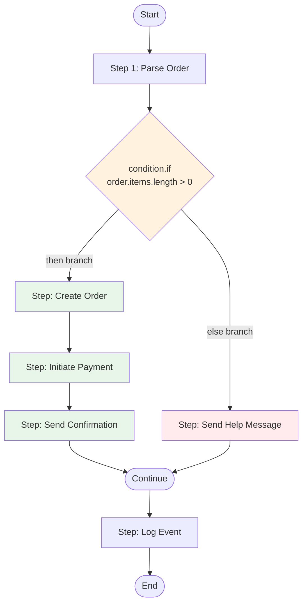
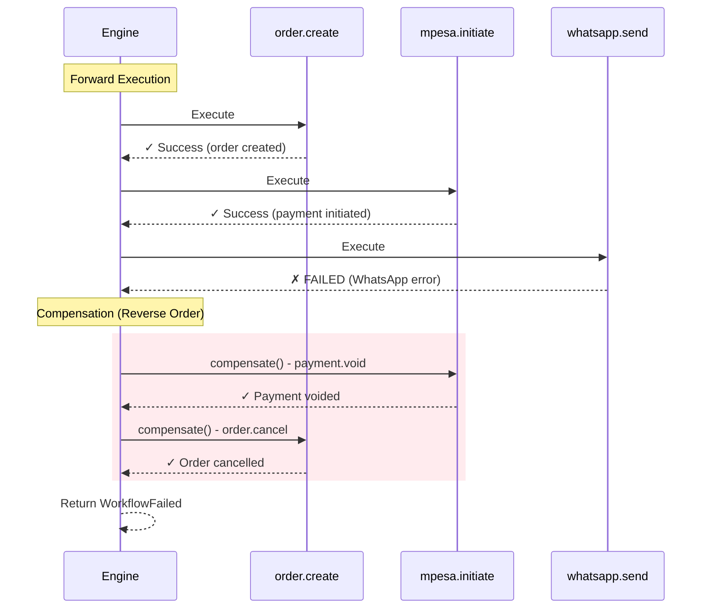
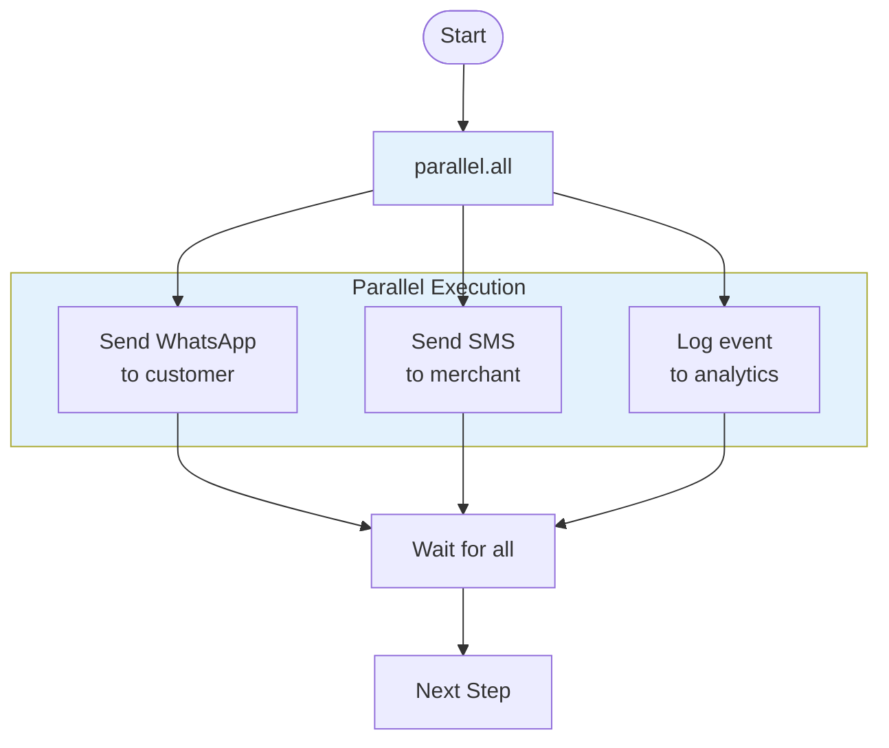
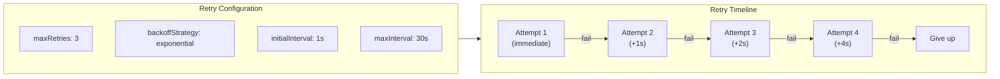

# KCOS Workflow Execution

## Execution Lifecycle

## Step-by-Step Execution

## Expression Resolution

## Branching Logic

## Error Handling & Compensation (Saga Pattern)

## Parallel Execution

## Retry Policy

