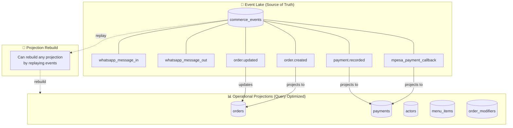
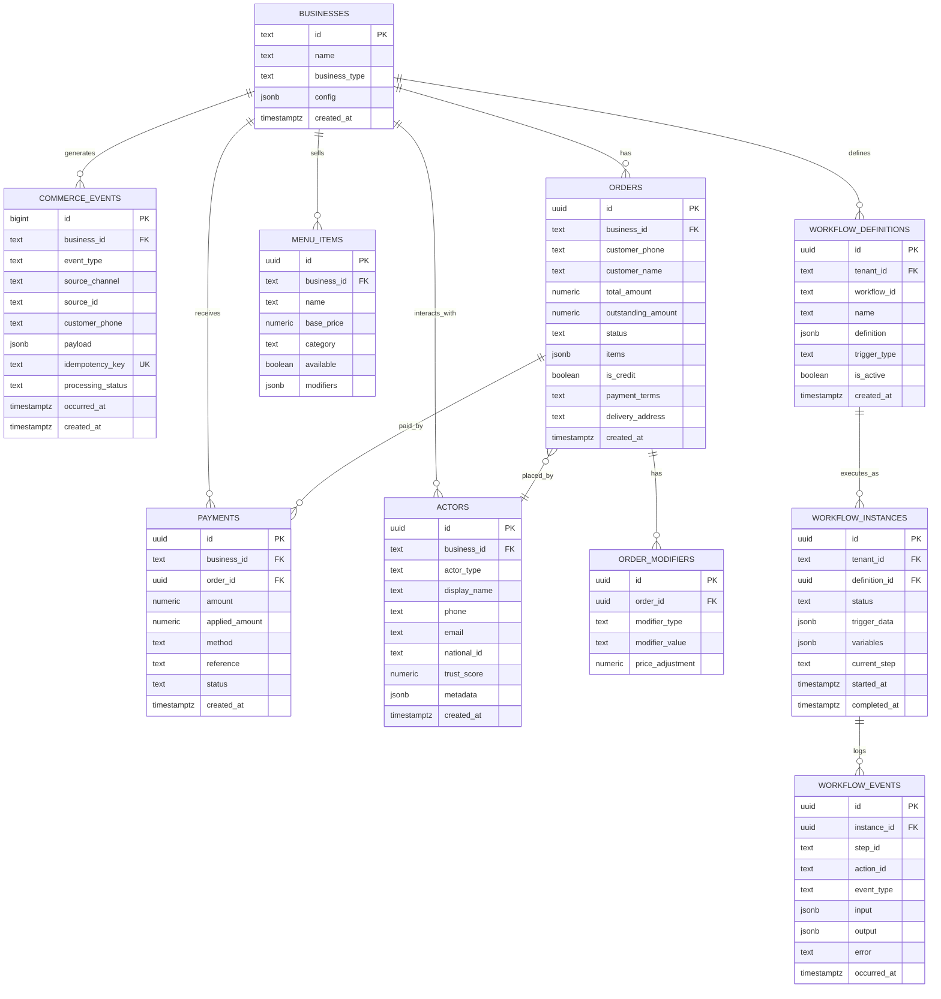
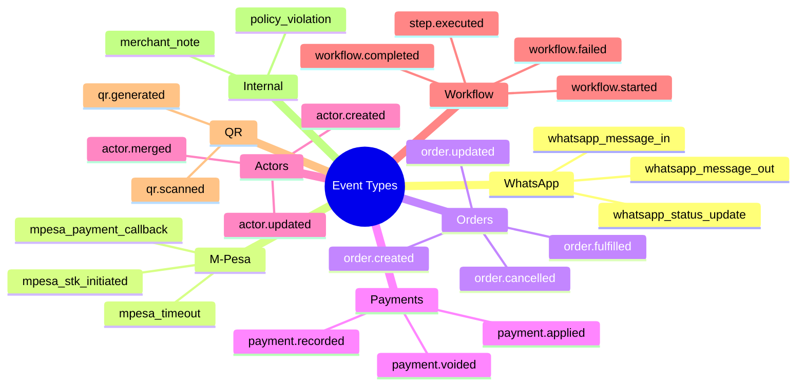
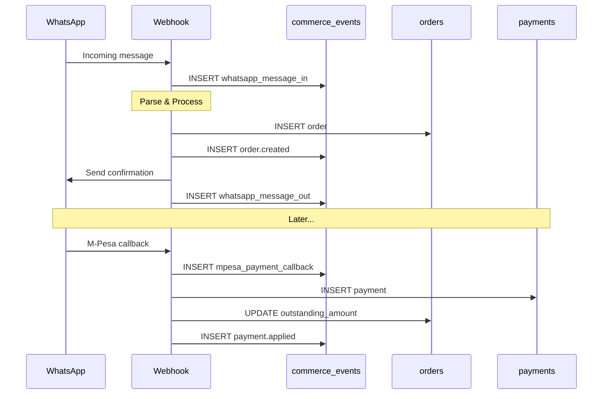

# KCOS Data Architecture

## Event Sourcing Model



## Database Schema



## Event Types



## Data Flow



## Idempotency Pattern

```mermaid
flowchart TB
    subgraph Request["Incoming Request"]
        REQ["Event with source_id: 'wamid_xxx'"]
    end

    subgraph Check["Idempotency Check"]
        Q["SELECT * FROM commerce_events\nWHERE idempotency_key = 'whatsapp:wamid_xxx'"]
    end

    subgraph Decision{Exists?}
    end

    subgraph Skip["Skip Processing"]
        SKIP["Return cached result\nNo side effects"]
    end

    subgraph Process["Process Event"]
        PROC["Execute logic\nINSERT with idempotency_key"]
    end

    REQ --> Check
    Check --> Decision
    Decision -->|Yes| Skip
    Decision -->|No| Process

    style Skip fill:#e8f5e9
    style Process fill:#e3f2fd
```

## Query Patterns

```sql
-- Get all orders for a business (RLS enforced)
SELECT * FROM orders 
WHERE business_id = 'elixosense'
ORDER BY created_at DESC;

-- Get order with payment status
SELECT 
    o.*,
    COALESCE(SUM(p.applied_amount), 0) as total_paid
FROM orders o
LEFT JOIN payments p ON p.order_id = o.id
WHERE o.business_id = 'elixosense'
GROUP BY o.id;

-- Replay events to rebuild state
SELECT * FROM commerce_events
WHERE business_id = 'elixosense'
ORDER BY id ASC;

-- Daily summary
SELECT 
    DATE(created_at) as day,
    COUNT(*) as order_count,
    SUM(total_amount) as total_revenue
FROM orders
WHERE business_id = 'elixosense'
GROUP BY DATE(created_at);
```
