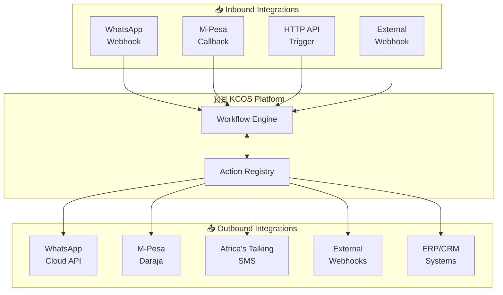
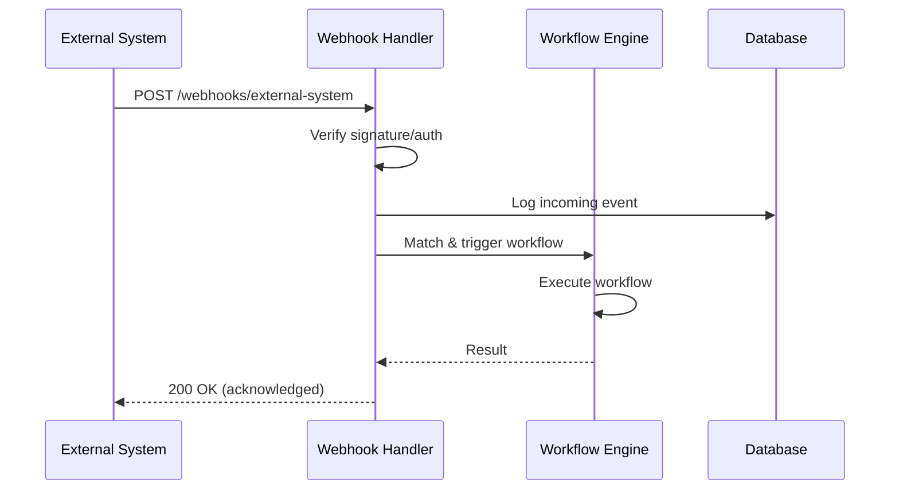
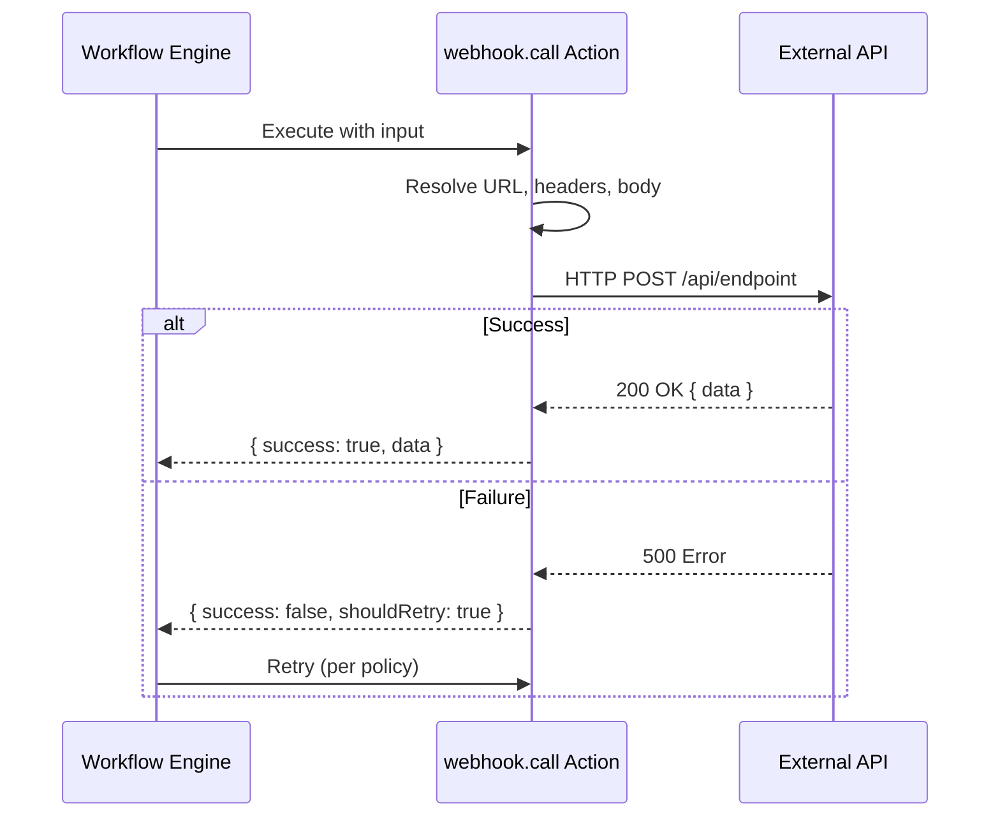
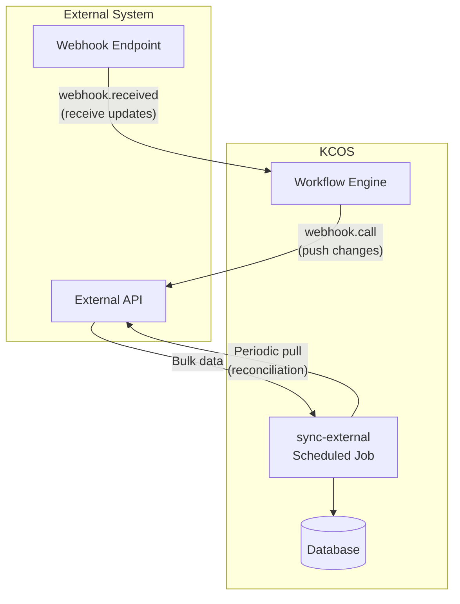
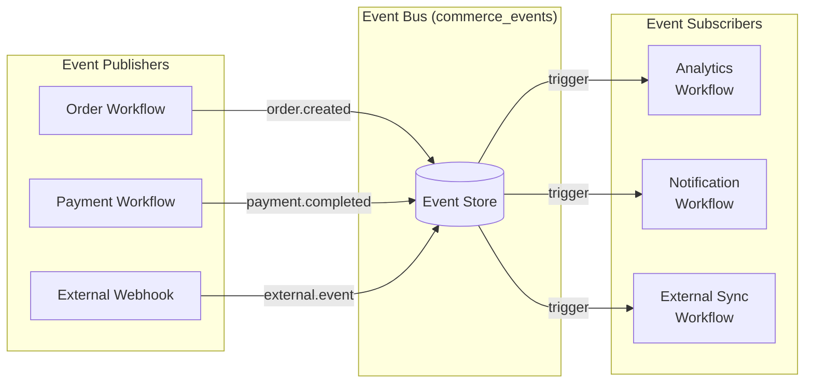
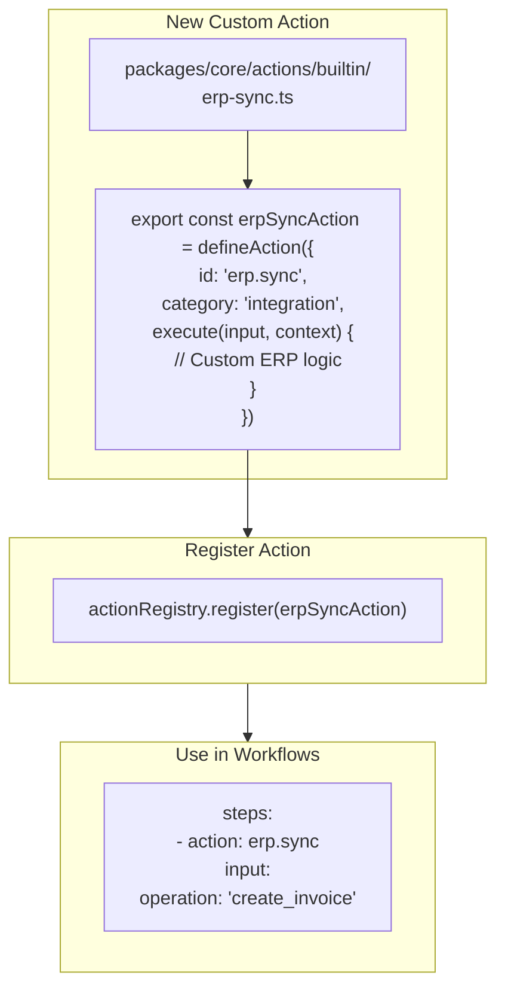
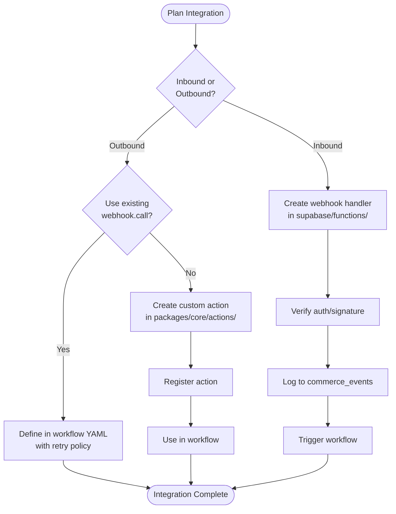

# KCOS Integration Patterns

## Integration Overview



## Pattern 1: Inbound Webhook Integration

Use this when external systems need to trigger KCOS workflows.



### Implementation

```typescript
// supabase/functions/external-webhook/index.ts
Deno.serve(async (req: Request) => {
  // 1. Verify request (signature, API key, etc.)
  const apiKey = req.headers.get('x-api-key');
  if (apiKey !== Deno.env.get('EXTERNAL_API_KEY')) {
    return new Response('Unauthorized', { status: 401 });
  }

  // 2. Parse payload
  const payload = await req.json();

  // 3. Log to event store
  await supabase.from('commerce_events').insert({
    business_id: payload.businessId,
    event_type: 'webhook.external_system',
    payload,
    idempotency_key: `external:${payload.eventId}`,
  });

  // 4. Trigger matching workflow
  await triggerWorkflow('external-system-flow', payload);

  return new Response(JSON.stringify({ status: 'ok' }));
});
```

## Pattern 2: Outbound Webhook (webhook.call)

Use this to push data to external systems from workflows.



### Workflow Usage

```yaml
steps:
  - id: sync_to_erp
    action: webhook.call
    input:
      url: "https://erp.example.com/api/orders"
      method: POST
      headers:
        Authorization: "Bearer {{ tenant.config.erpApiKey }}"
        Content-Type: "application/json"
      body:
        orderId: "{{ order.id }}"
        customerPhone: "{{ customer.phone }}"
        total: "{{ order.total }}"
        items: "{{ order.items }}"
      timeout: 30000
    retryPolicy:
      maxRetries: 3
      backoffStrategy: exponential
      initialInterval: "2s"
```

## Pattern 3: Bi-Directional Sync

For systems that need both push and pull.



### Sync Workflow

```yaml
id: erp-bidirectional-sync
name: ERP Bi-directional Sync
trigger:
  type: schedule.cron
  schedule: "0 */6 * * *"  # Every 6 hours

steps:
  # Pull changes from ERP
  - id: fetch_erp_updates
    action: http.request
    input:
      url: "{{ tenant.config.erpUrl }}/api/changes"
      method: GET
      headers:
        Authorization: "Bearer {{ tenant.config.erpApiKey }}"
      query:
        since: "{{ tenant.config.lastSyncAt }}"
    output: erpChanges

  # Process each change
  - id: process_changes
    action: loop.each
    input:
      items: "{{ erpChanges.data }}"
      itemVariable: "change"
      steps:
        - id: apply_change
          action: data.transform
          input:
            # Map ERP format to KCOS format
            expression: |
              {
                "type": change.entityType,
                "action": change.action,
                "data": change.payload
              }
```

## Pattern 4: Event Bridge (Pub/Sub)

For loose coupling with multiple subscribers.



### Event-Triggered Workflow

```yaml
id: on-order-created-sync
name: Sync Order to External Systems
trigger:
  type: event.emitted
  conditions:
    - field: "{{ data.event_type }}"
      operator: equals
      value: "order.created"

steps:
  - id: notify_warehouse
    action: webhook.call
    input:
      url: "{{ tenant.config.warehouseWebhook }}"
      body:
        orderId: "{{ trigger.data.payload.orderId }}"
        items: "{{ trigger.data.payload.items }}"

  - id: update_analytics
    action: webhook.call
    input:
      url: "{{ tenant.config.analyticsEndpoint }}"
      body:
        event: "new_order"
        value: "{{ trigger.data.payload.total }}"
```

## Pattern 5: Custom Integration Action

Create a dedicated action for complex integrations.



### Custom Action Template

```typescript
// packages/core/actions/builtin/erp-sync.ts
import { defineAction, success, failure } from '../helpers';

export const erpSyncAction = defineAction({
  id: 'erp.sync',
  category: 'integration',
  description: 'Sync data with external ERP system',
  
  inputSchema: {
    type: 'object',
    required: ['operation', 'data'],
    properties: {
      operation: {
        type: 'string',
        enum: ['create_order', 'update_inventory', 'create_invoice']
      },
      data: { type: 'object' }
    }
  },
  
  outputSchema: {
    type: 'object',
    properties: {
      erpId: { type: 'string' },
      status: { type: 'string' }
    }
  },
  
  retryable: true,
  idempotent: true,
  
  async execute(input, context) {
    const erpUrl = process.env.ERP_API_URL;
    const erpKey = process.env.ERP_API_KEY;
    
    try {
      const response = await fetch(`${erpUrl}/${input.operation}`, {
        method: 'POST',
        headers: {
          'Authorization': `Bearer ${erpKey}`,
          'Content-Type': 'application/json',
          'X-Tenant-ID': context.tenantId,
          'X-Idempotency-Key': context.idempotencyKey
        },
        body: JSON.stringify(input.data)
      });
      
      if (!response.ok) {
        return failure(`ERP error: ${response.status}`, {
          shouldRetry: response.status >= 500
        });
      }
      
      const result = await response.json();
      return success({
        erpId: result.id,
        status: result.status
      });
    } catch (error) {
      return failure(error.message, { shouldRetry: true });
    }
  }
});
```

## Integration Checklist


