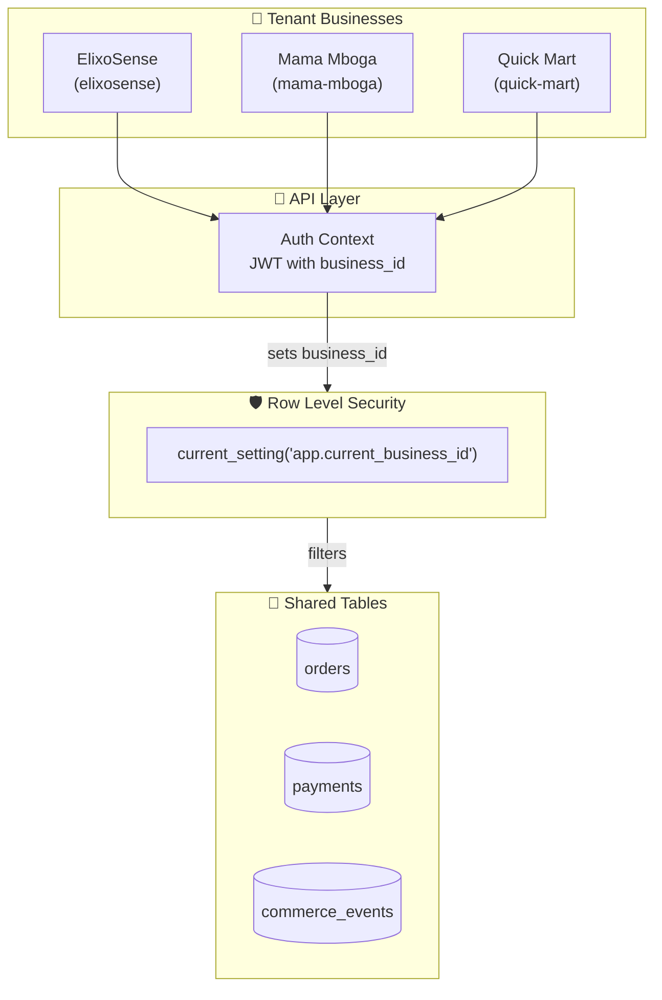
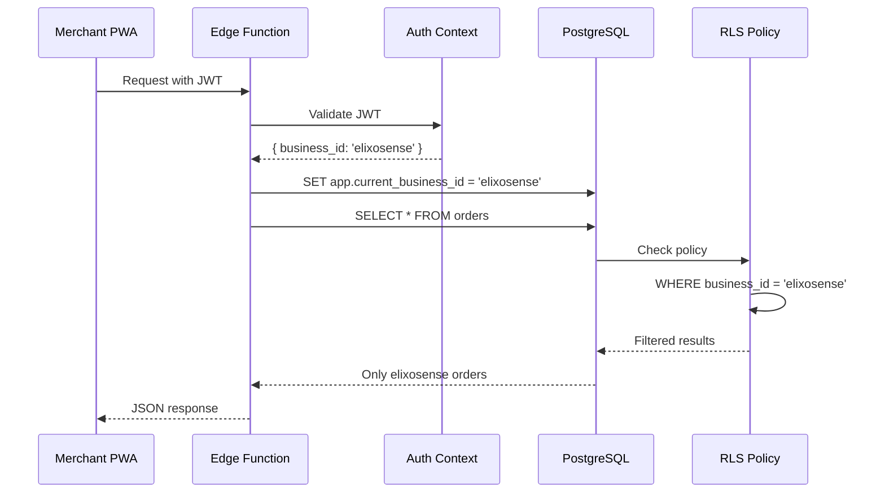
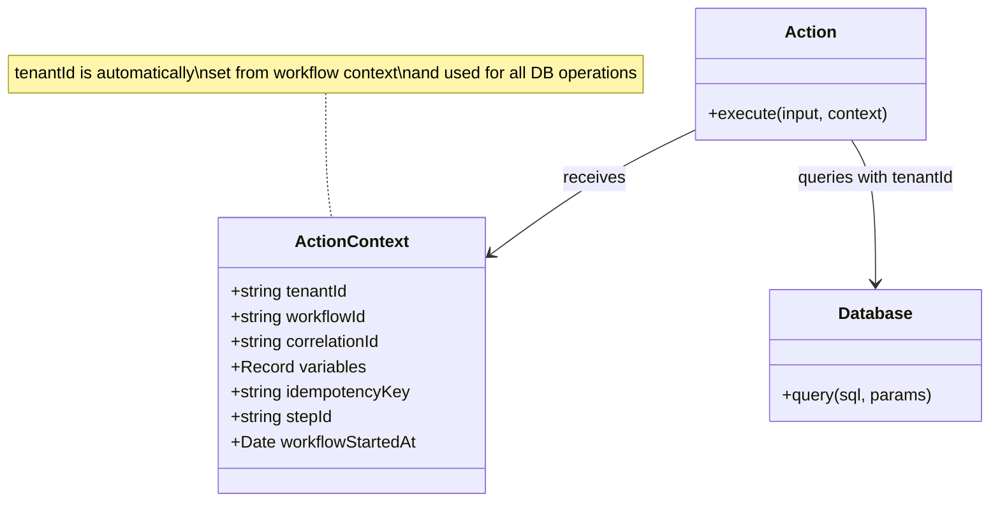
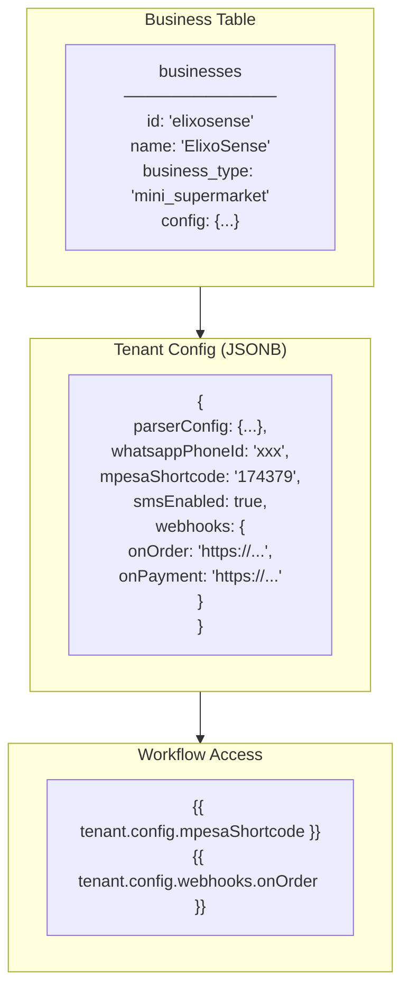
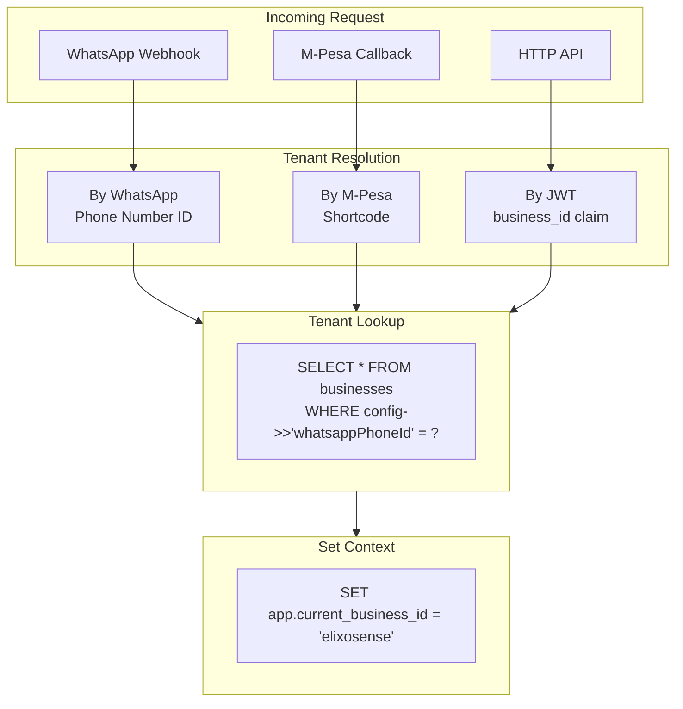
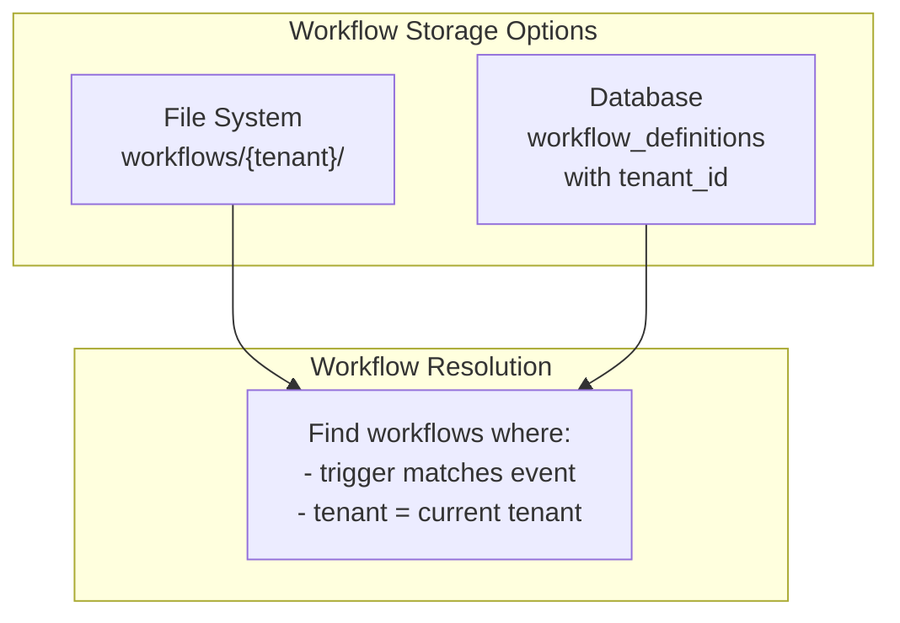
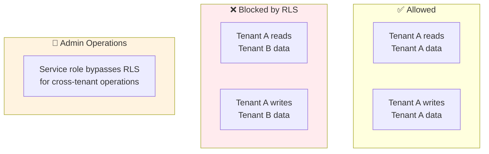
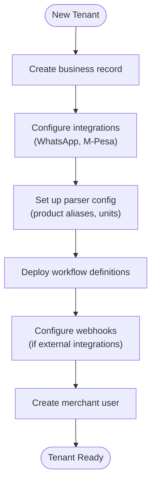

# KCOS Multi-Tenant Architecture

## Tenant Isolation Model



## RLS Policy Implementation



## Database Policies

```sql
-- All tables have business_id column
ALTER TABLE orders ADD COLUMN business_id TEXT NOT NULL;
ALTER TABLE payments ADD COLUMN business_id TEXT NOT NULL;
ALTER TABLE commerce_events ADD COLUMN business_id TEXT NOT NULL;
ALTER TABLE workflow_definitions ADD COLUMN tenant_id TEXT NOT NULL;

-- Enable RLS on all tables
ALTER TABLE orders ENABLE ROW LEVEL SECURITY;
ALTER TABLE payments ENABLE ROW LEVEL SECURITY;
ALTER TABLE commerce_events ENABLE ROW LEVEL SECURITY;
ALTER TABLE workflow_definitions ENABLE ROW LEVEL SECURITY;

-- Isolation policies
CREATE POLICY tenant_isolation_orders ON orders
    FOR ALL
    USING (business_id = current_setting('app.current_business_id', true));

CREATE POLICY tenant_isolation_payments ON payments
    FOR ALL
    USING (business_id = current_setting('app.current_business_id', true));

CREATE POLICY tenant_isolation_events ON commerce_events
    FOR ALL
    USING (business_id = current_setting('app.current_business_id', true));

CREATE POLICY tenant_isolation_workflows ON workflow_definitions
    FOR ALL
    USING (tenant_id = current_setting('app.current_tenant_id', true));
```

## Tenant Context in Actions



### Action Using Tenant Context

```typescript
async execute(input: ActionInput, context: ActionContext): Promise<ActionOutput> {
  const supabase = getSupabaseClient();
  
  // All queries automatically scoped by context.tenantId
  const { data, error } = await supabase
    .from('orders')
    .insert({
      business_id: context.tenantId,  // Always use context
      customer_phone: input.customerPhone,
      total_amount: input.totalAmount,
    })
    .select()
    .single();

  // tenantId also used for idempotency
  return withIdempotency(
    context.tenantId,
    context.idempotencyKey,
    'order.create',
    input,
    async () => { /* ... */ }
  );
}
```

## Per-Tenant Configuration



## Tenant Resolution Flow



## Multi-Tenant Workflow Definitions

```yaml
# workflows/elixosense/order-flow.yaml
id: elixosense-order
tenant: elixosense  # Explicit tenant binding

# workflows/mama-mboga/order-flow.yaml  
id: mama-mboga-order
tenant: mama-mboga

# Or stored in database with tenant_id
```



## Cross-Tenant Considerations



## Tenant Onboarding Checklist


