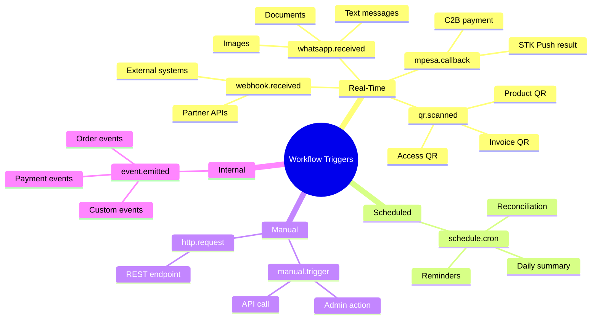
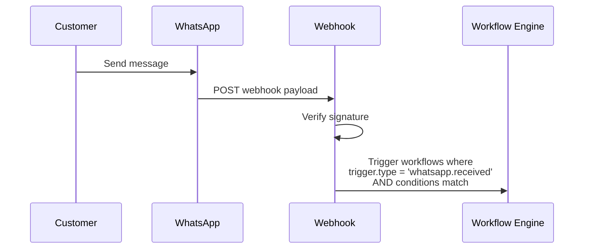
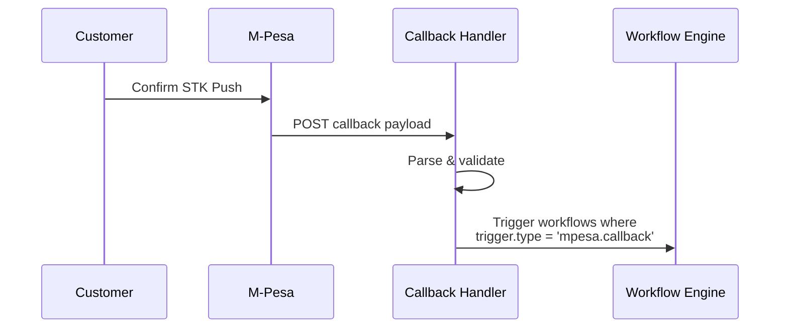
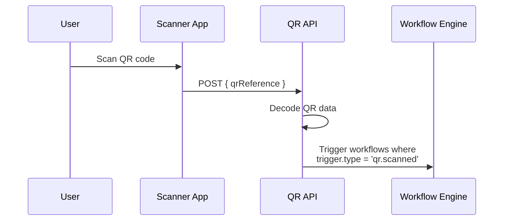
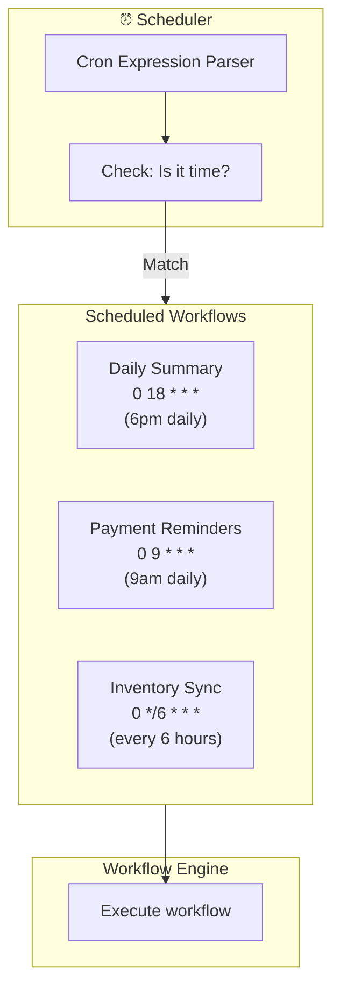
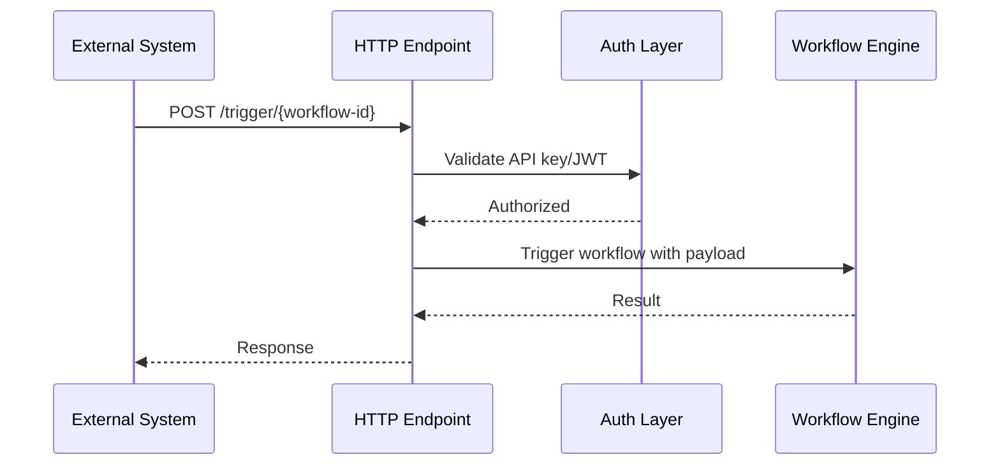
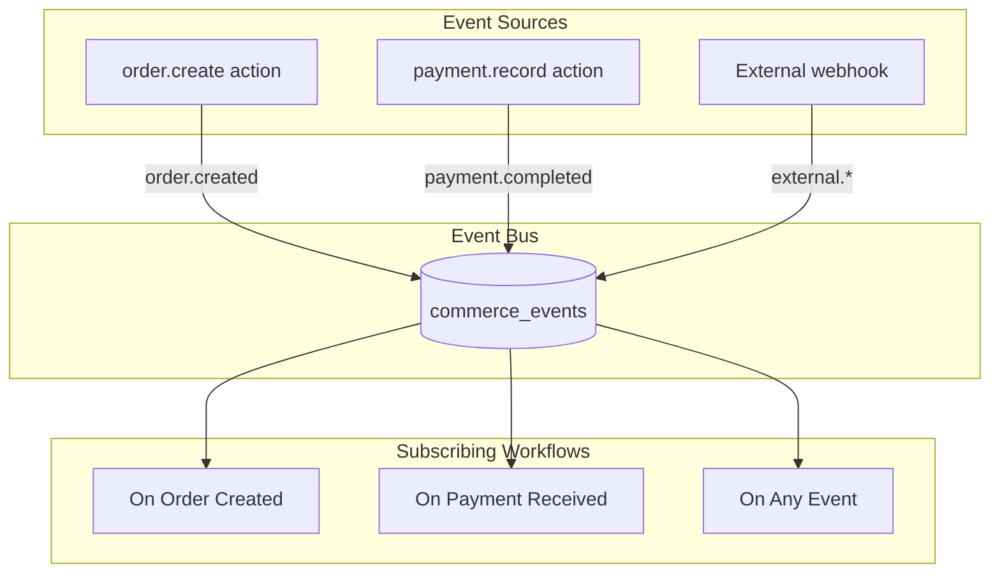
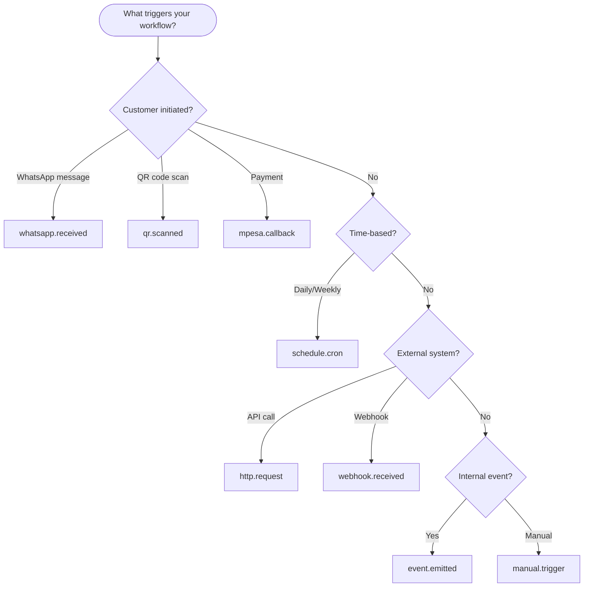

# KCOS Trigger Catalog

## All Available Triggers



## Trigger Details

### whatsapp.received



#### Trigger Schema

```yaml
trigger:
  type: whatsapp.received
  conditions:
    # Filter by message type
    - field: "{{ data.type }}"
      operator: equals
      value: "text"
    
    # Filter by content keywords
    - field: "{{ data.text }}"
      operator: contains
      value: ["nataka", "order", "oda"]
    
    # Filter by sender (optional)
    - field: "{{ data.from }}"
      operator: matches
      value: "^254"

# Available in trigger context:
# trigger.data.id       - Message ID
# trigger.data.from     - Sender phone
# trigger.data.text     - Message body (if text)
# trigger.data.type     - Message type (text, document, image)
# trigger.data.document - Document info (if document)
# trigger.timestamp     - When received
```

### mpesa.callback



#### Trigger Schema

```yaml
trigger:
  type: mpesa.callback
  conditions:
    # Only successful payments
    - field: "{{ data.ResultCode }}"
      operator: equals
      value: 0
    
    # Optional: specific amount range
    - field: "{{ data.Amount }}"
      operator: gt
      value: 100

# Available in trigger context:
# trigger.data.ResultCode        - 0 = success
# trigger.data.Amount            - Payment amount
# trigger.data.MpesaReceiptNumber - Receipt ID
# trigger.data.TransactionDate   - When paid
# trigger.data.PhoneNumber       - Payer phone
# trigger.data.CheckoutRequestID - Original request ID
```

### qr.scanned



#### Trigger Schema

```yaml
trigger:
  type: qr.scanned
  conditions:
    # Filter by QR type
    - field: "{{ data.qrType }}"
      operator: equals
      value: "product"  # or: invoice, access, shop, menu

# Available in trigger context:
# trigger.data.reference   - KCOS QR reference
# trigger.data.qrType      - Type of QR
# trigger.data.businessId  - Owning business
# trigger.data.payload     - Embedded data
# trigger.data.scannedAt   - Timestamp
# trigger.data.scannerId   - Who scanned (if known)
```

### schedule.cron



#### Trigger Schema

```yaml
trigger:
  type: schedule.cron
  schedule: "0 18 * * *"  # CRON expression

# Common schedules:
# "0 9 * * *"     - Daily at 9am
# "0 18 * * *"    - Daily at 6pm
# "0 */6 * * *"   - Every 6 hours
# "0 9 * * 1"     - Mondays at 9am
# "*/15 * * * *"  - Every 15 minutes

# Available in trigger context:
# trigger.scheduledAt - When triggered
# trigger.timezone    - Configured timezone (Africa/Nairobi)
```

### http.request



#### Trigger Schema

```yaml
trigger:
  type: http.request
  # No conditions - triggered directly via API

# Available in trigger context:
# trigger.data.*       - Request body fields
# trigger.headers.*    - Request headers
# trigger.method       - HTTP method
# trigger.path         - Request path
```

### event.emitted



#### Trigger Schema

```yaml
trigger:
  type: event.emitted
  conditions:
    - field: "{{ data.event_type }}"
      operator: equals
      value: "order.created"

# Available in trigger context:
# trigger.data.event_type   - Event type
# trigger.data.payload      - Event payload
# trigger.data.occurred_at  - When event occurred
# trigger.data.source       - Event source
```

## Trigger Selection Guide



## Filter Condition Operators

| Operator | Description | Example |
|----------|-------------|---------|
| `equals` | Exact match | `{{ data.type }}` equals `"text"` |
| `contains` | Contains substring/item | `{{ data.text }}` contains `["order", "oda"]` |
| `matches` | Regex match | `{{ data.from }}` matches `"^254"` |
| `gt` | Greater than | `{{ data.amount }}` gt `100` |
| `lt` | Less than | `{{ data.amount }}` lt `10000` |
| `in` | In array | `{{ data.status }}` in `["pending", "partial"]` |

## Multiple Triggers Example

```yaml
# A workflow can only have ONE trigger
# For multiple entry points, create separate workflows 
# that call a shared workflow

# workflows/order-via-whatsapp.yaml
id: order-via-whatsapp
trigger:
  type: whatsapp.received
steps:
  - id: process
    action: workflow.call
    input:
      workflowId: shared-order-processing
      data: "{{ trigger.data }}"

# workflows/order-via-api.yaml
id: order-via-api
trigger:
  type: http.request
steps:
  - id: process
    action: workflow.call
    input:
      workflowId: shared-order-processing
      data: "{{ trigger.data }}"
```
