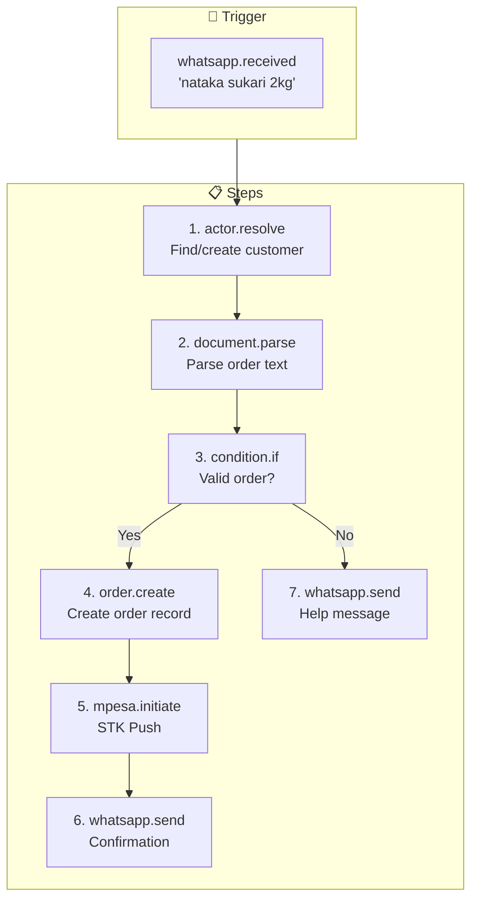
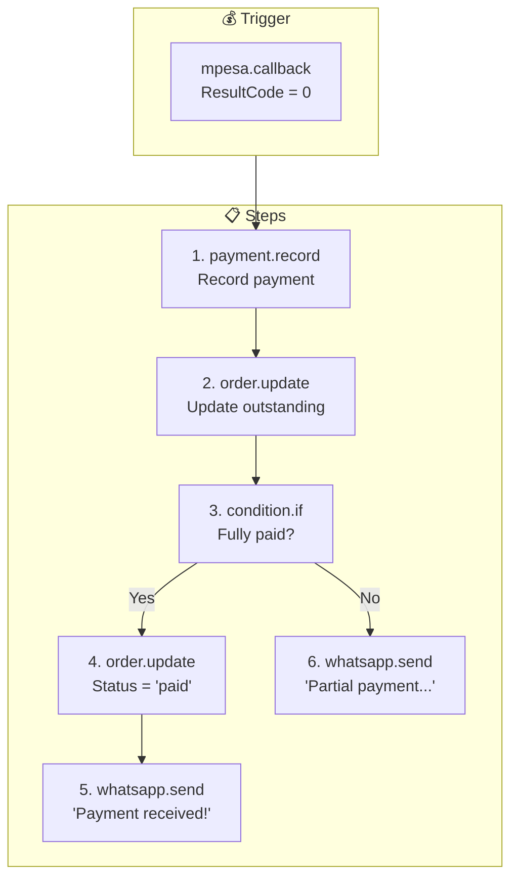
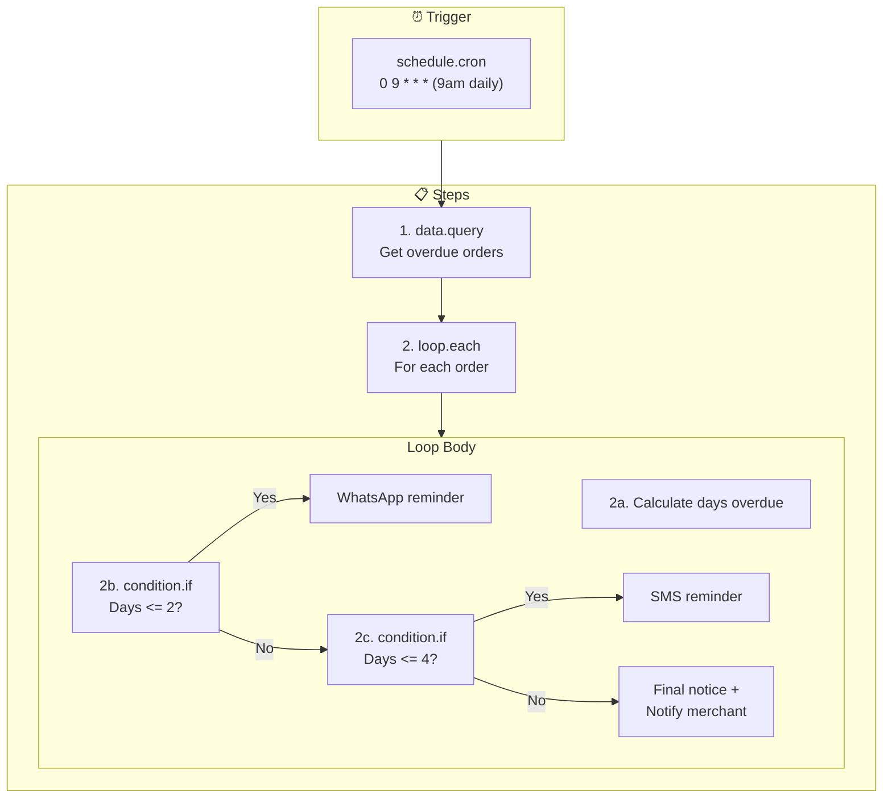
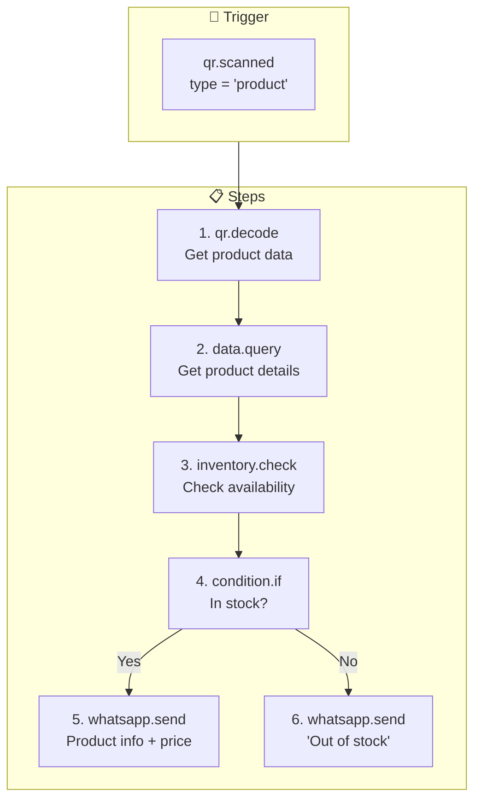
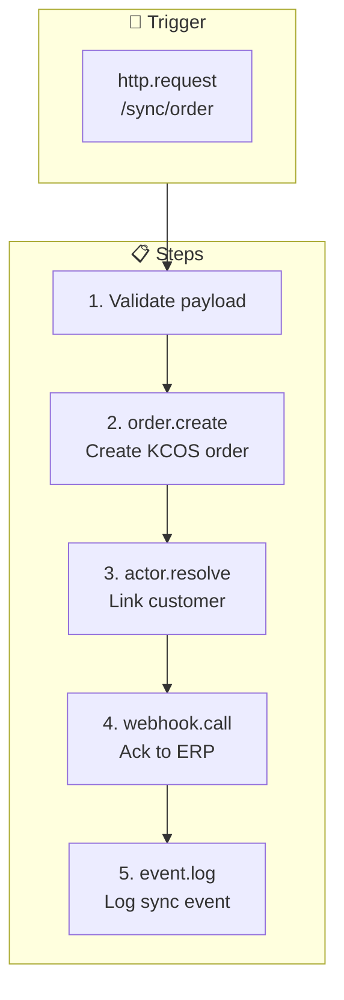
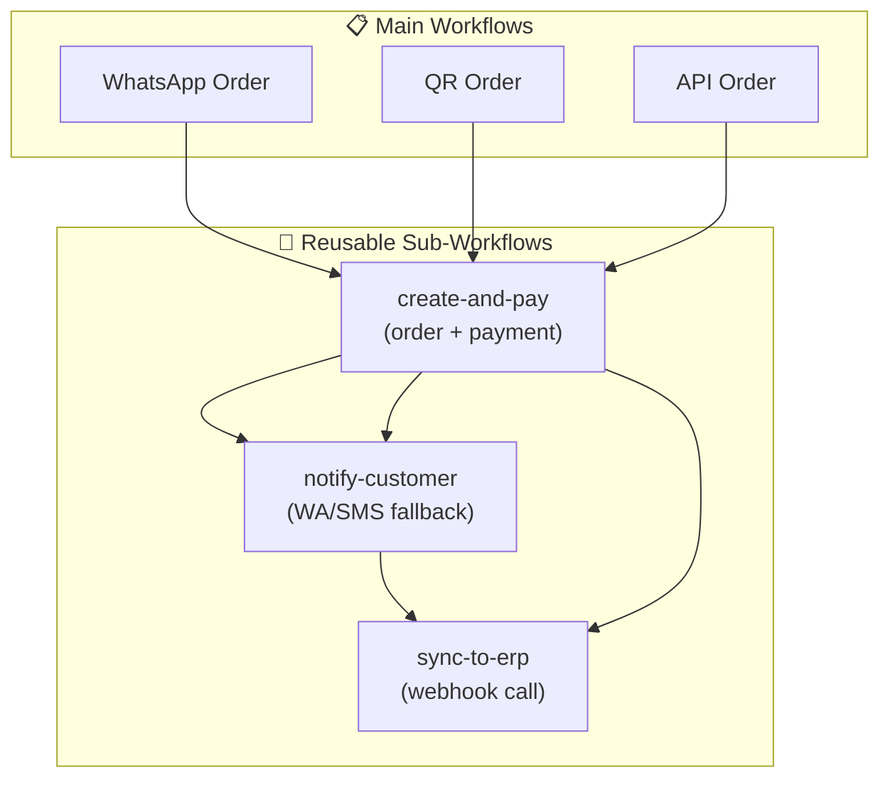

# KCOS Example Workflows

## Workflow Pattern Library

This document provides reusable workflow patterns for common Kenyan commerce scenarios.

---

## Pattern 1: WhatsApp Order Flow



### Full YAML

```yaml
id: whatsapp-order-flow
name: WhatsApp Order Processing
description: Process orders from WhatsApp messages
version: "1.0"
tags: [order, whatsapp, retail]

trigger:
  type: whatsapp.received
  conditions:
    - field: "{{ data.type }}"
      operator: equals
      value: "text"

steps:
  - id: resolve_customer
    action: actor.resolve
    input:
      phone: "{{ trigger.data.from }}"
    output: customer

  - id: parse_order
    action: document.parse
    input:
      content: "{{ trigger.data.text }}"
      type: "order"
      config: "{{ tenant.config.parserConfig }}"
    output: parsed

  - id: check_order
    action: condition.if
    input:
      condition: "{{ parsed.confidence >= 0.6 and $count(parsed.items) > 0 }}"
    then:
      - id: create_order
        action: order.create
        input:
          customerPhone: "{{ customer.phone }}"
          customerId: "{{ customer.id }}"
          items: "{{ parsed.items }}"
          totalAmount: "{{ parsed.total }}"
          source: "whatsapp"
        output: order
        compensation: order.cancel

      - id: initiate_payment
        action: mpesa.initiate
        input:
          phone: "{{ customer.phone }}"
          amount: "{{ order.totalAmount }}"
          reference: "{{ order.id }}"
        retryPolicy:
          maxRetries: 2
          backoffStrategy: exponential
          initialInterval: "2s"

      - id: send_confirmation
        action: whatsapp.send
        input:
          to: "{{ customer.phone }}"
          message: |
            Asante {{ customer.displayName }}! 
            Oda yako: {{ order.itemsText }}
            Jumla: KSh {{ order.totalAmount }}
            Subiri M-Pesa prompt.

    else:
      - id: send_help
        action: whatsapp.send
        input:
          to: "{{ trigger.data.from }}"
          message: |
            Samahani, sijaelewa oda yako.
            Andika kama: sukari 2kg, maziwa 1 lita

onError:
  strategy: compensate
```

---

## Pattern 2: Payment Confirmation Flow



### Full YAML

```yaml
id: payment-confirmation
name: M-Pesa Payment Confirmation
trigger:
  type: mpesa.callback
  conditions:
    - field: "{{ data.ResultCode }}"
      operator: equals
      value: 0

steps:
  - id: record_payment
    action: payment.record
    input:
      reference: "{{ trigger.data.CheckoutRequestID }}"
      amount: "{{ trigger.data.Amount }}"
      method: "mpesa"
      mpesaReceipt: "{{ trigger.data.MpesaReceiptNumber }}"
    output: payment

  - id: get_order
    action: data.query
    input:
      table: "orders"
      filter:
        id: "{{ payment.orderId }}"
    output: order

  - id: check_fully_paid
    action: condition.if
    input:
      condition: "{{ order.outstandingAmount <= 0 }}"
    then:
      - id: mark_paid
        action: order.update
        input:
          orderId: "{{ order.id }}"
          status: "paid"

      - id: notify_paid
        action: whatsapp.send
        input:
          to: "{{ order.customerPhone }}"
          message: |
            Asante! Malipo ya KSh {{ payment.amount }} tumepokea.
            Receipt: {{ trigger.data.MpesaReceiptNumber }}
            Oda yako iko tayari!

    else:
      - id: notify_partial
        action: whatsapp.send
        input:
          to: "{{ order.customerPhone }}"
          message: |
            Tumepokea KSh {{ payment.amount }}.
            Baki: KSh {{ order.outstandingAmount }}
```

---

## Pattern 3: Daily Payment Reminders



### Full YAML

```yaml
id: payment-reminders
name: Escalating Payment Reminders
trigger:
  type: schedule.cron
  schedule: "0 9 * * *"

steps:
  - id: get_overdue
    action: data.query
    input:
      table: "orders"
      filter:
        status: ["pending", "partial"]
        outstanding_amount_gt: 0
        created_at_lt: "{{ $now() - 'P1D' }}"
    output: overdueOrders

  - id: process_reminders
    action: loop.each
    input:
      items: "{{ overdueOrders }}"
      itemVariable: "order"
      steps:
        - id: calc_days
          action: data.transform
          input:
            expression: "{{ $floor(($now() - $toMillis(order.created_at)) / 86400000) }}"
          output: daysOverdue

        - id: choose_channel
          action: condition.if
          input:
            condition: "{{ daysOverdue <= 2 }}"
          then:
            - id: wa_reminder
              action: whatsapp.send
              input:
                to: "{{ order.customer_phone }}"
                message: |
                  Habari! Una deni ya KSh {{ order.outstanding_amount }}.
                  Tafadhali lipa leo kupitia M-Pesa.
          else:
            - id: check_day_4
              action: condition.if
              input:
                condition: "{{ daysOverdue <= 4 }}"
              then:
                - id: sms_reminder
                  action: sms.send
                  input:
                    to: "{{ order.customer_phone }}"
                    message: "UKUMBUSHO: Deni KSh {{ order.outstanding_amount }}. Lipa sasa."
              else:
                - id: final_notice
                  action: whatsapp.send
                  input:
                    to: "{{ order.customer_phone }}"
                    message: "ONYO LA MWISHO: Deni KSh {{ order.outstanding_amount }}."

                - id: alert_merchant
                  action: notification.push
                  input:
                    channel: "merchant"
                    priority: "high"
                    message: "Customer {{ order.customer_phone }} - {{ daysOverdue }} days overdue"

onError:
  strategy: ignore  # Continue with other orders
```

---

## Pattern 4: QR Product Scan



### Full YAML

```yaml
id: qr-product-scan
name: QR Product Lookup
trigger:
  type: qr.scanned
  conditions:
    - field: "{{ data.qrType }}"
      operator: equals
      value: "product"

steps:
  - id: decode_qr
    action: qr.decode
    input:
      reference: "{{ trigger.data.reference }}"
    output: qrData

  - id: get_product
    action: data.query
    input:
      table: "menu_items"
      filter:
        id: "{{ qrData.productId }}"
    output: product

  - id: check_stock
    action: condition.if
    input:
      condition: "{{ product.available and product.stock > 0 }}"
    then:
      - id: show_product
        action: whatsapp.send
        input:
          to: "{{ trigger.data.scannerPhone }}"
          message: |
            📦 {{ product.name }}
            💰 KSh {{ product.base_price }}
            ✅ In stock
            
            Reply 'ORDER {{ product.name }}' to purchase.
    else:
      - id: out_of_stock
        action: whatsapp.send
        input:
          to: "{{ trigger.data.scannerPhone }}"
          message: |
            📦 {{ product.name }}
            ❌ Currently out of stock
            
            We'll notify you when available.
```

---

## Pattern 5: External System Sync



### Full YAML

```yaml
id: erp-order-sync
name: ERP Order Sync
description: Receive orders from external ERP
trigger:
  type: http.request

steps:
  - id: validate
    action: condition.if
    input:
      condition: "{{ trigger.data.orderId and trigger.data.items }}"
    then:
      - id: create_order
        action: order.create
        input:
          externalId: "{{ trigger.data.orderId }}"
          customerPhone: "{{ trigger.data.customerPhone }}"
          items: "{{ trigger.data.items }}"
          totalAmount: "{{ trigger.data.total }}"
          source: "erp_sync"
        output: order

      - id: resolve_customer
        action: actor.resolve
        input:
          phone: "{{ trigger.data.customerPhone }}"
          metadata:
            erpCustomerId: "{{ trigger.data.erpCustomerId }}"
        output: customer

      - id: ack_erp
        action: webhook.call
        input:
          url: "{{ tenant.config.erpAckUrl }}"
          method: POST
          body:
            erpOrderId: "{{ trigger.data.orderId }}"
            kcosOrderId: "{{ order.id }}"
            status: "synced"

      - id: log_sync
        action: event.log
        input:
          eventType: "erp.order_synced"
          eventData:
            erpOrderId: "{{ trigger.data.orderId }}"
            kcosOrderId: "{{ order.id }}"

    else:
      - id: reject_invalid
        action: webhook.call
        input:
          url: "{{ tenant.config.erpAckUrl }}"
          body:
            status: "rejected"
            reason: "Missing required fields"
```

---

## Workflow Composition


