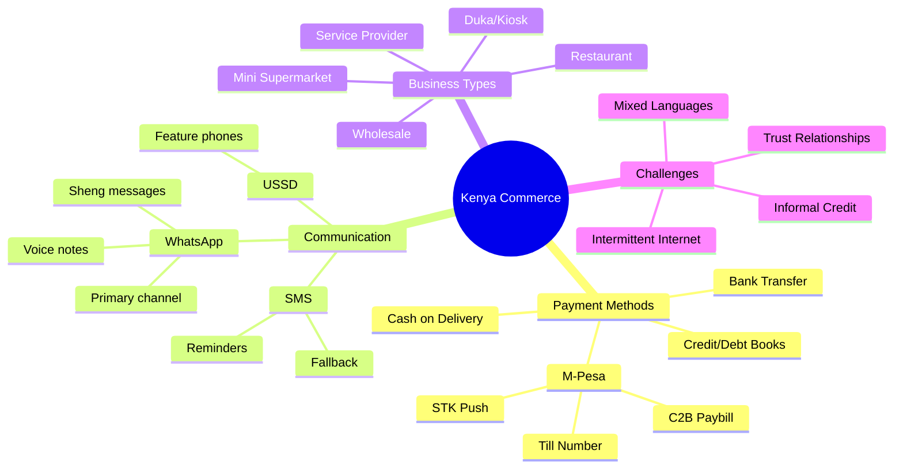
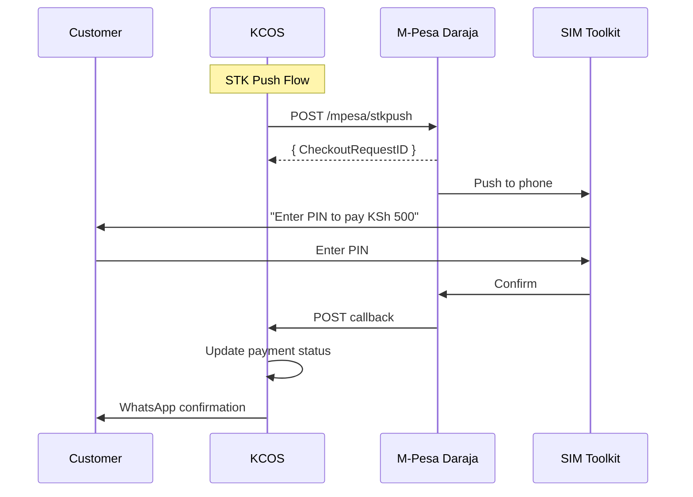
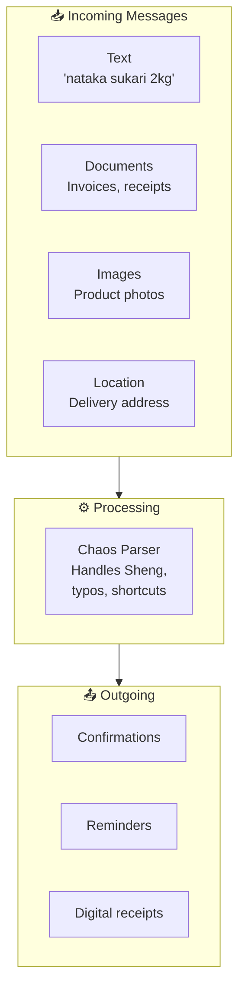
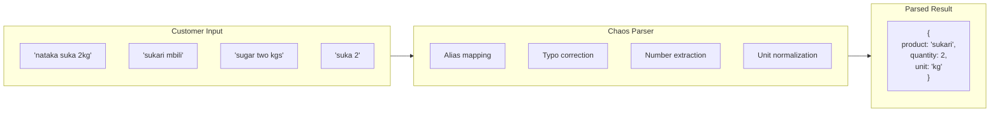
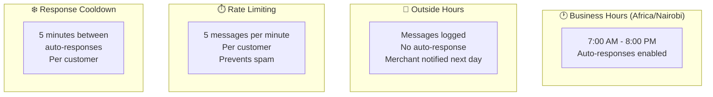
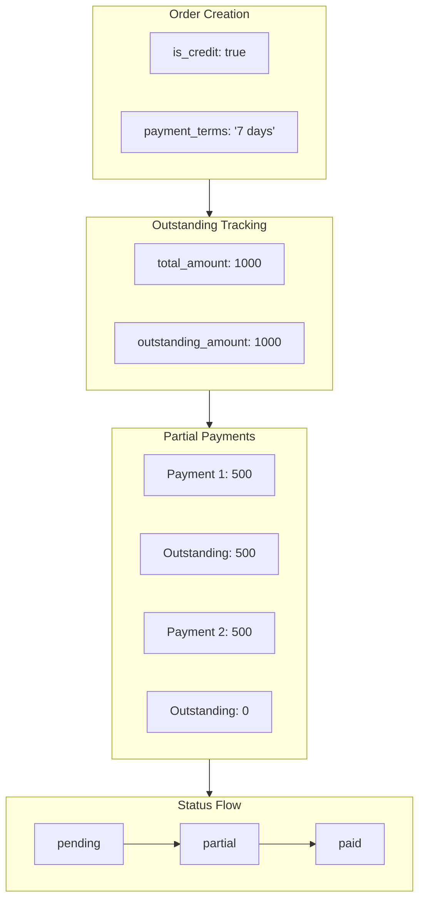
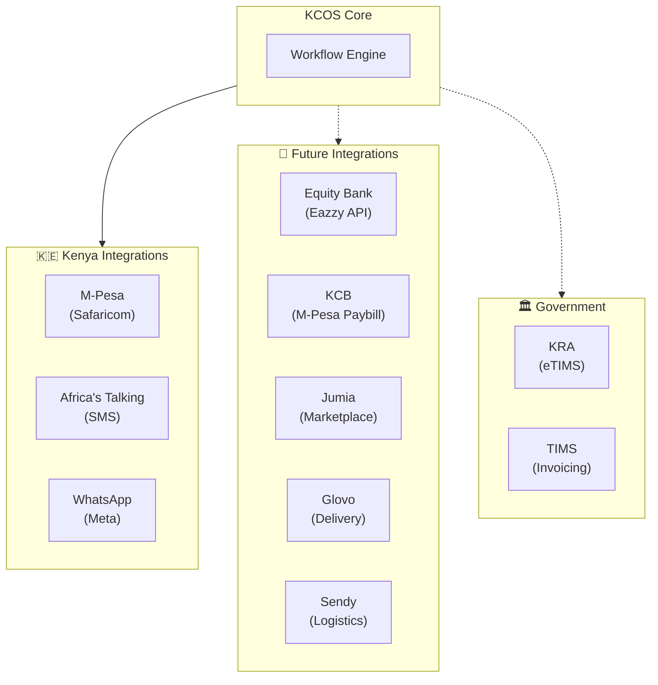

# KCOS Kenya Context

## Kenya Commerce Landscape



## M-Pesa Integration



### M-Pesa Specifics

| Parameter | Value | Notes |
|-----------|-------|-------|
| Min Amount | KSh 1 | |
| Max Amount | KSh 150,000 | Per transaction |
| Phone Format | 254XXXXXXXXX | No leading 0 |
| Timeout | ~30 seconds | For user response |
| Callback | Required | Must be HTTPS |

## WhatsApp Integration



### Sheng & Language Handling



### Parser Configuration

```yaml
parser_rules:
  product_aliases:
    sukari: ["sugar", "suka", "sucre", "shuga"]
    maziwa: ["milk", "mziwa", "mlk"]
    unga: ["flour", "uga", "ngano"]
    mafuta: ["oil", "cooking oil", "mfuta"]
    sabuni: ["soap", "sabun", "sbn"]
    
  unit_mappings:
    kg: ["kilo", "kilogram", "kgs", "kilos"]
    g: ["gram", "grams", "grm"]
    lita: ["litre", "liter", "litres", "l", "lt"]
    pcs: ["piece", "pieces", "pc", "piec"]
    packet: ["packets", "pkt", "pkts", "pckt"]
    
  number_words:
    moja: 1
    mbili: 2
    tatu: 3
    nne: 4
    tano: 5
```

## Business Hours & Timing



## Credit/Debt Management



## Multi-Channel Fallback

```mermaid
flowchart TB
    subgraph Primary["📱 Primary: WhatsApp"]
        WA["whatsapp.send"]
    end

    subgraph Fallback["📨 Fallback: SMS"]
        SMS["sms.send\n(Africa's Talking)"]
    end

    subgraph Decision{WhatsApp\nfailed?}
    end

    WA --> Decision
    Decision -->|Yes| SMS
    Decision -->|No| DONE["✓ Delivered"]
    SMS --> DONE

    style Fallback fill:#fff3e0
```

### Fallback Implementation

```typescript
async function sendWithFallback(params: {
  to: string;
  message: string;
  businessId: string;
}) {
  // Try WhatsApp first
  const waResult = await whatsappSend(params);
  
  if (waResult.success) {
    return { channel: 'whatsapp', ...waResult };
  }
  
  // Fallback to SMS
  const smsResult = await smsSend({
    to: params.to,
    message: truncateForSms(params.message), // Max 160 chars
  });
  
  return { 
    channel: 'sms', 
    whatsappError: waResult.error,
    ...smsResult 
  };
}
```

## Kenya-Specific Workflows

### Pattern: Duka Credit Sale

```yaml
id: duka-credit-sale
name: Duka Credit Sale with Follow-up
description: Sell on credit with automatic reminders

steps:
  - id: create_credit_order
    action: order.create
    input:
      isCredit: true
      paymentTerms: "{{ trigger.data.terms || '7 days' }}"

  - id: record_in_duka_book
    action: event.log
    input:
      eventType: "duka.credit_issued"
      eventData:
        customerName: "{{ customer.displayName }}"
        amount: "{{ order.totalAmount }}"
        dueDate: "{{ $now() + trigger.data.terms }}"

  - id: notify_customer
    action: whatsapp.send
    input:
      to: "{{ customer.phone }}"
      message: |
        {{ customer.displayName }}, deni yako ni KSh {{ order.totalAmount }}.
        Tafadhali lipa kabla ya siku {{ trigger.data.terms }}.
```

### Pattern: Mama Mboga Order

```yaml
id: mama-mboga-order
name: Mama Mboga Vegetable Order
description: Handles informal vegetable orders with weight estimates

steps:
  - id: parse_mboga
    action: document.parse
    input:
      content: "{{ trigger.data.text }}"
      type: "order"
      config:
        # Mama mboga specific
        product_aliases:
          sukuma: ["sukuma wiki", "kale", "skuma"]
          nyanya: ["tomatoes", "tomato", "tamato"]
          vitunguu: ["onions", "onion", "tunguu"]
          pilipili: ["pepper", "pilpil", "hoho"]
        
        # Informal units
        unit_mappings:
          bunch: ["fungu", "bunch", "bnch"]
          heap: ["rundo", "heap", "pile"]
          debe: ["tin", "debe", "bucket"]
```

## Integration Landscape



## Localization Checklist

| Area | Consideration | Implementation |
|------|---------------|----------------|
| **Currency** | KSh (Kenya Shillings) | Format: `KSh 1,000` |
| **Phone** | 254XXXXXXXXX | 10 digits after country code |
| **Timezone** | Africa/Nairobi (EAT, UTC+3) | All timestamps |
| **Language** | Swahili + English + Sheng | Parser aliases |
| **Business Hours** | 7am - 8pm typical | Policy guards |
| **Public Holidays** | Kenyan calendar | Schedule awareness |
| **Weekend** | Sat-Sun (some work) | Configurable |
