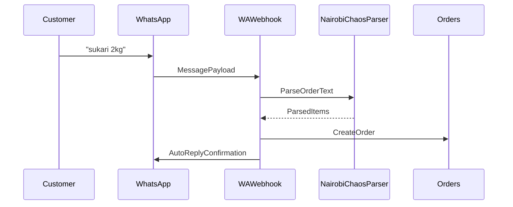
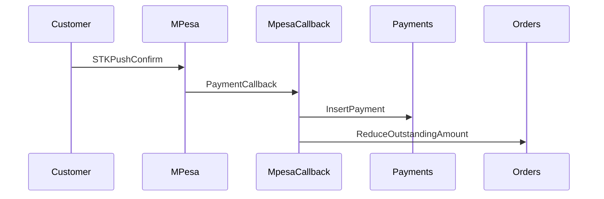
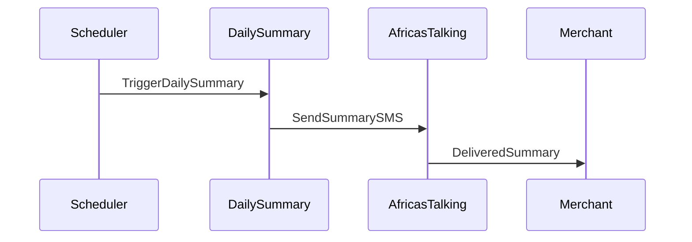
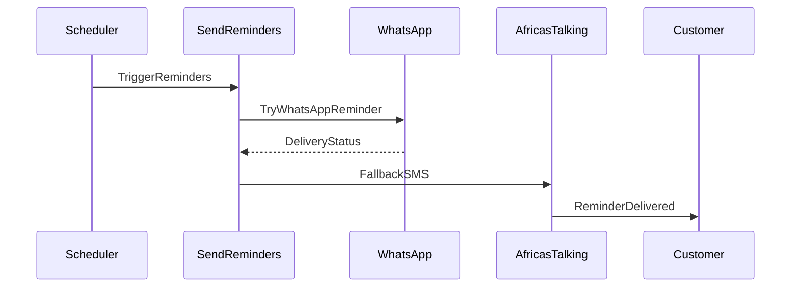

# Mini-Supermarket Flow

This flow describes the default Kamau workflow for WhatsApp ordering and M-Pesa payments.

## 1. Customer Order Sequence

## 2. Payment Confirmation Flow

## 3. Daily SMS Summary

## 4. Payment Reminder Flow

