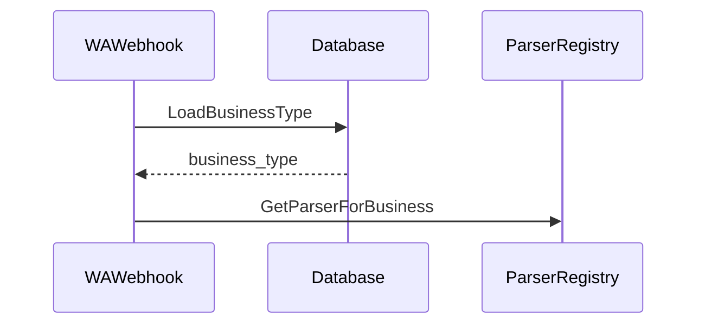
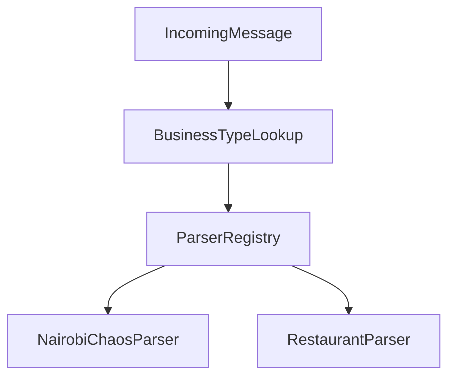
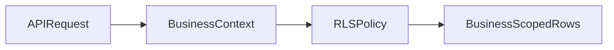

# Multi-Tenant Flow

This flow shows how the system routes messages and enforces tenant isolation.

## 1. Business Type Detection

```mermaid
sequenceDiagram
  participant webhook as WAWebhook
  participant db as Database
  participant registry as ParserRegistry

  webhook->>db: LoadBusinessType
  db-->>webhook: business_type
  webhook->>registry: GetParserForBusiness
```

## 2. Parser Selection

```mermaid
flowchart TB
  incoming["IncomingMessage"]
  lookup["BusinessTypeLookup"]
  registry["ParserRegistry"]
  chaos["NairobiChaosParser"]
  restaurant["RestaurantParser"]

  incoming --> lookup --> registry
  registry --> chaos
  registry --> restaurant
```

## 3. RLS Enforcement

```mermaid
flowchart LR
  request["APIRequest"]
  context["BusinessContext"]
  rls["RLSPolicy"]
  data["BusinessScopedRows"]

  request --> context --> rls --> data
```

