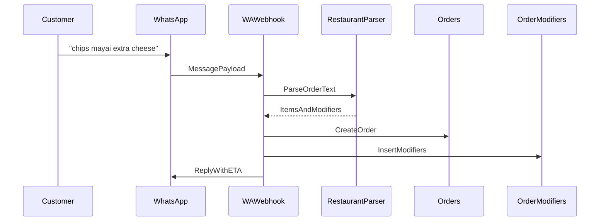
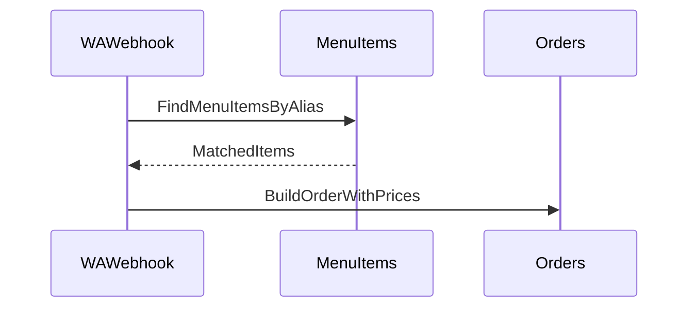
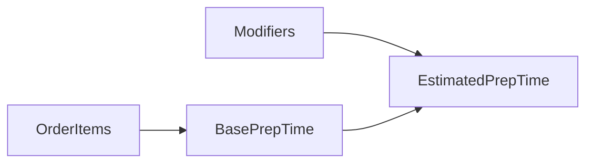
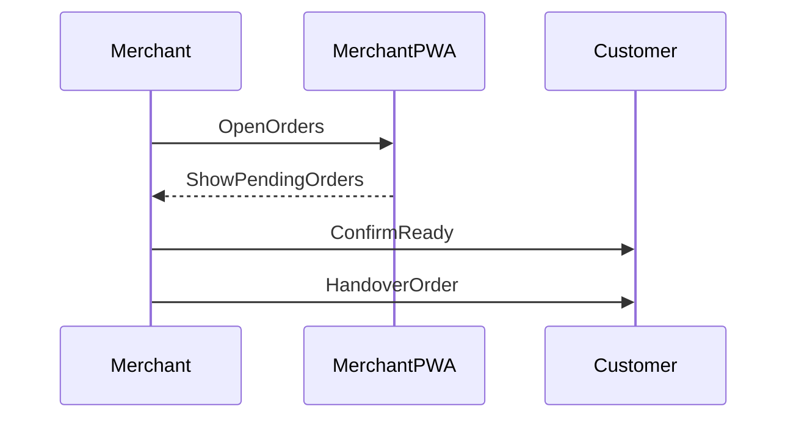

# Restaurant Flow

This flow describes restaurant ordering with menu item lookup and modifiers.

## 1. Order With Modifiers

## 2. Menu Item Lookup

## 3. Prep Time Estimation

## 4. Fulfillment Sequence

