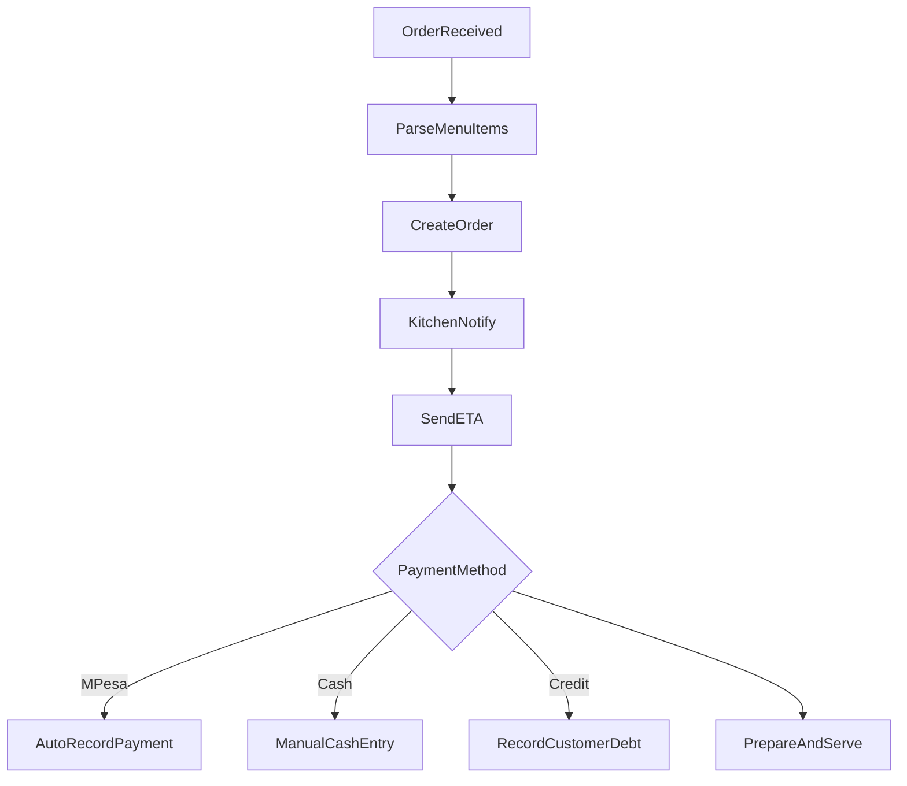

# Restaurant Flow - Everything Lite

## Order Intake to Kitchen

## Lite Features Enabled

- Menu item catalog
- Simple kitchen notifications
- Fast payment capture
- Basic order tracking

## Lite Features Disabled

- Complex modifiers engine
- Table management automation
- Advanced inventory depletion

