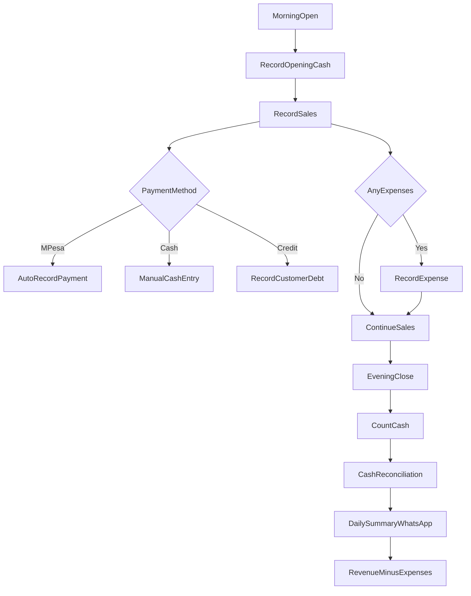

# Retail Business Flow - Everything Lite

## Daily Operations

## Lite Features Enabled

- Sales tracking (cash, M-Pesa, credit)
- Simple inventory counts
- Customer debt tracking
- Expense recording
- Optional supplier debt tracking
- Daily cash reconciliation
- Daily summary via WhatsApp

## Lite Features Disabled

- Advanced inventory (batches, transfer, warehouse)
- Automated reordering
- Multi-warehouse transfers
- Deep analytics dashboards
