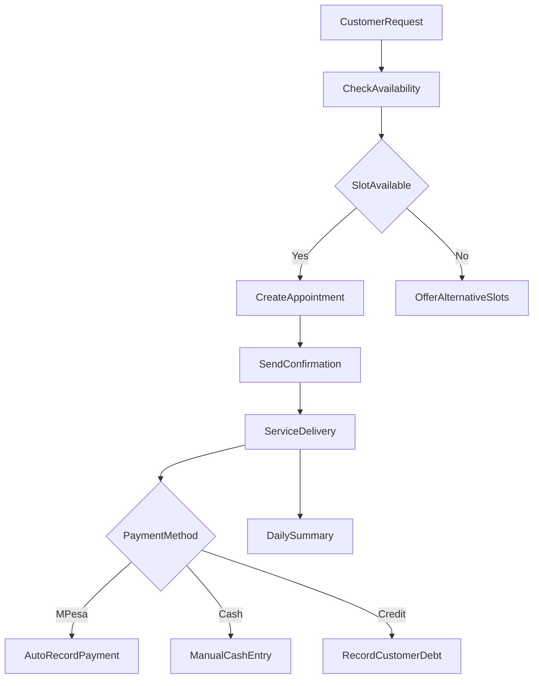

# Services Flow - Everything Lite

## Appointment-Centered Service

## Lite Features Enabled

- Service catalog
- Appointment scheduling
- WhatsApp confirmations and reminders
- Simple payments and debt tracking

## Lite Features Disabled

- Complex calendar integrations
- Resource optimization
- Advanced staff scheduling
