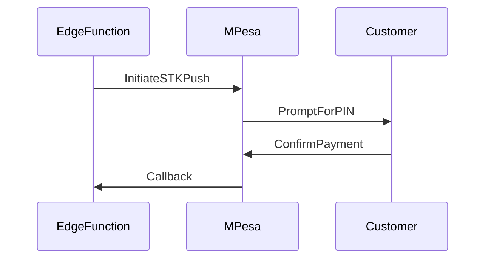
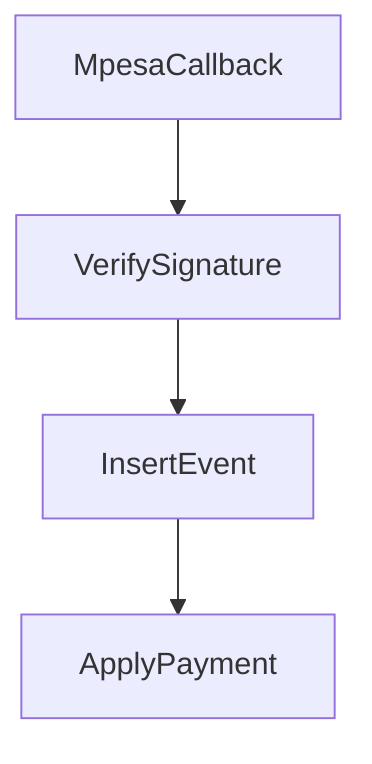

# M-Pesa Integration

This document describes STK Push initiation and callback handling.

## Required Secrets

- `MPESA_CONSUMER_KEY`
- `MPESA_CONSUMER_SECRET`
- `MPESA_SHORTCODE`
- `MPESA_PASSKEY`
- `MPESA_CALLBACK_URL`

## STK Push Flow

## Callback Processing

## Operational Notes

- Callback idempotency is enforced by `mpesa_receipt`.
- Payments are applied to outstanding balances in `orders`.

