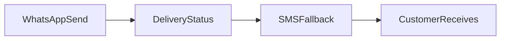
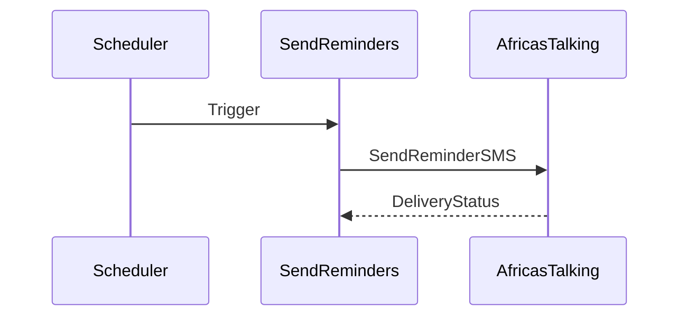
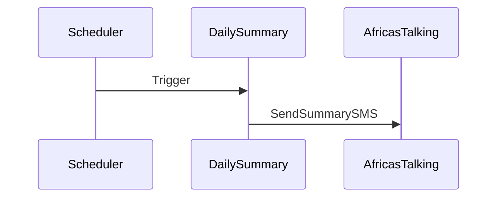

# SMS Integration (Africa's Talking)

This document covers SMS fallback, reminders, and daily summaries.

## Required Secrets

- `AFRICASTALKING_API_KEY`
- `AFRICASTALKING_USERNAME`
- `SMS_SENDER_ID` (optional)

## SMS Fallback Strategy

## Reminder Flow

## Daily Summary Flow

## Operational Notes

- SMS messages are logged into `commerce_events`.
- Use `SMS_SENDER_ID` if a branded sender is approved.

