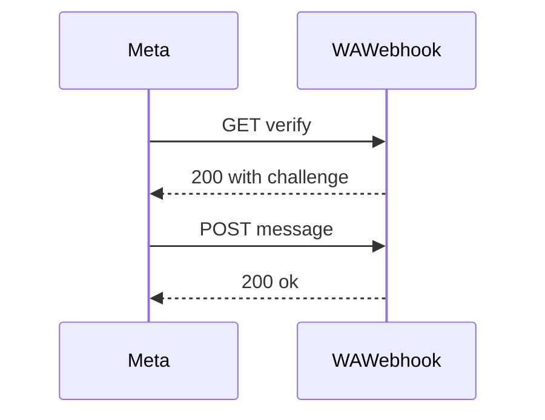
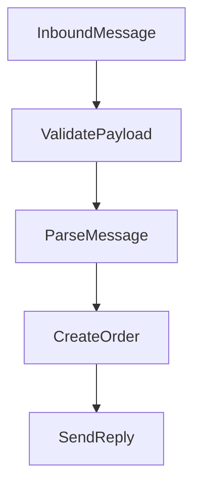

# WhatsApp Integration

This document describes WhatsApp Cloud API setup and webhook handling.

## Required Secrets

- `WHATSAPP_ACCESS_TOKEN`
- `WHATSAPP_PHONE_NUMBER_ID`
- `SUPABASE_URL`
- `SUPABASE_ANON_KEY`

## Webhook Verification Flow

## Message Processing Flow

## Operational Notes

- Only `text` messages are currently processed.
- Rate limiting and auto-response cooldown are enforced.
- All messages are logged in `commerce_events`.

