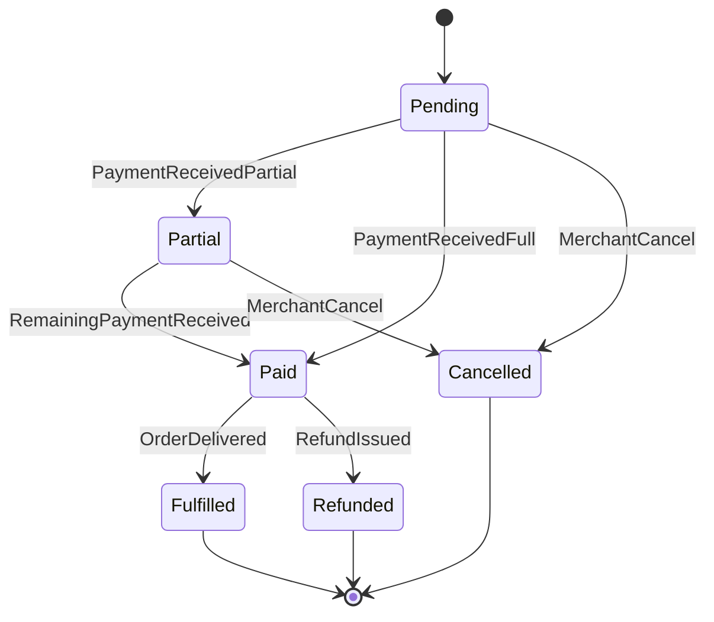

# Order State Machine

This state machine defines the lifecycle of an order and the conditions that trigger transitions.

## Transition Notes

- `PaymentReceivedPartial`: applied_amount < outstanding_amount
- `PaymentReceivedFull`: applied_amount >= outstanding_amount
- `OrderDelivered`: merchant confirms delivery or pickup
- `RefundIssued`: manual correction after payment

