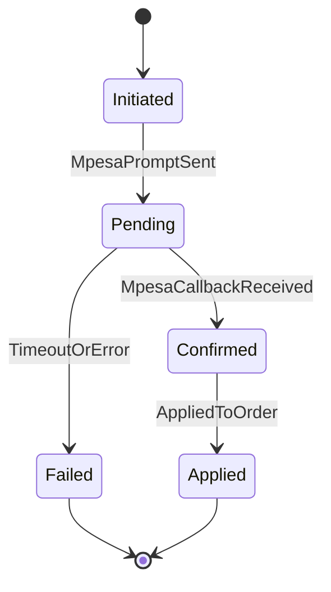

# Payment State Machine

This state machine defines the lifecycle of a payment from initiation to application.

## Transition Notes

- `MpesaPromptSent`: STK push acknowledged by Daraja API
- `MpesaCallbackReceived`: payment confirmation callback received
- `AppliedToOrder`: payment applied to `orders.outstanding_amount`

