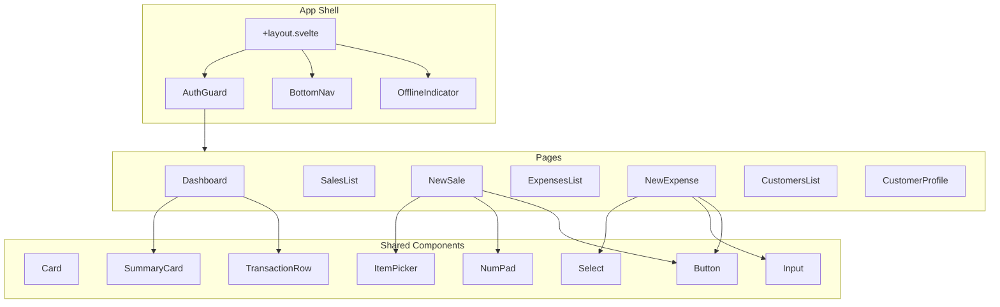

# Component Hierarchy

**Framework:** Svelte 5 + SvelteKit  
**Styling:** Tailwind CSS  
**Design:** Phone-first, touch-optimized

---

## App Structure

```
src/
├── routes/
│   ├── +layout.svelte          # Root layout (auth check, nav)
│   ├── +page.svelte             # Dashboard
│   ├── login/
│   │   └── +page.svelte         # Login page
│   ├── sales/
│   │   ├── +page.svelte         # Sales list
│   │   ├── new/
│   │   │   └── +page.svelte     # New sale form
│   │   └── [id]/
│   │       └── +page.svelte     # Sale detail
│   ├── expenses/
│   │   ├── +page.svelte         # Expenses list
│   │   └── new/
│   │       └── +page.svelte     # New expense form
│   ├── customers/
│   │   ├── +page.svelte         # Customer list
│   │   └── [phone]/
│   │       └── +page.svelte     # Customer profile
│   └── settings/
│       └── +page.svelte         # Settings
├── lib/
│   ├── components/
│   │   ├── ui/                  # Base UI components
│   │   ├── forms/               # Form components
│   │   ├── cards/               # Data display cards
│   │   └── layout/              # Layout components
│   ├── stores/                  # Svelte stores
│   ├── api/                     # API client
│   ├── db/                      # IndexedDB wrapper
│   └── utils/                   # Utilities
└── app.css                      # Global styles
```

---

## Component Tree



---

## UI Components

### 1. Base Components (`lib/components/ui/`)

#### Button

```svelte
<!-- Button.svelte -->
<script lang="ts">
  export let variant: 'primary' | 'secondary' | 'ghost' = 'primary';
  export let size: 'sm' | 'md' | 'lg' = 'md';
  export let disabled = false;
  export let loading = false;
</script>

<button
  class="
    rounded-xl font-medium transition-all active:scale-95
    {variant === 'primary' ? 'bg-emerald-600 text-white' : ''}
    {variant === 'secondary' ? 'bg-gray-100 text-gray-900' : ''}
    {variant === 'ghost' ? 'bg-transparent text-gray-600' : ''}
    {size === 'sm' ? 'px-3 py-2 text-sm' : ''}
    {size === 'md' ? 'px-4 py-3 text-base' : ''}
    {size === 'lg' ? 'px-6 py-4 text-lg w-full' : ''}
    {disabled ? 'opacity-50 cursor-not-allowed' : ''}
  "
  {disabled}
  on:click
>
  {#if loading}
    <span class="animate-spin">⏳</span>
  {:else}
    <slot />
  {/if}
</button>
```

#### Input

```svelte
<!-- Input.svelte -->
<script lang="ts">
  export let label = '';
  export let type: 'text' | 'number' | 'tel' = 'text';
  export let placeholder = '';
  export let value = '';
  export let error = '';
</script>

<div class="space-y-1">
  {#if label}
    <label class="text-sm font-medium text-gray-700">{label}</label>
  {/if}
  <input
    {type}
    {placeholder}
    bind:value
    class="
      w-full px-4 py-3 rounded-xl border-2
      {error ? 'border-red-500' : 'border-gray-200'}
      focus:border-emerald-500 focus:outline-none
      text-lg
    "
  />
  {#if error}
    <p class="text-sm text-red-500">{error}</p>
  {/if}
</div>
```

#### Card

```svelte
<!-- Card.svelte -->
<script lang="ts">
  export let padding: 'sm' | 'md' | 'lg' = 'md';
</script>

<div
  class="
    bg-white rounded-2xl shadow-sm border border-gray-100
    {padding === 'sm' ? 'p-3' : ''}
    {padding === 'md' ? 'p-4' : ''}
    {padding === 'lg' ? 'p-6' : ''}
  "
>
  <slot />
</div>
```

---

### 2. Form Components (`lib/components/forms/`)

#### NumPad (for amount entry)

```svelte
<!-- NumPad.svelte -->
<script lang="ts">
  import { createEventDispatcher } from 'svelte';
  
  export let value = '';
  export let maxLength = 10;
  
  const dispatch = createEventDispatcher();
  
  const keys = ['1', '2', '3', '4', '5', '6', '7', '8', '9', '.', '0', '⌫'];
  
  function handleKey(key: string) {
    if (key === '⌫') {
      value = value.slice(0, -1);
    } else if (value.length < maxLength) {
      if (key === '.' && value.includes('.')) return;
      value += key;
    }
    dispatch('change', value);
  }
</script>

<div class="grid grid-cols-3 gap-2">
  {#each keys as key}
    <button
      class="
        h-14 rounded-xl text-2xl font-medium
        bg-gray-100 active:bg-gray-200 transition-colors
      "
      on:click={() => handleKey(key)}
    >
      {key}
    </button>
  {/each}
</div>
```

#### ItemPicker (for sale items)

```svelte
<!-- ItemPicker.svelte -->
<script lang="ts">
  import { createEventDispatcher } from 'svelte';
  import type { Product } from '$lib/types';
  
  export let products: Product[] = [];
  export let selectedItems: { product: Product; qty: number }[] = [];
  
  const dispatch = createEventDispatcher();
  
  function addItem(product: Product) {
    const existing = selectedItems.find(i => i.product.id === product.id);
    if (existing) {
      existing.qty += 1;
    } else {
      selectedItems = [...selectedItems, { product, qty: 1 }];
    }
    dispatch('change', selectedItems);
  }
</script>

<div class="space-y-2">
  <!-- Search -->
  <input
    type="search"
    placeholder="🔍 Search products..."
    class="w-full px-4 py-3 rounded-xl border-2 border-gray-200"
  />
  
  <!-- Quick add buttons -->
  <div class="flex flex-wrap gap-2">
    {#each products.slice(0, 8) as product}
      <button
        class="px-3 py-2 bg-gray-100 rounded-lg text-sm"
        on:click={() => addItem(product)}
      >
        {product.name}
      </button>
    {/each}
  </div>
  
  <!-- Selected items -->
  {#if selectedItems.length > 0}
    <div class="border-t pt-2 mt-2">
      {#each selectedItems as item}
        <div class="flex justify-between py-2">
          <span>{item.product.name} x{item.qty}</span>
          <span>KES {item.product.price * item.qty}</span>
        </div>
      {/each}
    </div>
  {/if}
</div>
```

---

### 3. Data Display (`lib/components/cards/`)

#### SummaryCard

```svelte
<!-- SummaryCard.svelte -->
<script lang="ts">
  export let title: string;
  export let value: string | number;
  export let subtitle = '';
  export let icon = '';
  export let trend: 'up' | 'down' | 'neutral' = 'neutral';
</script>

<div class="bg-white rounded-2xl p-4 shadow-sm border border-gray-100">
  <div class="flex items-start justify-between">
    <div>
      <p class="text-sm text-gray-500">{title}</p>
      <p class="text-2xl font-bold mt-1">
        {typeof value === 'number' ? `KES ${value.toLocaleString()}` : value}
      </p>
      {#if subtitle}
        <p class="text-sm mt-1 {trend === 'up' ? 'text-green-600' : trend === 'down' ? 'text-red-600' : 'text-gray-500'}">
          {#if trend === 'up'}▲{:else if trend === 'down'}▼{/if}
          {subtitle}
        </p>
      {/if}
    </div>
    {#if icon}
      <span class="text-2xl">{icon}</span>
    {/if}
  </div>
</div>
```

#### TransactionRow

```svelte
<!-- TransactionRow.svelte -->
<script lang="ts">
  export let type: 'sale' | 'expense' | 'payment';
  export let description: string;
  export let amount: number;
  export let time: string;
  export let status: 'completed' | 'pending' | 'credit' = 'completed';
</script>

<div class="flex items-center justify-between py-3 border-b border-gray-100">
  <div class="flex items-center gap-3">
    <div class="
      w-10 h-10 rounded-full flex items-center justify-center
      {type === 'sale' ? 'bg-green-100' : ''}
      {type === 'expense' ? 'bg-red-100' : ''}
      {type === 'payment' ? 'bg-blue-100' : ''}
    ">
      {#if type === 'sale'}💰{:else if type === 'expense'}📤{:else}💳{/if}
    </div>
    <div>
      <p class="font-medium">{description}</p>
      <p class="text-sm text-gray-500">{time}</p>
    </div>
  </div>
  <div class="text-right">
    <p class="font-semibold {type === 'expense' ? 'text-red-600' : 'text-green-600'}">
      {type === 'expense' ? '-' : '+'}KES {amount.toLocaleString()}
    </p>
    {#if status === 'credit'}
      <span class="text-xs text-amber-600">Credit</span>
    {:else if status === 'pending'}
      <span class="text-xs text-gray-500">Pending sync</span>
    {/if}
  </div>
</div>
```

---

### 4. Layout Components (`lib/components/layout/`)

#### BottomNav

```svelte
<!-- BottomNav.svelte -->
<script lang="ts">
  import { page } from '$app/stores';
  
  const navItems = [
    { href: '/', icon: '🏠', label: 'Home' },
    { href: '/sales', icon: '🛒', label: 'Sales' },
    { href: '/sales/new', icon: '➕', label: 'New Sale', primary: true },
    { href: '/expenses', icon: '📝', label: 'Expenses' },
    { href: '/customers', icon: '👥', label: 'Customers' },
  ];
</script>

<nav class="fixed bottom-0 left-0 right-0 bg-white border-t border-gray-200 pb-safe">
  <div class="flex justify-around items-center h-16">
    {#each navItems as item}
      <a
        href={item.href}
        class="
          flex flex-col items-center gap-1 px-3 py-2 rounded-xl
          {$page.url.pathname === item.href ? 'text-emerald-600' : 'text-gray-500'}
          {item.primary ? 'bg-emerald-600 text-white rounded-full w-14 h-14 -mt-4 shadow-lg' : ''}
        "
      >
        <span class="text-xl">{item.icon}</span>
        {#if !item.primary}
          <span class="text-xs">{item.label}</span>
        {/if}
      </a>
    {/each}
  </div>
</nav>
```

#### PageHeader

```svelte
<!-- PageHeader.svelte -->
<script lang="ts">
  export let title: string;
  export let backHref: string | null = null;
  export let action: { label: string; href: string } | null = null;
</script>

<header class="sticky top-0 bg-white border-b border-gray-100 z-10">
  <div class="flex items-center justify-between px-4 py-3">
    <div class="flex items-center gap-3">
      {#if backHref}
        <a href={backHref} class="text-2xl">←</a>
      {/if}
      <h1 class="text-xl font-bold">{title}</h1>
    </div>
    {#if action}
      <a href={action.href} class="text-emerald-600 font-medium">
        {action.label}
      </a>
    {/if}
  </div>
</header>
```

#### OfflineIndicator

```svelte
<!-- OfflineIndicator.svelte -->
<script lang="ts">
  import { networkStatus, pendingSyncCount } from '$lib/stores/network';
</script>

{#if $networkStatus === 'offline'}
  <div class="bg-amber-500 text-white px-4 py-2 text-center text-sm">
    ⚡ Offline - {$pendingSyncCount} items waiting to sync
  </div>
{:else if $networkStatus === 'slow'}
  <div class="bg-yellow-500 text-white px-4 py-1 text-center text-xs">
    🐢 Slow connection
  </div>
{/if}
```

---

## Page Layouts

### Dashboard

```svelte
<!-- routes/+page.svelte -->
<script lang="ts">
  import SummaryCard from '$lib/components/cards/SummaryCard.svelte';
  import TransactionRow from '$lib/components/cards/TransactionRow.svelte';
  import { todaySummary, recentTransactions } from '$lib/stores/data';
</script>

<div class="p-4 pb-20 space-y-4">
  <!-- Greeting -->
  <div>
    <h1 class="text-2xl font-bold">Good morning, Kamau</h1>
    <p class="text-gray-500">January 20, 2026</p>
  </div>
  
  <!-- Summary cards -->
  <div class="grid grid-cols-2 gap-3">
    <SummaryCard
      title="Today's Revenue"
      value={$todaySummary.revenue}
      icon="💰"
      trend="up"
      subtitle="+15% vs yesterday"
    />
    <SummaryCard
      title="Profit"
      value={$todaySummary.profit}
      icon="📈"
    />
  </div>
  
  <!-- Quick actions -->
  <div class="flex gap-2">
    <a href="/sales/new" class="flex-1 bg-emerald-600 text-white py-4 rounded-xl text-center font-medium">
      ➕ New Sale
    </a>
    <a href="/expenses/new" class="flex-1 bg-gray-100 py-4 rounded-xl text-center font-medium">
      📝 Add Expense
    </a>
  </div>
  
  <!-- Recent transactions -->
  <div>
    <h2 class="font-semibold mb-2">Recent Activity</h2>
    {#each $recentTransactions as tx}
      <TransactionRow {...tx} />
    {/each}
  </div>
</div>
```

### New Sale

```svelte
<!-- routes/sales/new/+page.svelte -->
<script lang="ts">
  import PageHeader from '$lib/components/layout/PageHeader.svelte';
  import ItemPicker from '$lib/components/forms/ItemPicker.svelte';
  import NumPad from '$lib/components/forms/NumPad.svelte';
  import Button from '$lib/components/ui/Button.svelte';
  import { products } from '$lib/stores/data';
  import { recordSale } from '$lib/api/sales';
  
  let items = [];
  let paymentMethod = 'cash';
  let isCredit = false;
  let customerPhone = '';
  let loading = false;
  
  $: total = items.reduce((sum, i) => sum + i.product.price * i.qty, 0);
  
  async function handleSubmit() {
    loading = true;
    await recordSale({ items, paymentMethod, isCredit, customerPhone });
    // Navigate to success or back
  }
</script>

<PageHeader title="New Sale" backHref="/sales" />

<div class="p-4 pb-20 space-y-4">
  <!-- Item picker -->
  <ItemPicker {products} bind:selectedItems={items} />
  
  <!-- Total -->
  <div class="text-center py-4 bg-gray-50 rounded-xl">
    <p class="text-sm text-gray-500">Total</p>
    <p class="text-4xl font-bold">KES {total.toLocaleString()}</p>
  </div>
  
  <!-- Payment method -->
  <div class="flex gap-2">
    <button
      class="flex-1 py-3 rounded-xl {paymentMethod === 'cash' ? 'bg-emerald-600 text-white' : 'bg-gray-100'}"
      on:click={() => paymentMethod = 'cash'}
    >
      💵 Cash
    </button>
    <button
      class="flex-1 py-3 rounded-xl {paymentMethod === 'mpesa' ? 'bg-emerald-600 text-white' : 'bg-gray-100'}"
      on:click={() => paymentMethod = 'mpesa'}
    >
      📱 M-Pesa
    </button>
    <button
      class="flex-1 py-3 rounded-xl {isCredit ? 'bg-amber-500 text-white' : 'bg-gray-100'}"
      on:click={() => isCredit = !isCredit}
    >
      💳 Credit
    </button>
  </div>
  
  <!-- Customer phone (if credit) -->
  {#if isCredit}
    <input
      type="tel"
      placeholder="Customer phone (254...)"
      bind:value={customerPhone}
      class="w-full px-4 py-3 rounded-xl border-2 border-gray-200"
    />
  {/if}
  
  <!-- Submit -->
  <Button variant="primary" size="lg" {loading} on:click={handleSubmit}>
    Complete Sale
  </Button>
</div>
```

---

## Color Palette

```css
/* Tailwind theme extension */
:root {
  /* Primary - Emerald (Money/Success) */
  --color-primary: #059669;
  --color-primary-light: #d1fae5;
  
  /* Secondary - Gray */
  --color-gray-50: #f9fafb;
  --color-gray-100: #f3f4f6;
  --color-gray-500: #6b7280;
  --color-gray-900: #111827;
  
  /* Accent */
  --color-warning: #f59e0b;  /* Amber - Credit/Warning */
  --color-error: #ef4444;    /* Red - Expense/Error */
  --color-info: #3b82f6;     /* Blue - Info/M-Pesa */
}
```

---

## Touch Targets

All interactive elements must have:
- Minimum 44x44px touch target (iOS HIG)
- Adequate spacing between targets
- Visual feedback on press (scale/color change)

```css
/* Global touch feedback */
button, a, [role="button"] {
  @apply transition-all active:scale-95;
  min-height: 44px;
  min-width: 44px;
}
```
