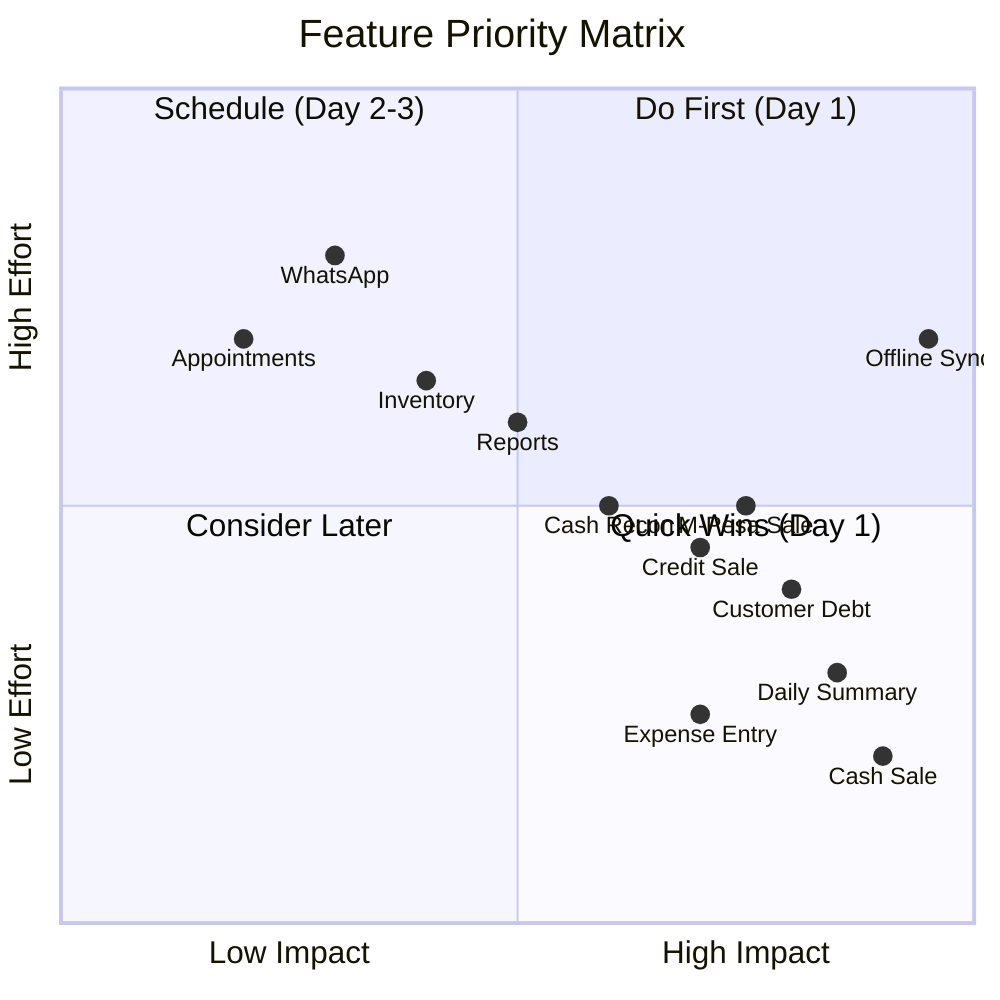
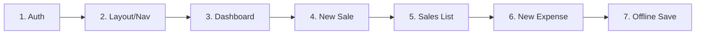
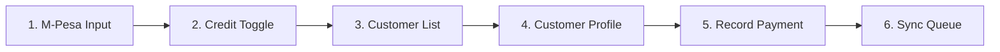

# MVP Features Priority

**Target:** Launch-ready retail merchant app  
**Timeline:** January 20-22, 2026 (3 days)  
**Focus:** Core retail flows that work offline

---

## Priority Matrix



---

## Day 1 (January 20) - Core Sales

### Must Ship ✅

| Feature | Effort | Impact | Notes |
|---------|--------|--------|-------|
| **Login/Auth** | 2h | Critical | Supabase Auth, persist session |
| **Dashboard** | 2h | High | Today's summary, quick actions |
| **Record Cash Sale** | 3h | Critical | Item entry, total, complete |
| **View Sales List** | 1h | High | Today's sales, simple list |
| **Record Expense** | 2h | High | Category, amount, payment method |
| **Offline Storage** | 2h | Critical | IndexedDB, save locally |

### Implementation Order



### Day 1 Screens

```
┌─────────────────────┐
│ 1. Login            │
│    - Email/password │
│    - Remember me    │
└─────────────────────┘
         ↓
┌─────────────────────┐
│ 2. Dashboard        │
│    - Today summary  │
│    - Quick actions  │
│    - Recent sales   │
└─────────────────────┘
         ↓
┌─────────────────────┐
│ 3. New Sale         │
│    - Add items      │
│    - Enter total    │
│    - Cash/complete  │
└─────────────────────┘
         ↓
┌─────────────────────┐
│ 4. Sales List       │
│    - Today's sales  │
│    - Total revenue  │
└─────────────────────┘
         ↓
┌─────────────────────┐
│ 5. New Expense      │
│    - Category       │
│    - Amount         │
│    - Description    │
└─────────────────────┘
```

---

## Day 2 (January 21) - Payments & Customers

### Features

| Feature | Effort | Impact | Notes |
|---------|--------|--------|-------|
| **M-Pesa Sale** | 2h | High | Transaction code input |
| **Credit Sale** | 2h | High | Customer phone, terms |
| **Customer List** | 2h | High | Who owes money |
| **Customer Profile** | 2h | Medium | Order history, debt |
| **Record Payment** | 2h | High | Debt collection |
| **Background Sync** | 3h | Critical | Service worker, queue |

### Implementation Order



### Day 2 Screens

```
┌─────────────────────┐
│ New Sale (updated)  │
│    + M-Pesa input   │
│    + Credit toggle  │
│    + Customer phone │
└─────────────────────┘
         ↓
┌─────────────────────┐
│ Customer List       │
│    - Name, debt     │
│    - Debt age       │
│    - Tap to view    │
└─────────────────────┘
         ↓
┌─────────────────────┐
│ Customer Profile    │
│    - Total spent    │
│    - Outstanding    │
│    - Order history  │
│    - [Record Payment]│
└─────────────────────┘
         ↓
┌─────────────────────┐
│ Record Payment      │
│    - Amount         │
│    - Method         │
│    - Apply to order │
└─────────────────────┘
```

---

## Day 3 (January 22) - Polish & Reports

### Features

| Feature | Effort | Impact | Notes |
|---------|--------|--------|-------|
| **Daily Report** | 2h | Medium | P&L summary |
| **Cash Reconciliation** | 2h | Medium | Opening/closing float |
| **Expense List** | 1h | Medium | View past expenses |
| **Pull to Refresh** | 1h | Low | UX polish |
| **Error Handling** | 2h | High | User-friendly errors |
| **Loading States** | 1h | Medium | Skeletons, spinners |
| **PWA Setup** | 2h | High | Manifest, icons |

### Day 3 Screens

```
┌─────────────────────┐
│ Dashboard (updated) │
│    + P&L card       │
│    + Pull refresh   │
│    + Better loading │
└─────────────────────┘
         ↓
┌─────────────────────┐
│ Cash Recon          │
│    - Opening float  │
│    - Expected cash  │
│    - Actual count   │
│    - Variance       │
└─────────────────────┘
         ↓
┌─────────────────────┐
│ Expense List        │
│    - Date filter    │
│    - Category       │
│    - Total          │
└─────────────────────┘
```

---

## Future (Week 2+)

### Phase 2 Features

| Feature | Effort | Impact | Business Type |
|---------|--------|--------|---------------|
| Inventory management | 5h | Medium | Retail |
| Low stock alerts | 3h | Medium | Retail |
| WhatsApp receipts | 4h | Medium | All |
| Multi-employee | 6h | Medium | Pro tier |
| Commissions | 4h | Medium | Pro tier |
| Supplier management | 5h | Medium | Retail |
| Service catalog | 4h | Medium | Services |
| Appointment booking | 6h | Medium | Services |
| Menu management | 4h | Medium | Restaurant |
| Kitchen display | 6h | Medium | Restaurant |

### Phase 3 Features

| Feature | Effort | Impact | Notes |
|---------|--------|--------|-------|
| Multi-location | 8h | Low | Enterprise |
| Analytics dashboard | 8h | Medium | Pro/Enterprise |
| Export to Excel | 3h | Low | All |
| API access | 5h | Low | Enterprise |
| Custom workflows | 10h | Medium | Enterprise |
| White-label | 10h | Low | Partners |

---

## Technical Debt to Address

### Before Launch
- [ ] Proper error boundaries
- [ ] Input validation (phone, amounts)
- [ ] Session refresh handling
- [ ] Network error recovery

### After Launch
- [ ] Unit tests for stores
- [ ] E2E tests for critical flows
- [ ] Performance optimization
- [ ] Bundle size reduction
- [ ] Accessibility audit

---

## Success Metrics (Day 1)

| Metric | Target |
|--------|--------|
| Record sale | < 10 seconds |
| App load (cached) | < 2 seconds |
| Offline sale save | < 500ms |
| Sync (when online) | < 5 seconds |

---

## Day 1 Checklist

```markdown
### Morning (4 hours)
- [ ] Set up SvelteKit project structure
- [ ] Configure Tailwind CSS
- [ ] Implement auth flow (login, session)
- [ ] Create layout with bottom nav

### Afternoon (4 hours)
- [ ] Build dashboard with summary cards
- [ ] Implement new sale form
- [ ] Add sales list view
- [ ] Add expense form

### Evening (2 hours)
- [ ] Set up IndexedDB
- [ ] Implement local save
- [ ] Test offline mode
- [ ] Deploy preview build
```

---

## API Endpoints Needed (Day 1)

```typescript
// Auth
POST /auth/login        // Email + password
GET  /auth/me           // Current user + business

// Sales
POST /api/sales         // Record sale
GET  /api/sales         // List today's sales

// Expenses
POST /api/expenses      // Record expense
GET  /api/expenses      // List expenses

// Reports
GET  /api/reports/daily // Today's summary
```

---

## Data Stores (Day 1)

```typescript
// Svelte stores needed
export const user = writable<User | null>(null);
export const business = writable<Business | null>(null);
export const todaySales = writable<Sale[]>([]);
export const todayExpenses = writable<Expense[]>([]);
export const todaySummary = writable<DailySummary | null>(null);
export const networkStatus = writable<'online' | 'offline'>('online');
export const pendingSync = writable<number>(0);
```
