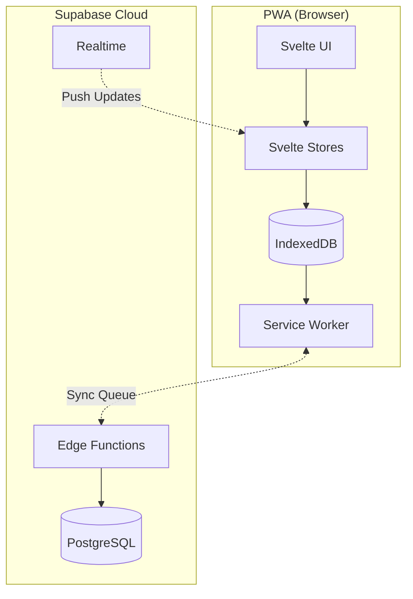
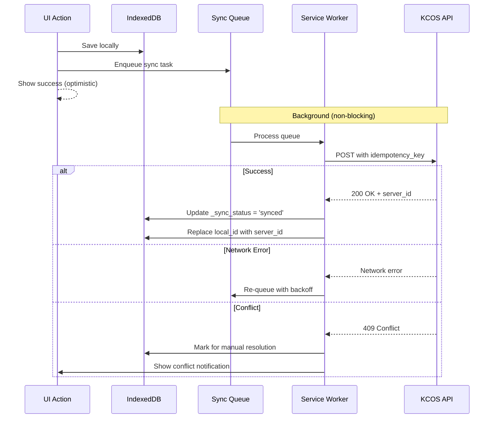
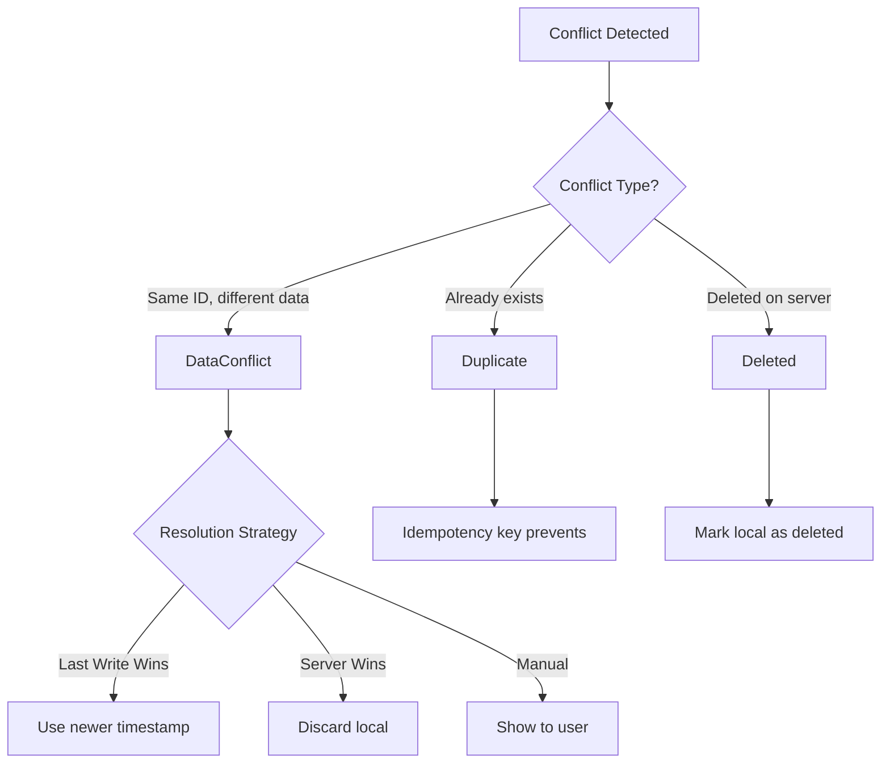
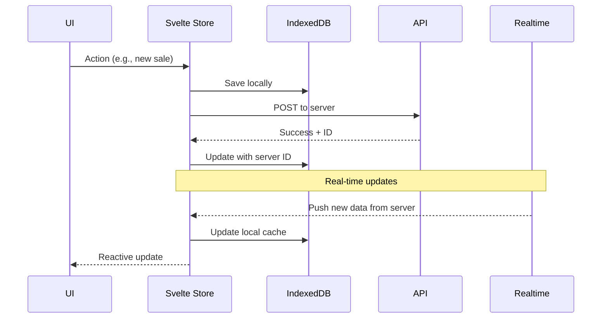
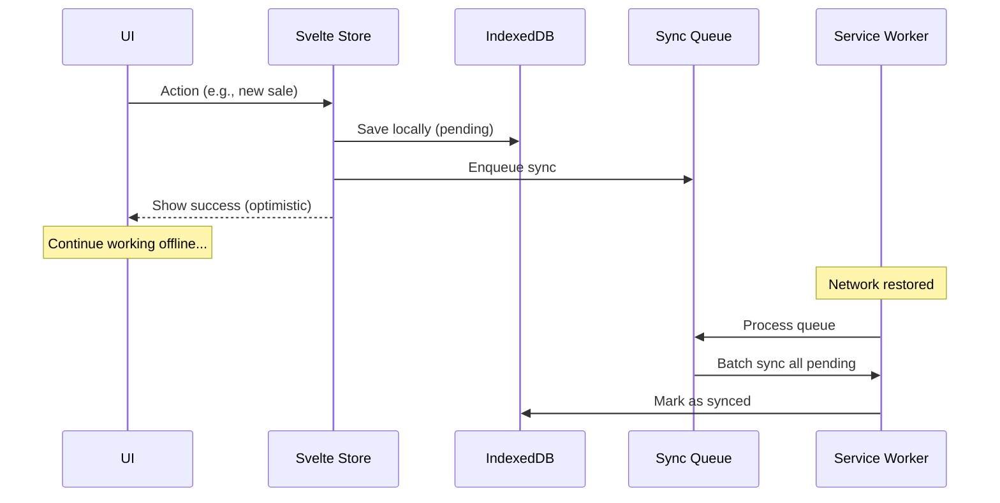

# Offline-First Sync Strategy

**Goal:** The app must work fully offline and sync seamlessly when online.  
**Reality:** Kenya has unreliable 2G/3G, frequent network drops, expensive data.

---

## Architecture Overview



---

## Sync Strategy: Optimistic Local-First

### 1. All Writes Go to IndexedDB First

```typescript
// Every action writes locally first
async function recordSale(sale: Sale) {
  // 1. Generate local ID
  const localId = `local_${Date.now()}_${Math.random().toString(36).slice(2)}`;
  
  // 2. Save to IndexedDB immediately
  await db.sales.add({
    ...sale,
    id: localId,
    _sync_status: 'pending',
    _created_at: new Date().toISOString(),
  });
  
  // 3. Update UI immediately (optimistic)
  salesStore.update(s => [...s, sale]);
  
  // 4. Queue for sync (non-blocking)
  syncQueue.enqueue({ type: 'sale', data: sale, localId });
  
  return { success: true, localId };
}
```

### 2. Background Sync Queue



---

## IndexedDB Schema

```typescript
interface SaleRecord {
  id: string;                    // local_xxx or server UUID
  business_id: string;
  customer_phone: string;
  customer_name?: string;
  items: SaleItem[];
  total_amount: number;
  outstanding_amount: number;
  payment_method: 'cash' | 'mpesa' | 'credit';
  payment_reference?: string;
  is_credit: boolean;
  status: string;
  created_at: string;
  
  // Sync metadata
  _sync_status: 'pending' | 'syncing' | 'synced' | 'conflict';
  _sync_attempts: number;
  _last_sync_attempt?: string;
  _server_id?: string;           // Set after successful sync
  _idempotency_key: string;      // Prevents duplicates
}

interface SyncQueueItem {
  id: string;
  type: 'sale' | 'expense' | 'payment' | 'customer';
  operation: 'create' | 'update' | 'delete';
  data: unknown;
  localId: string;
  idempotencyKey: string;
  attempts: number;
  createdAt: string;
  nextRetryAt?: string;
}
```

### IndexedDB Stores

```typescript
const dbSchema = {
  sales: '++_localId, id, business_id, customer_phone, created_at, _sync_status',
  expenses: '++_localId, id, business_id, expense_date, _sync_status',
  customers: 'phone, business_id, _sync_status',
  syncQueue: '++id, type, nextRetryAt',
  settings: 'key',
  cache: 'key, expiresAt',
};
```

---

## Sync Queue Implementation

```typescript
class SyncQueue {
  private db: IDBDatabase;
  private processing = false;
  
  async enqueue(item: Omit<SyncQueueItem, 'id' | 'attempts' | 'createdAt'>) {
    const queueItem: SyncQueueItem = {
      ...item,
      id: crypto.randomUUID(),
      attempts: 0,
      createdAt: new Date().toISOString(),
      idempotencyKey: `${item.type}_${item.localId}_${Date.now()}`,
    };
    
    await this.db.add('syncQueue', queueItem);
    this.processQueue();
  }
  
  async processQueue() {
    if (this.processing || !navigator.onLine) return;
    this.processing = true;
    
    try {
      const items = await this.db.getAll('syncQueue');
      
      for (const item of items) {
        if (item.nextRetryAt && new Date(item.nextRetryAt) > new Date()) {
          continue; // Not ready for retry
        }
        
        try {
          await this.syncItem(item);
          await this.db.delete('syncQueue', item.id);
        } catch (error) {
          await this.handleSyncError(item, error);
        }
      }
    } finally {
      this.processing = false;
    }
  }
  
  private async syncItem(item: SyncQueueItem) {
    const endpoint = this.getEndpoint(item.type, item.operation);
    
    const response = await fetch(endpoint, {
      method: 'POST',
      headers: {
        'Content-Type': 'application/json',
        'Authorization': `Bearer ${await getToken()}`,
        'X-Idempotency-Key': item.idempotencyKey,
      },
      body: JSON.stringify(item.data),
    });
    
    if (!response.ok) {
      throw new SyncError(response.status, await response.text());
    }
    
    const result = await response.json();
    
    // Update local record with server ID
    await this.updateLocalRecord(item, result);
  }
  
  private async handleSyncError(item: SyncQueueItem, error: Error) {
    const maxAttempts = 5;
    const backoffMs = Math.min(1000 * Math.pow(2, item.attempts), 60000);
    
    if (item.attempts >= maxAttempts) {
      // Move to dead letter / mark for manual resolution
      await this.markConflict(item);
      await this.db.delete('syncQueue', item.id);
      return;
    }
    
    // Update for retry
    await this.db.put('syncQueue', {
      ...item,
      attempts: item.attempts + 1,
      nextRetryAt: new Date(Date.now() + backoffMs).toISOString(),
    });
  }
}
```

---

## Service Worker Strategy

```typescript
// sw.ts
self.addEventListener('sync', (event: SyncEvent) => {
  if (event.tag === 'sync-sales') {
    event.waitUntil(syncSales());
  }
});

self.addEventListener('online', () => {
  // Trigger sync when coming online
  self.registration.sync.register('sync-sales');
});

async function syncSales() {
  const queue = new SyncQueue();
  await queue.processQueue();
}
```

---

## Conflict Resolution



### Conflict Types

1. **Duplicate Creation** - Prevented by idempotency key
2. **Update Conflict** - Use `updated_at` timestamp (last write wins)
3. **Delete Conflict** - If server deleted, remove local copy
4. **Network Timeout** - Retry with exponential backoff

---

## Data Flow: Online vs Offline

### Online Mode



### Offline Mode



---

## Cache Strategy

### What to Cache

| Data Type | Cache Duration | Refresh Trigger |
|-----------|---------------|-----------------|
| User profile | Session | Login/logout |
| Business config | 24 hours | App open |
| Products/Menu | 1 hour | Pull to refresh |
| Today's sales | Real-time | Each sale |
| Customer list | 1 hour | Pull to refresh |
| Reports | 5 minutes | Manual refresh |

### Cache Implementation

```typescript
class DataCache {
  async get<T>(key: string): Promise<T | null> {
    const cached = await db.cache.get(key);
    if (!cached) return null;
    if (new Date(cached.expiresAt) < new Date()) {
      await db.cache.delete(key);
      return null;
    }
    return cached.data as T;
  }
  
  async set<T>(key: string, data: T, ttlMs: number): Promise<void> {
    await db.cache.put({
      key,
      data,
      expiresAt: new Date(Date.now() + ttlMs).toISOString(),
    });
  }
  
  async invalidate(pattern: string): Promise<void> {
    const keys = await db.cache.getAllKeys();
    for (const key of keys) {
      if (key.startsWith(pattern)) {
        await db.cache.delete(key);
      }
    }
  }
}
```

---

## Network Status Management

```svelte
<script lang="ts">
  import { onMount } from 'svelte';
  import { writable } from 'svelte/store';
  
  export const networkStatus = writable<'online' | 'offline' | 'slow'>('online');
  export const pendingSyncCount = writable(0);
  
  onMount(() => {
    // Initial status
    networkStatus.set(navigator.onLine ? 'online' : 'offline');
    
    // Listen for changes
    window.addEventListener('online', () => {
      networkStatus.set('online');
      triggerSync();
    });
    
    window.addEventListener('offline', () => {
      networkStatus.set('offline');
    });
    
    // Check connection quality
    if ('connection' in navigator) {
      const conn = (navigator as any).connection;
      conn.addEventListener('change', () => {
        if (conn.effectiveType === '2g' || conn.effectiveType === 'slow-2g') {
          networkStatus.set('slow');
        }
      });
    }
  });
</script>
```

### UI Indicator

```svelte
{#if $networkStatus === 'offline'}
  <div class="bg-amber-500 text-white px-4 py-2 text-center">
    ⚡ Offline Mode - Sales saved locally
    {#if $pendingSyncCount > 0}
      ({$pendingSyncCount} pending sync)
    {/if}
  </div>
{:else if $networkStatus === 'slow'}
  <div class="bg-yellow-500 text-white px-4 py-1 text-center text-sm">
    🐢 Slow connection - Some features may be delayed
  </div>
{/if}
```

---

## Initial Data Load

On app open, load essential data:

```typescript
async function initializeApp() {
  // 1. Check auth
  const session = await getSession();
  if (!session) {
    redirect('/login');
    return;
  }
  
  // 2. Load from cache first (instant)
  const cachedBusiness = await cache.get('business');
  if (cachedBusiness) {
    businessStore.set(cachedBusiness);
  }
  
  // 3. Refresh from server (background)
  try {
    const business = await api.get('/auth/me');
    businessStore.set(business);
    await cache.set('business', business, 24 * 60 * 60 * 1000);
  } catch (error) {
    // Use cached data, show offline indicator
    if (!cachedBusiness) {
      throw new Error('No cached data and offline');
    }
  }
  
  // 4. Process pending sync queue
  syncQueue.processQueue();
  
  // 5. Subscribe to real-time updates
  subscribeToUpdates();
}
```

---

## Testing Offline Mode

### Chrome DevTools

1. Open DevTools → Network tab
2. Set "Throttling" to "Offline"
3. Test all user journeys
4. Verify local saves work
5. Go back online, verify sync

### Automated Tests

```typescript
describe('Offline Mode', () => {
  beforeEach(() => {
    // Mock offline
    vi.spyOn(navigator, 'onLine', 'get').mockReturnValue(false);
  });
  
  it('should save sale locally when offline', async () => {
    const sale = { items: [...], total: 500 };
    const result = await recordSale(sale);
    
    expect(result.success).toBe(true);
    expect(result.localId).toMatch(/^local_/);
    
    const saved = await db.sales.get(result.localId);
    expect(saved._sync_status).toBe('pending');
  });
  
  it('should sync when coming online', async () => {
    // Create offline sale
    await recordSale({ ... });
    
    // Go online
    vi.spyOn(navigator, 'onLine', 'get').mockReturnValue(true);
    window.dispatchEvent(new Event('online'));
    
    // Wait for sync
    await vi.waitFor(() => {
      const sale = db.sales.getFirst();
      expect(sale._sync_status).toBe('synced');
    });
  });
});
```
