# User Journeys

**Target User:** Kenyan duka owner (solo retail merchant)  
**Device:** Android phone, 5" screen, unreliable 3G  
**Language:** English with Swahili support

---

## Journey Index

1. [[#Morning Opening Routine]]
2. [[#Recording a Cash Sale]]
3. [[#Recording an M-Pesa Sale]]
4. [[#Recording a Credit Sale]]
5. [[#Recording an Expense]]
6. [[#Checking Customer Debt]]
7. [[#Collecting Debt Payment]]
8. [[#Checking Daily Summary]]
9. [[#End-of-Day Closing]]
10. [[#Offline Sale (No Internet)]]

---

## Morning Opening Routine

**Goal:** Open the app, see yesterday's summary, record opening cash float.

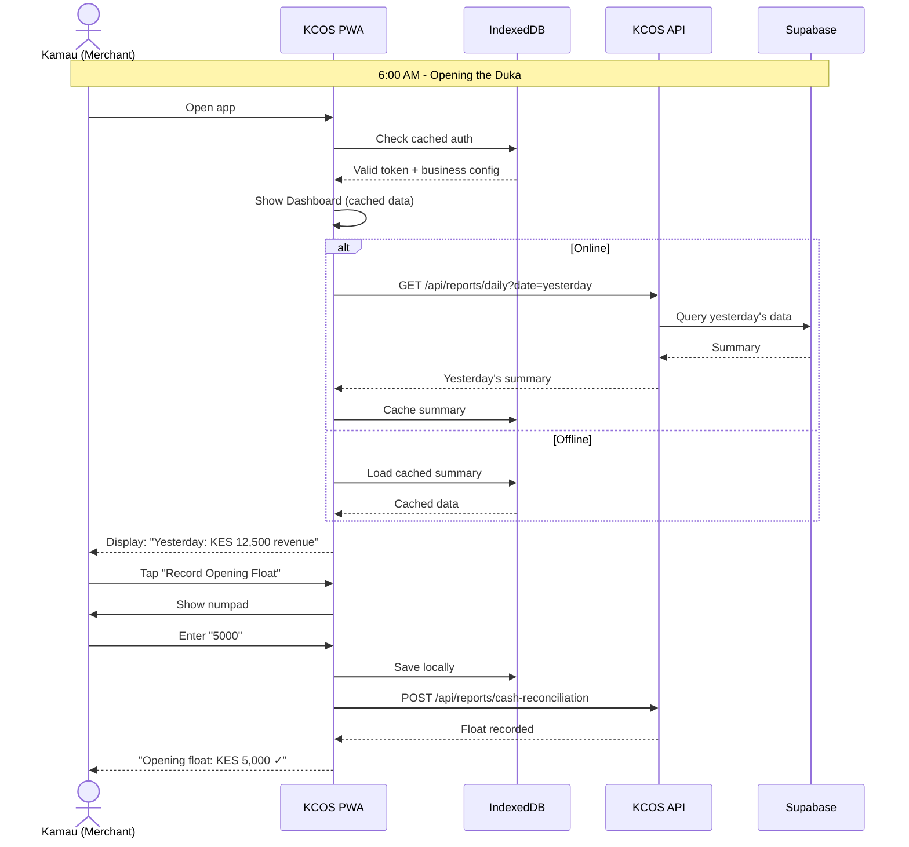

### UI Screens

```
┌─────────────────────────────────┐
│  ☀️ Good Morning, Kamau         │
│  ─────────────────────────────  │
│                                 │
│  📊 Yesterday's Summary         │
│  ┌─────────────────────────────┐│
│  │ Revenue:     KES 12,500     ││
│  │ Expenses:    KES  3,200     ││
│  │ Profit:      KES  9,300     ││
│  │ Orders:      15             ││
│  └─────────────────────────────┘│
│                                 │
│  💰 Today's Opening Float       │
│  ┌─────────────────────────────┐│
│  │      KES [    5,000    ]    ││
│  │      [  Record Float  ]     ││
│  └─────────────────────────────┘│
│                                 │
│  ─────────────────────────────  │
│  [🛒 Sales] [📝 Expenses] [👥 Customers]│
└─────────────────────────────────┘
```

---

## Recording a Cash Sale

**Goal:** Customer pays cash, record the sale quickly.

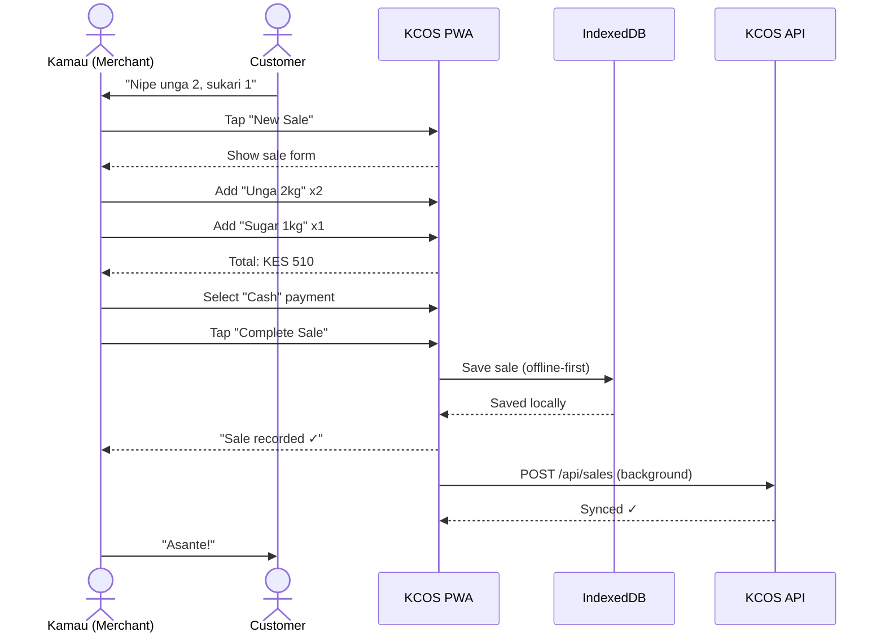

### UI Flow

```
┌─────────────┐    ┌─────────────┐    ┌─────────────┐
│  Dashboard  │───▶│  New Sale   │───▶│  Complete   │
│             │    │             │    │             │
│ [New Sale]  │    │ Items:      │    │ ✓ Saved!    │
│             │    │ + Unga x2   │    │             │
│             │    │ + Sugar x1  │    │ [New Sale]  │
│             │    │             │    │ [Dashboard] │
│             │    │ Total: 510  │    │             │
│             │    │             │    │             │
│             │    │ [Cash]      │    │             │
│             │    │ [Complete]  │    │             │
└─────────────┘    └─────────────┘    └─────────────┘
```

---

## Recording an M-Pesa Sale

**Goal:** Customer pays via M-Pesa, record with transaction code.

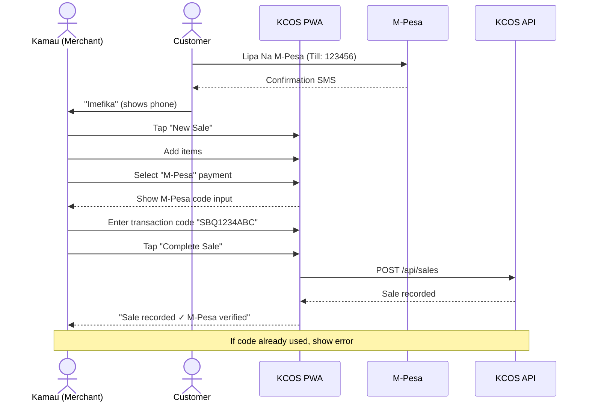

### UI - M-Pesa Input

```
┌─────────────────────────────────┐
│  💳 M-Pesa Payment              │
│  ─────────────────────────────  │
│                                 │
│  Transaction Code:              │
│  ┌─────────────────────────────┐│
│  │      SBQ1234ABC             ││
│  └─────────────────────────────┘│
│                                 │
│  📱 Ask customer for M-Pesa     │
│     confirmation message        │
│                                 │
│  Amount: KES 510                │
│                                 │
│  [✓ Complete Sale]              │
│                                 │
└─────────────────────────────────┘
```

---

## Recording a Credit Sale

**Goal:** Customer takes goods on credit, track the debt.

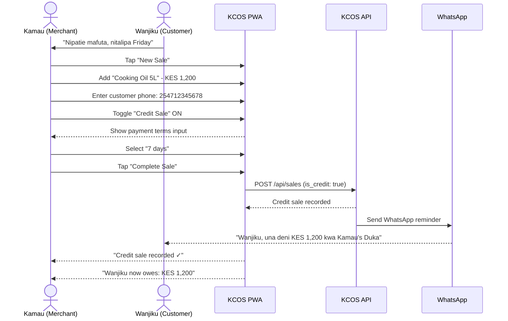

### UI - Credit Sale Toggle

```
┌─────────────────────────────────┐
│  🛒 New Sale                    │
│  ─────────────────────────────  │
│                                 │
│  Items:                         │
│  • Cooking Oil 5L    KES 1,200  │
│  ─────────────────────────────  │
│  Total:              KES 1,200  │
│                                 │
│  Customer Phone:                │
│  [254712345678      ]           │
│                                 │
│  ┌─────────────────────────────┐│
│  │ 💳 Credit Sale    [ON]      ││
│  │ Payment Terms: [7 days ▾]   ││
│  └─────────────────────────────┘│
│                                 │
│  [✓ Record Credit Sale]         │
│                                 │
└─────────────────────────────────┘
```

---

## Recording an Expense

**Goal:** Track business expenses (transport, stock purchase, etc.)

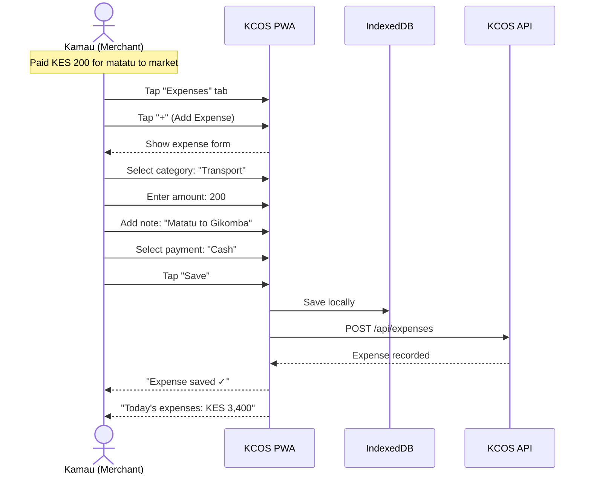

### UI - Expense Form

```
┌─────────────────────────────────┐
│  📝 New Expense                 │
│  ─────────────────────────────  │
│                                 │
│  Category:                      │
│  [🚌 Transport          ▾]      │
│                                 │
│  Amount (KES):                  │
│  [200                   ]       │
│                                 │
│  Description:                   │
│  [Matatu to Gikomba     ]       │
│                                 │
│  Paid with:                     │
│  [💵 Cash] [📱 M-Pesa]          │
│                                 │
│  [✓ Save Expense]               │
│                                 │
└─────────────────────────────────┘
```

---

## Checking Customer Debt

**Goal:** See who owes money and how much.

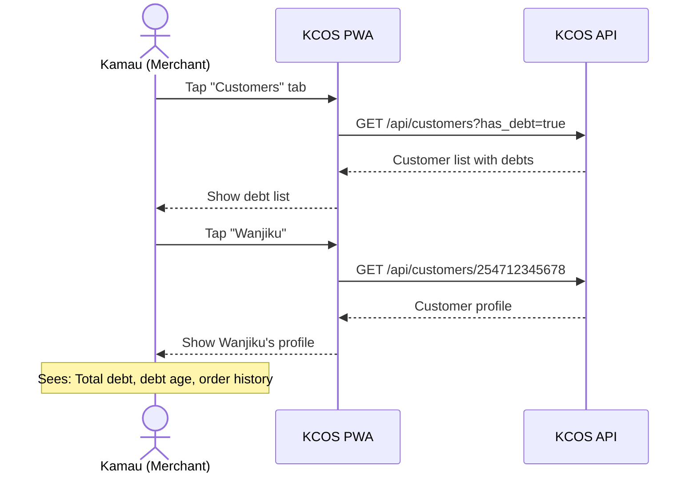

### UI - Customer Debt List

```
┌─────────────────────────────────┐
│  👥 Customers with Debt         │
│  ─────────────────────────────  │
│  Total Outstanding: KES 8,500   │
│  ─────────────────────────────  │
│                                 │
│  ┌─────────────────────────────┐│
│  │ 👤 Wanjiku                  ││
│  │    KES 1,200 • 5 days ago   ││
│  │    ⚠️ Due in 2 days         ││
│  └─────────────────────────────┘│
│                                 │
│  ┌─────────────────────────────┐│
│  │ 👤 Otieno                   ││
│  │    KES 2,800 • 12 days ago  ││
│  │    🔴 5 days overdue        ││
│  └─────────────────────────────┘│
│                                 │
│  ┌─────────────────────────────┐│
│  │ 👤 Amina                    ││
│  │    KES 4,500 • 3 days ago   ││
│  │    ✓ Due in 4 days          ││
│  └─────────────────────────────┘│
│                                 │
└─────────────────────────────────┘
```

---

## Collecting Debt Payment

**Goal:** Customer pays part or all of their debt.

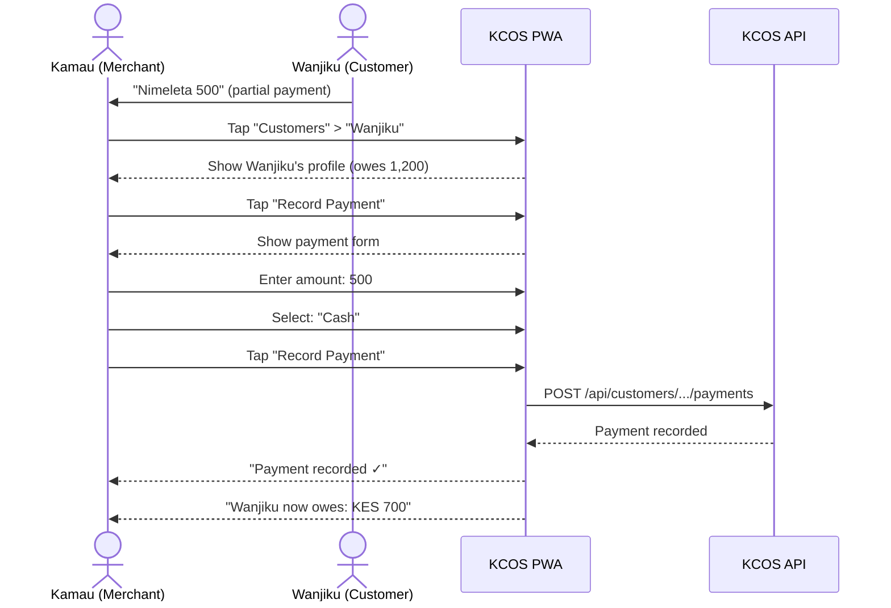

### UI - Record Payment

```
┌─────────────────────────────────┐
│  💰 Record Payment              │
│  ─────────────────────────────  │
│  Customer: Wanjiku              │
│  Current Debt: KES 1,200        │
│  ─────────────────────────────  │
│                                 │
│  Amount Received:               │
│  [500                   ]       │
│                                 │
│  Payment Method:                │
│  [💵 Cash] [📱 M-Pesa]          │
│                                 │
│  ─────────────────────────────  │
│  After payment: KES 700 left    │
│  ─────────────────────────────  │
│                                 │
│  [✓ Record Payment]             │
│                                 │
└─────────────────────────────────┘
```

---

## Checking Daily Summary

**Goal:** Quick view of today's business performance.

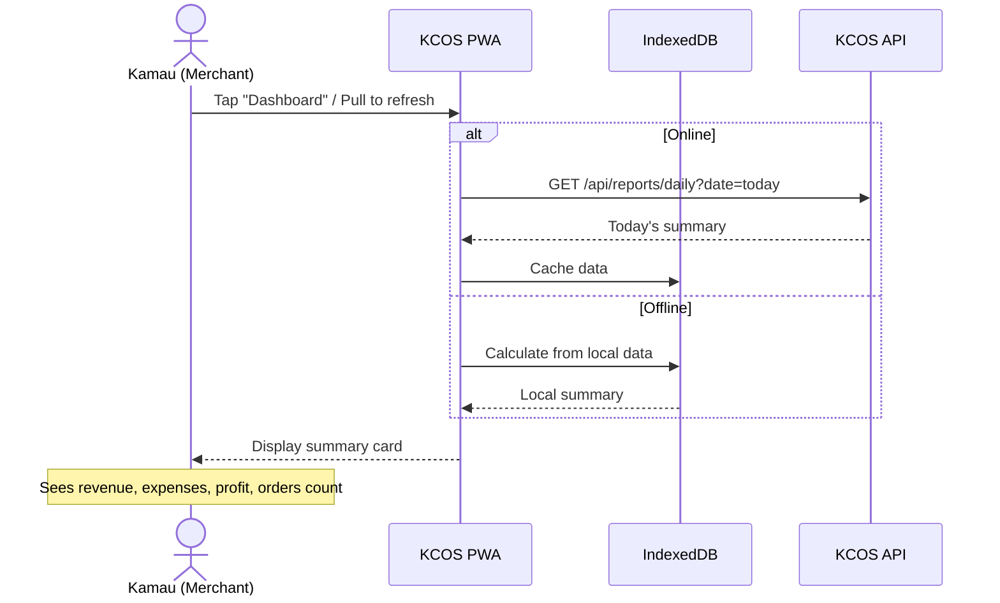

### UI - Dashboard Summary

```
┌─────────────────────────────────┐
│  📊 Today's Summary             │
│  January 20, 2026               │
│  ─────────────────────────────  │
│                                 │
│  💰 Revenue                     │
│  ┌─────────────────────────────┐│
│  │      KES 12,500             ││
│  │  Cash: 8,000 • MPesa: 4,000 ││
│  │  Credit: 500                ││
│  └─────────────────────────────┘│
│                                 │
│  📉 Expenses                    │
│  ┌─────────────────────────────┐│
│  │      KES 3,200              ││
│  │  Stock: 3,000 • Trans: 200  ││
│  └─────────────────────────────┘│
│                                 │
│  📈 Profit                      │
│  ┌─────────────────────────────┐│
│  │      KES 9,300              ││
│  │  ▲ 15% vs yesterday         ││
│  └─────────────────────────────┘│
│                                 │
│  🛒 Orders: 15                  │
│  👥 Customers: 12               │
│  ─────────────────────────────  │
│  [🛒 Sales] [📝 Expenses] [👥]  │
└─────────────────────────────────┘
```

---

## End-of-Day Closing

**Goal:** Reconcile cash, review day, prepare for tomorrow.

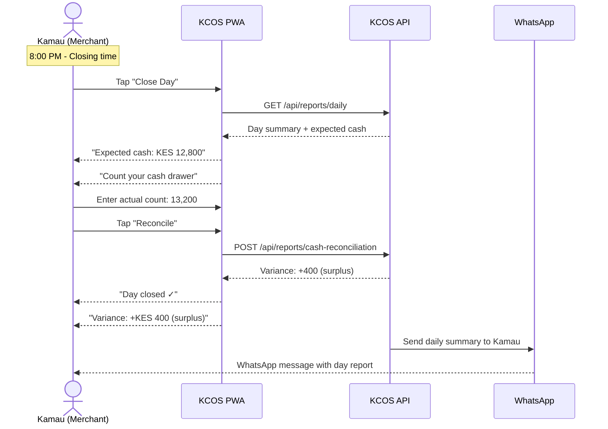

### UI - Day Closing

```
┌─────────────────────────────────┐
│  🌙 Close Day                   │
│  January 20, 2026               │
│  ─────────────────────────────  │
│                                 │
│  📊 Day Summary                 │
│  Revenue:       KES 12,500      │
│  Expenses:      KES  3,200      │
│  Profit:        KES  9,300      │
│  ─────────────────────────────  │
│                                 │
│  💰 Cash Reconciliation         │
│  ┌─────────────────────────────┐│
│  │ Opening Float:    5,000     ││
│  │ + Cash Sales:     8,000     ││
│  │ - Cash Expenses:    200     ││
│  │ ─────────────────────────── ││
│  │ Expected:        12,800     ││
│  └─────────────────────────────┘│
│                                 │
│  Actual Cash Count:             │
│  [13,200                ]       │
│                                 │
│  Variance: +400 ✓ (Surplus)     │
│                                 │
│  [✓ Close Day]                  │
│                                 │
└─────────────────────────────────┘
```

---

## Offline Sale (No Internet)

**Goal:** Continue selling even without network connection.

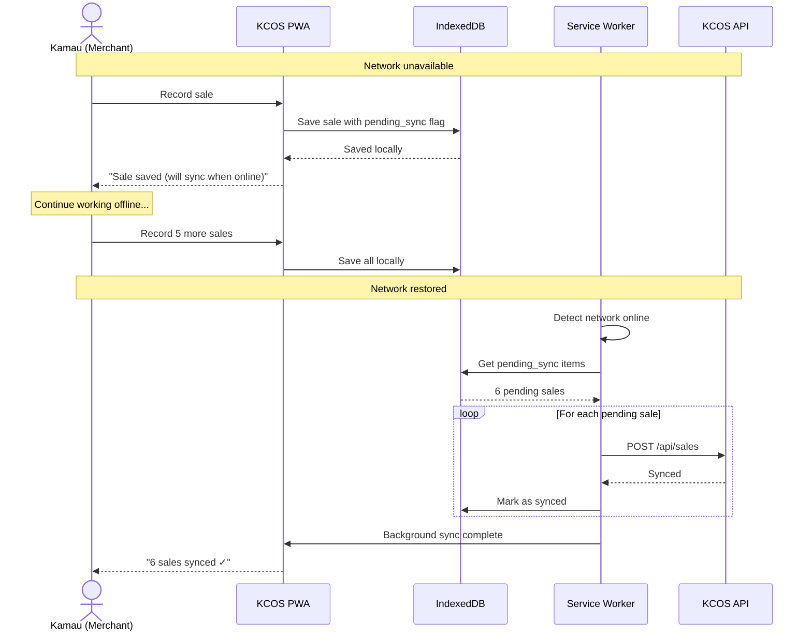

### UI - Offline Indicator

```
┌─────────────────────────────────┐
│  ⚡ OFFLINE MODE                │
│  ─────────────────────────────  │
│  Sales saved locally            │
│  Will sync when online          │
│  ─────────────────────────────  │
│                                 │
│  📊 Today's Summary (Local)     │
│  Revenue: KES 8,500             │
│  Pending sync: 6 sales          │
│                                 │
│  [🛒 New Sale]                  │
│                                 │
│  ─────────────────────────────  │
│  🔄 Last synced: 2 hours ago    │
└─────────────────────────────────┘
```

---

## Navigation Structure

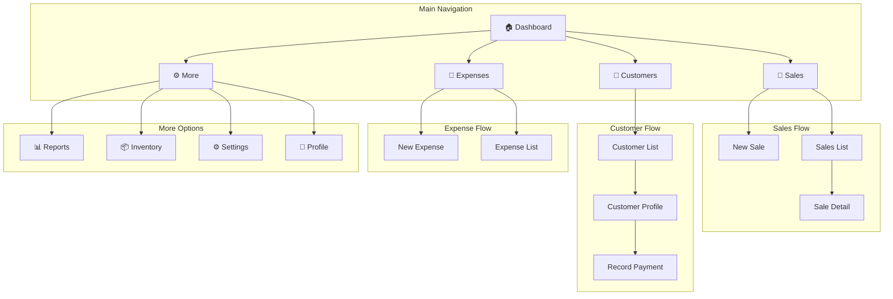

---

## Feature Flags in UI

Based on business config, show/hide features:

```svelte
{#if $businessConfig.enableExpenses}
  <NavItem href="/expenses" icon="📝">Expenses</NavItem>
{/if}

{#if $businessConfig.enableInventory}
  <NavItem href="/inventory" icon="📦">Inventory</NavItem>
{/if}

{#if $businessConfig.enableAppointments}
  <NavItem href="/appointments" icon="📅">Appointments</NavItem>
{/if}

{#if $businessConfig.enableSupplierCredit}
  <NavItem href="/suppliers" icon="🏭">Suppliers</NavItem>
{/if}
```
